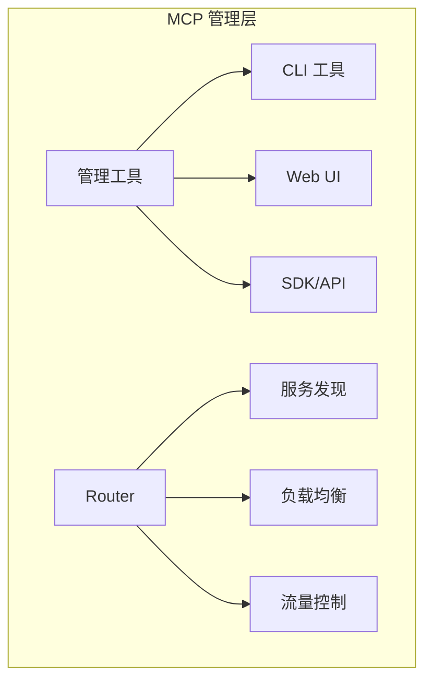

# 1.11 MCP 管理工具与 Router 全解析

> 本章将深入介绍 MCP 的各种管理工具、Router 解决方案和_registry系统，帮助开发者更高效地管理和扩展 MCP 服务。

---

## 章节导航

| 阶段 | 内容 | 篇幅 |
|------|------|------|
| 问题引入 | MCP 规模化的挑战 | 10% |
| 核心概念 | 管理工具与 Router 概述 | 20% |
| 管理工具 | 各类管理工具详解 | 25% |
| Router 方案 | MCP Router 深度解析 | 25% |
| 实践指南 | 工具选型与配置 | 10% |
| 总结 | 要点回顾 | 10% |

---

## 一、引子：MCP 规模化的挑战

### 1.1 为什么要管理 MCP？

```
┌─────────────────────────────────────────────────────────────────┐
│                    MCP 规模化挑战                                   │
├─────────────────────────────────────────────────────────────────┤
│                                                                 │
│  问题:                                                          │
│  ┌─────────────────────────────────────────────────────────┐   │
│  │  • 服务器数量增长难以管理                               │   │
│  │  • 多环境配置复杂（开发/测试/生产）                    │   │
│  │  • 服务器版本升级困难                                   │   │
│  │  • 缺乏统一监控和日志                                  │   │
│  │  • 难以发现和复用已有 MCP                             │   │
│  └─────────────────────────────────────────────────────────┘   │
│                                                                 │
│  解决: 管理工具与 Router                                         │
│  ┌─────────────────────────────────────────────────────────┐   │
│  │  ✓ 集中化配置管理                                      │   │
│  │  ✓ 动态服务发现                                        │   │
│  │  ✓ 流量路由与负载均衡                                  │   │
│  │  ✓ 监控与告警                                          │   │
│  │  ✓ 统一认证与授权                                      │   │
│  └─────────────────────────────────────────────────────────┘   │
│                                                                 │
└─────────────────────────────────────────────────────────────────┘
```

### 1.2 MCP 管理全景图



---

## 二、核心概念：管理工具与 Router 概述

### 2.1 管理工具分类

```
┌─────────────────────────────────────────────────────────────────┐
│                    MCP 管理工具分类                                 │
├─────────────────────────────────────────────────────────────────┤
│                                                                 │
│  ┌─────────────────────────────────────────────────────────┐   │
│  │ CLI 工具                                                │   │
│  │  • 命令行方式管理 MCP 服务器                           │   │
│  │  • 快速部署和测试                                      │   │
│  │  • 适合 DevOps                                         │   │
│  └─────────────────────────────────────────────────────────┘   │
│                                                                 │
│  ┌─────────────────────────────────────────────────────────┐   │
│  │ Web UI 工具                                             │   │
│  │  • 图形化界面                                          │   │
│  │  • 可视化配置                                          │   │
│  │  │ 适合非技术用户                                    │   │
│  └─────────────────────────────────────────────────────────┘   │
│                                                                 │
│  ┌─────────────────────────────────────────────────────────┐   │
│  │ SDK / API                                               │   │
│  │  • 程序化管理                                          │   │
│  │  • 集成到现有系统                                      │   │
│  │  • 适合企业集成                                        │   │
│  └─────────────────────────────────────────────────────────┘   │
│                                                                 │
│  ┌─────────────────────────────────────────────────────────┐   │
│  │ Registry / Catalog                                       │   │
│  │  • MCP 服务器发现                                       │   │
│  │  • 共享和复用                                          │   │
│  │  • 社区生态                                            │   │
│  └─────────────────────────────────────────────────────────┘   │
│                                                                 │
└─────────────────────────────────────────────────────────────────┘
```

### 2.2 Router 架构概览

```
┌─────────────────────────────────────────────────────────────────┐
│                    MCP Router 架构                                  │
├─────────────────────────────────────────────────────────────────┤
│                                                                 │
│  ┌─────────────────────────────────────────────────────────┐   │
│  │                    MCP Router                             │   │
│  │  ┌─────────────┐  ┌─────────────┐  ┌─────────────┐     │   │
│  │  │   服务发现   │  │   负载均衡  │  │   流量控制  │     │   │
│  │  └─────────────┘  └─────────────┘  └─────────────┘     │   │
│  │  ┌─────────────┐  ┌─────────────┐  ┌─────────────┐     │   │
│  │  │   协议转换   │  │   安全代理  │  │   监控追踪  │     │   │
│  │  └─────────────┘  └─────────────┘  └─────────────┘     │   │
│  └─────────────────────────────────────────────────────────┘   │
│                              │                                   │
│         ┌────────────────────┼────────────────────┐             │
│         ▼                    ▼                    ▼             │
│  ┌─────────────┐     ┌─────────────┐     ┌─────────────┐     │
│  │  MCP Server │     │  MCP Server │     │  MCP Server │     │
│  │      A       │     │      B       │     │      C       │     │
│  └─────────────┘     └─────────────┘     └─────────────┘     │
│                                                                 │
└─────────────────────────────────────────────────────────────────┘
```

---

## 三、管理工具详解

### 3.1 CLI 管理工具

#### 3.1.1 mcp-cli (官方)

```bash
# 安装
npm install -g @modelcontextprotocol/cli

# 列出已配置的服务器
mcp list

# 测试服务器连接
mcp test server-name

# 查看服务器状态
mcp status

# 验证配置
mcp validate

# 交互式配置
mcp config init
```

**功能**：
- 服务器列表管理
- 配置验证
- 连接测试

#### 3.1.2 smithery-cli

```bash
# 安装
npm install -g @smithery/cli

# 部署 MCP 服务器
smithery deploy --server github --region us-east-1

# 管理已部署服务器
smithery list
smithery stop server-id
smithery logs server-id

# 扩展管理
smithery scale server-id --replicas 3
```

**功能**：
- 一键部署
- 自动扩缩容
- 日志管理

#### 3.1.3 mcp-manager

```bash
# 安装
pip install mcp-manager

# 启动管理界面
mcp-manager dashboard

# 添加服务器
mcp-manager add --name github --type npx --args "@modelcontextprotocol/server-github"

# 启动所有服务器
mcp-manager start-all

# 批量更新
mcp-manager update --all
```

### 3.2 Web UI 管理工具

#### 3.2.1 Smithery.ai (托管平台)

```
┌─────────────────────────────────────────────────────────────────┐
│                    Smithery.ai 功能                                    │
├─────────────────────────────────────────────────────────────────┤
│                                                                 │
│  核心功能:                                                        │
│  ┌─────────────────────────────────────────────────────────┐   │
│  │ ✓ 云端托管 MCP 服务器                                   │   │
│  │ ✓ 一键部署                                               │   │
│  │ ✓ 自动扩缩容                                             │   │
│  │ ✓ HTTPS/域名配置                                         │   │
│  │ ✓ 使用量统计                                             │   │
│  │ ✓ 团队协作                                               │   │
│  └─────────────────────────────────────────────────────────┘   │
│                                                                 │
│  定价:                                                           │
│  ┌─────────────────────────────────────────────────────────┐   │
│  │ • Free:  1 个服务器                                     │   │
│  │ • Pro:   $19/月，无限服务器                            │   │
│  │ • Team:  $49/月，团队协作                              │   │
│  └─────────────────────────────────────────────────────────┘   │
│                                                                 │
│  URL: https://smithery.ai                                        │
│                                                                 │
└─────────────────────────────────────────────────────────────────┘
```

#### 3.2.2 MiniMax MCP Hub (国内)

```
┌─────────────────────────────────────────────────────────────────┐
│                    MiniMax MCP Hub 功能                                │
├─────────────────────────────────────────────────────────────────┤
│                                                                 │
│  核心功能:                                                        │
│  ┌─────────────────────────────────────────────────────────┐   │
│  │ ✓ 中文界面                                                │   │
│  │ ✓ 国内镜像加速                                            │   │
│  │ ✓ 一键部署                                                │   │
│  │ ✓ 使用统计                                                │   │
│  └─────────────────────────────────────────────────────────┘   │
│                                                                 │
│  特色:                                                           │
│  ┌─────────────────────────────────────────────────────────┐   │
│  │ • 国内网络优化                                            │   │
│  │ • 支付宝/微信支付                                         │   │
│  │ • 中文客服支持                                            │   │
│  └─────────────────────────────────────────────────────────┘   │
│                                                                 │
└─────────────────────────────────────────────────────────────────┘
```

#### 3.2.3 MCP Dashboard (开源)

```python
# mcp-dashboard
# 自托管 MCP 管理界面

# 安装
docker run -d -p 3000:3000 \
  -e MCP_CONFIG_PATH=/config \
  -v ./config:/config \
  mcp-dashboard:latest

# 功能:
# - 服务器状态监控
# - 配置管理
# - 日志查看
# - 用户管理
```

### 3.3 Registry 与 Catalog

#### 3.3.1 awesome-mcp (社区资源列表)

```
┌─────────────────────────────────────────────────────────────────┐
│                    awesome-mcp 资源                                    │
├─────────────────────────────────────────────────────────────────┤
│                                                                 │
│  GitHub: github.com/punkpeer/awesome-mcp                       │
│                                                                 │
│  收录内容:                                                       │
│  ┌─────────────────────────────────────────────────────────┐   │
│  │ • 500+ MCP 服务器项目                                   │   │
│  │ • 50+ 客户端应用                                        │   │
│  │ • 20+ 框架和工具                                        │   │
│  │ • 10+ 教程和文档                                        │   │
│  └─────────────────────────────────────────────────────────┘   │
│                                                                 │
│  分类:                                                           │
│  ┌─────────────────────────────────────────────────────────┐   │
│  │ • ai-tools          AI 工具                            │   │
│  │ • development       开发工具                           │   │
│  │ • databases         数据库                             │   │
│  │ • productivity     生产力                             │   │
│  │ • communication    通信                               │   │
│  │ • automation       自动化                              │   │
│  └─────────────────────────────────────────────────────────┘   │
│                                                                 │
└─────────────────────────────────────────────────────────────────┘
```

#### 3.3.2 MCP Registry (官方)

```yaml
# mcp-registry.yaml
registries:
  - name: "官方"
    url: "https://registry.mcp.sh/official"
  - name: "社区"
    url: "https://registry.mcp.sh/community"
  - name: "私有"
    url: "https://registry.internal.company.com"

# 搜索 MCP 服务器
mcp search "database"

# 添加到本地
mcp add --from registry/github
```

#### 3.3.3 NPX 快速启动

```bash
# 快速启动热门 MCP 服务器
npx -y @modelcontextprotocol/server-filesystem ./data
npx -y @modelcontextprotocol/server-github
npx -y @modelcontextprotocol/server-brave-search

# 带参数启动
npx -y @modelcontextprotocol/server-sqlite --filename ./mydb.sqlite

# 查看可用服务器列表
npx @modelcontextprotocol/list-servers
```

---

## 四、Router 方案详解

### 4.1 MCP Gateway (自建方案)

```
┌─────────────────────────────────────────────────────────────────┐
│                    MCP Gateway 架构                                  │
├─────────────────────────────────────────────────────────────────┤
│                                                                 │
│  ┌──────────────────────────────────────────────────────────┐  │
│  │                     MCP Gateway                          │  │
│  │  ┌─────────────────────────────────────────────────┐   │  │
│  │  │  请求入口 (HTTP/WS)                              │   │  │
│  │  └─────────────────────────────────────────────────┘   │  │
│  │                         │                               │  │
│  │  ┌─────────────────────────────────────────────────┐   │  │
│  │  │  路由层                                         │   │  │
│  │  │  • 路径路由 (/mcp/server-*)                     │   │  │
│  │  │  • 头部路由                                     │   │  │
│  │  │  • 权重路由                                     │   │  │
│  │  └─────────────────────────────────────────────────┘   │  │
│  │                         │                               │  │
│  │ ─┐   │  ┌──────────────────────────────────────────────── │
│  │  │  认证层                                         │   │  │
│  │  │  • API Key 验证                                 │   │  │
│  │  │  • JWT 验证                                     │   │  │
│  │  │  • OAuth 2.0                                    │   │  │
│  │  └─────────────────────────────────────────────────┘   │  │
│  │                         │                               │  │
│  │  ┌─────────────────────────────────────────────────┐   │  │
│  │  │  限流层                                         │   │  │
│  │  │  • QPS 限制                                     │   │  │
│  │  │  • 并发限制                                     │   │  │
│  │  │  • 配额管理                                     │   │  │
│  │  └─────────────────────────────────────────────────┘   │  │
│  │                         │                               │  │
│  │  ┌─────────────────────────────────────────────────┐   │  │
│  │  │  后端服务器池                                    │   │
│  │  │  • server-a.internal:8080                       │   │
│  │  │  • server-b.internal:8080                       │   │
│  │  │  • server-c.internal:8080                       │   │
│  │  └─────────────────────────────────────────────────┘   │  │
│  └──────────────────────────────────────────────────────────┘  │
│                                                                 │
└─────────────────────────────────────────────────────────────────┘
```

#### 4.1.1 FastMCP Gateway 实现

```python
"""
MCP Gateway 实现
文件: mcp_gateway.py
"""
from fastapi import FastAPI, HTTPException, Header, Request
from fastapi.middleware.cors import CORSMiddleware
from fastapi.responses import JSONResponse
import httpx
import json
import os
from typing import Optional, Dict, Any
from pydantic import BaseModel
import asyncio

app = FastAPI(title="MCP Gateway")

# CORS 配置
app.add_middleware(
    CORSMiddleware,
    allow_origins=["*"],
    allow_credentials=True,
    allow_methods=["*"],
    allow_headers=["*"],
)

# 服务器配置
SERVERS = {
    "github": {
        "url": os.getenv("GITHUB_SERVER_URL", "http://localhost:8081"),
        "auth": os.getenv("GITHUB_SERVER_AUTH"),
    },
    "filesystem": {
        "url": os.getenv("FILESYSTEM_SERVER_URL", "http://localhost:8082"),
        "auth": os.getenv("FILESYSTEM_SERVER_AUTH"),
    },
    "database": {
        "url": os.getenv("DATABASE_SERVER_URL", "http://localhost:8083"),
        "auth": os.getenv("DATABASE_SERVER_AUTH"),
    }
}

# 速率限制
RATE_LIMITS = {
    "default": {"requests": 100, "period": 60},
    "github": {"requests": 50, "period": 60},
    "heavy": {"requests": 10, "period": 60}
}

class MCPRequest(BaseModel):
    jsonrpc: str = "2.0"
    id: Optional[int] = None
    method: str
    params: Optional[Dict[str, Any]] = {}

async def forward_request(
    server_name: str,
    method: str,
    params: Optional[Dict[str, Any]] = None,
    auth: Optional[str] = None
) -> Dict[str, Any]:
    """转发请求到后端 MCP 服务器"""
    if server_name not in SERVERS:
        raise HTTPException(status_code=404, detail="Server not found")

    server = SERVERS[server_name]
    url = server["url"]

    headers = {"Content-Type": "application/json"}
    if auth:
        headers["Authorization"] = f"Bearer {auth}"

    payload = {
        "jsonrpc": "2.0",
        "method": method,
        "params": params or {},
        "id": 1
    }

    async with httpx.AsyncClient(timeout=30.0) as client:
        try:
            response = await client.post(url, json=payload, headers=headers)
            return response.json()
        except httpx.ConnectError:
            raise HTTPException(status_code=503, detail="Server unavailable")
        except Exception as e:
            raise HTTPException(status_code=500, detail=str(e))

@app.post("/mcp/{server_name}")
async def handle_mcp_request(
    server_name: str,
    request: MCPRequest,
    authorization: Optional[str] = Header(None)
):
    """MCP 请求入口"""
    # 认证检查
    if authorization:
        token = authorization.replace("Bearer ", "")
        # 验证 token...
        pass

    # 转发请求
    result = await forward_request(
        server_name=server_name,
        method=request.method,
        params=request.params
    )

    return result

@app.get("/mcp/{server_name}/tools")
async def list_tools(server_name: str):
    """列出服务器提供的工具"""
    result = await forward_request(
        server_name=server_name,
        method="tools/list"
    )
    return result

@app.get("/mcp/{server_name}/resources")
async def list_resources(server_name: str):
    """列出服务器提供的资源"""
    result = await forward_request(
        server_name=server_name,
        method="resources/list"
    )
    return result

@app.get("/health")
async def health_check():
    """健康检查"""
    return {"status": "healthy"}

@app.get("/servers")
async def list_servers():
    """列出所有可用服务器"""
    return {
        "servers": [
            {
                "name": name,
                "status": "online"  # 可扩展为实际状态检查
            }
            for name in SERVERS.keys()
        ]
    }

if __name__ == "__main__":
    import uvicorn
    uvicorn.run(app, host="0.0.0.0", port=8000)
```

### 4.2 云端 Router 方案

#### 4.2.1 Claude Gateway (Anthropic 官方)

```
┌─────────────────────────────────────────────────────────────────┐
│                    Claude Gateway                                      │
├─────────────────────────────────────────────────────────────────┤
│                                                                 │
│  官方托管的 MCP 代理服务:                                        │
│                                                                 │
│  ┌─────────────────────────────────────────────────────────┐   │
│  │ ✓ 企业级安全与合规                                       │   │
│  │ ✓ SOC 2 认证                                            │   │
│  │ ✓ HIPAA 合规 (可选)                                     │   │
│  │ ✓ 数据加密传输/存储                                    │   │
│  └─────────────────────────────────────────────────────────┘   │
│                                                                 │
│  功能:                                                           │
│  ┌─────────────────────────────────────────────────────────┐   │
│  │ • 集中式 MCP 配置                                       │   │
│  │ • SSO/SAML 集成                                         │   │
│  │ • 使用审计日志                                           │   │
│  │ • 配额管理                                               │   │
│  │ • 团队管理                                               │   │
│  └─────────────────────────────────────────────────────────┘   │
│                                                                 │
│  适用: 企业大规模部署                                            │
│                                                                 │
└─────────────────────────────────────────────────────────────────┘
```

#### 4.2.2 AWS API Gateway 集成

```yaml
# AWS CloudFormation 模板片段
Resources:
  MCPAPI:
    Type: AWS::ApiGateway::RestApi
    Properties:
      Name: mcp-gateway
      Description: MCP API Gateway

  MCPMethod:
    Type: AWS::ApiGateway::Method
    Properties:
      HttpMethod: POST
      Integration:
        Type: HTTP_PROXY
        Uri: !Sub "http://${MCPServerInstance}:8080/{proxy}"

  UsagePlan:
    Type: AWS::ApiGateway::UsagePlan
    Properties:
      Quota:
        Limit: 10000
        Period: MONTH
      Throttle:
        BurstLimit: 100
        RateLimit: 50
```

#### 4.2.3 Cloudflare Workers 方案

```javascript
// cloudflare-workers-mcp-router
// workers/cloudflare/index.js

export default {
  async fetch(request, env) {
    const url = new URL(request.url);
    const path = url.pathname;

    // 路由到不同的 MCP 服务器
    if (path.startsWith("/mcp/github")) {
      return fetch("https://mcp-server-github.example.com" + path, request);
    } else if (path.startsWith("/mcp/filesystem")) {
      return fetch("https://mcp-server-filesystem.example.com" + path, request);
    }

    return new Response("Not Found", { status: 404 });
  }
};
```

### 4.3 本地 Router 方案

#### 4.3.1 mcp-local-router

```bash
# 安装
npm install -g mcp-local-router

# 配置文件
cat > ~/.mcp/router.yaml << EOF
servers:
  - name: github
    command: npx
    args: ["-y", "@modelcontextprotocol/server-github"]
    env:
      GITHUB_TOKEN: ${GITHUB_TOKEN}

  - name: filesystem
    command: npx
    args: ["-y", "@modelcontextprotocol/server-filesystem", "./data"]

  - name: database
    url: http://localhost:8080

router:
  port: 3000
  cors: true
  auth:
    type: api-key
    keys:
      - key-xxx
      - key-yyy
EOF

# 启动
mcp-router start
```

#### 4.3.2 Docker Compose 本地集群

```yaml
# docker-compose.yml
version: '3.8'

services:
  mcp-router:
    image: mcp/router:latest
    ports:
      - "3000:3000"
    volumes:
      - ./config:/app/config
    environment:
      - LOG_LEVEL=info

  mcp-github:
    image: mcp/server-github:latest
    environment:
      - GITHUB_TOKEN=${GITHUB_TOKEN}

  mcp-filesystem:
    image: mcp/server-filesystem:latest
    volumes:
      - ./data:/data

  mcp-database:
    image: mcp/server-postgres:latest
    environment:
      - DATABASE_URL=postgres://user:pass@db:5432/mydb

  mcp-monitoring:
    image: mcp/monitoring:latest
    ports:
      - "9090:9090"
```

---

## 五、高级功能

### 5.1 服务发现

```python
"""
MCP 服务发现实现
"""
import etcd3
import json
from typing import List, Dict, Any

class MCPServiceRegistry:
    """基于 etcd 的服务发现"""

    def __init__(self, etcd_host="localhost", etcd_port=2379):
        self.client = etcd3.client(host=etcd_host, port=etcd_port)

    def register(self, name: str, host: str, port: int, metadata: Dict = None):
        """注册服务"""
        key = f"/mcp/services/{name}"
        value = json.dumps({
            "host": host,
            "port": port,
            "metadata": metadata or {}
        })
        self.client.put(key, value)

    def discover(self, name: str) -> List[Dict]:
        """发现服务"""
        key = f"/mcp/services/{name}"
        value, meta = self.client.get(key)
        if value:
            return [json.loads(value)]
        return []

    def discover_all(self) -> Dict[str, List[Dict]]:
        """发现所有服务"""
        result = {}
        for key, value in self.client.get_prefix("/mcp/services/"):
            name = key.decode().split("/")[-1]
            if name not in result:
                result[name] = []
            result[name].append(json.loads(value))
        return result

    def deregister(self, name: str):
        """注销服务"""
        self.client.delete_prefix(f"/mcp/services/{name}")
```

### 5.2 负载均衡

```python
"""
MCP 负载均衡器
"""
import random
from typing import List, Dict, Any
import httpx

class MCPLoadBalancer:
    """MCP 请求负载均衡"""

    def __init__(self, strategy: str = "round_robin"):
        self.strategy = strategy
        self.servers: List[Dict] = []
        self.current_index = 0

    def add_server(self, url: str, weight: int = 1):
        """添加服务器"""
        self.servers.append({"url": url, "weight": weight})

    def get_server(self) -> str:
        """获取下一个服务器"""
        if not self.servers:
            raise Exception("No servers available")

        if self.strategy == "round_robin":
            server = self.servers[self.current_index]
            self.current_index = (self.current_index + 1) % len(self.servers)
            return server["url"]

        elif self.strategy == "random":
            return random.choice(self.servers)["url"]

        elif self.strategy == "weighted":
            # 权重随机
            pool = []
            for s in self.servers:
                pool.extend([s["url"]] * s["weight"])
            return random.choice(pool)

        elif self.strategy == "least_connections":
            # 最少连接 - 简化实现
            return self.servers[0]["url"]

        raise ValueError(f"Unknown strategy: {self.strategy}")

    async def forward(self, method: str, params: Dict = None):
        """转发请求"""
        url = self.get_server()
        async with httpx.AsyncClient() as client:
            response = await client.post(
                url,
                json={"jsonrpc": "2.0", "method": method, "params": params or {}, "id": 1}
            )
            return response.json()
```

### 5.3 监控与追踪

```python
"""
MCP 监控中间件
"""
from fastapi import Request
import time
import logging

logger = logging.getLogger("mcp-monitor")

class MCPMonitor:
    """MCP 请求监控"""

    def __init__(self):
        self.metrics = {
            "requests_total": 0,
            "requests_success": 0,
            "requests_error": 0,
            "latency_sum": 0,
            "by_method": {},
            "by_server": {}
        }

    async def track_request(self, request: Request, call_next):
        """追踪请求"""
        start_time = time.time()
        server = request.path_params.get("server_name", "unknown")
        method = (await request.json()).get("method", "unknown")

        try:
            response = await call_next(request)
            duration = time.time() - start_time

            # 更新指标
            self.metrics["requests_total"] += 1
            self.metrics["requests_success"] += 1
            self.metrics["latency_sum"] += duration

            # 按方法统计
            if method not in self.metrics["by_method"]:
                self.metrics["by_method"][method] = {"count": 0, "latency": 0}
            self.metrics["by_method"][method]["count"] += 1
            self.metrics["by_method"][method]["latency"] += duration

            # 按服务器统计
            if server not in self.metrics["by_server"]:
                self.metrics["by_server"][server] = {"count": 0, "errors": 0}
            self.metrics["by_server"][server]["count"] += 1

            logger.info(f"{method} -> {server} : {duration:.3f}s")
            return response

        except Exception as e:
            duration = time.time() - start_time
            self.metrics["requests_total"] += 1
            self.metrics["requests_error"] += 1
            self.metrics["by_server"][server]["errors"] += 1
            logger.error(f"{method} -> {server} : ERROR ({duration:.3f}s): {e}")
            raise

    def get_metrics(self) -> dict:
        """获取监控指标"""
        avg_latency = (
            self.metrics["latency_sum"] / self.metrics["requests_total"]
            if self.metrics["requests_total"] > 0
            else 0
        )
        return {
            **self.metrics,
            "requests_in_flight": self.metrics["requests_total"] - self.metrics["requests_success"] - self.metrics["requests_error"],
            "avg_latency": avg_latency
        }
```

---

## 六、实践指南

### 6.1 工具选型建议

```
┌─────────────────────────────────────────────────────────────────┐
│                    MCP 管理工具选型指南                                │
├─────────────────────────────────────────────────────────────────┤
│                                                                 │
│  个人/小团队:                                                    │
│  ┌─────────────────────────────────────────────────────────┐   │
│  │ • 直接使用官方 CLI                                      │   │
│  │ • npx 快速启动                                         │   │
│  │ • awesome-mcp 发现资源                                │   │
│  └─────────────────────────────────────────────────────────┘   │
│                                                                 │
│  中型团队:                                                       │
│  ┌─────────────────────────────────────────────────────────┐   │
│  │ • Smithery 托管方案                                    │   │
│  │ • 自建简单 Gateway                                     │   │
│  │ • Docker Compose 本地集群                              │   │
│  └─────────────────────────────────────────────────────────┘   │
│                                                                 │
│  企业级:                                                         │
│  ┌─────────────────────────────────────────────────────────┐   │
│  │ • Claude Gateway (官方)                                │   │
│  │ • 自建 Kubernetes 集群                                 │   │
│  │ • 完整的监控/日志/告警                                 │   │
│  └─────────────────────────────────────────────────────────┘   │
│                                                                 │
└─────────────────────────────────────────────────────────────────┘
```

### 6.2 快速启动配置

```bash
# 一、快速开始 (个人)
npx -y @modelcontextprotocol/server-github

# 二、本地 Router (小团队)
npm install -g mcp-local-router
mcp-router init
mcp-router start

# 三、云端托管 (中型团队)
# 1. 注册 smithery.ai
# 2. 连接 GitHub
# 3. 一键部署

# 四、企业级 (大型组织)
# 1. 部署 MCP Gateway (Kubernetes)
# 2. 配置监控 (Prometheus + Grafana)
# 3. 设置日志聚合 (ELK)
# 4. 配置 SSO
```

### 6.3 监控配置示例

```yaml
# prometheus.yml (MCP 监控配置)
scrape_configs:
  - job_name: 'mcp-gateway'
    static_configs:
      - targets: ['localhost:9090']

  - job_name: 'mcp-servers'
    static_configs:
      - targets: ['server-github:8080', 'server-db:8080']

# grafana-dashboard.json (MCP 仪表板)
{
  "panels": [
    {"title": "MCP 请求量", "type": "graph", "targets": [{"expr": "rate(mcp_requests_total[5m]})}]},
    {"title": "MCP 延迟", "type": "graph", "targets": [{"expr": "histogram_quantile(0.95, rate(mcp_latency_bucket[5m]})}]},
    {"title": "错误率", "type": "graph", "targets": [{"expr": "rate(mcp_errors_total[5m]})}]}
  ]
}
```

---

## 七、本章小结

### 7.1 核心要点

```
┌─────────────────────────────────────────────────────────────────┐
│                    本章核心要点                                    │
├─────────────────────────────────────────────────────────────────┤
│                                                                 │
│  1. 管理工具                                                    │
│     • CLI 工具: mcp-cli, smithery-cli, mcp-manager            │
│     • Web UI: Smithery.ai, MCP Dashboard                      │
│     • Registry: awesome-mcp, NPX 快速启动                       │
│                                                                 │
│  2. Router 方案                                                 │
│     • 自建 Gateway: FastAPI 实现                                │
│     • 云端方案: Claude Gateway, AWS API Gateway                │
│     • 本地方案: mcp-local-router, Docker Compose              │
│                                                                 │
│  3. 高级功能                                                    │
│     • 服务发现: etcd-based Registry                            │
│     • 负载均衡: Round-robin, Random, Weighted                 │
│     • 监控追踪: Prometheus + Grafana                           │
│                                                                 │
│  4. 选型建议                                                    │
│     • 个人: npx 快速启动                                       │
│     • 小团队: 本地 Router                                      │
│     • 中型: Smithery 托管                                      │
│     • 企业: 自建 Gateway + 完整监控                            │
│                                                                 │
└─────────────────────────────────────────────────────────────────┘
```

### 7.2 知识检查

1. MCP 管理工具主要分为哪几类？
2. MCP Gateway 的核心功能有哪些？
3. 什么场景下需要使用 MCP Router？
4. 企业级 MCP 部署需要考虑哪些因素？

---

## 八、延伸阅读

| 资源 | 说明 |
|------|------|
| awesome-mcp | 社区 MCP 资源列表 |
| Smithery | MCP 托管平台 |
| MCP Gateway 示例 | FastAPI 实现 |

---

## 九、下一章预告

恭喜完成卷一 **基础入门** 的学习！下一章我们将进入 **卷二：开发实战**，学习如何使用各种框架开发 MCP 服务器。

---

*本章贡献者：MCP Tutorial Team*
*版本：v3.0 出版级*
