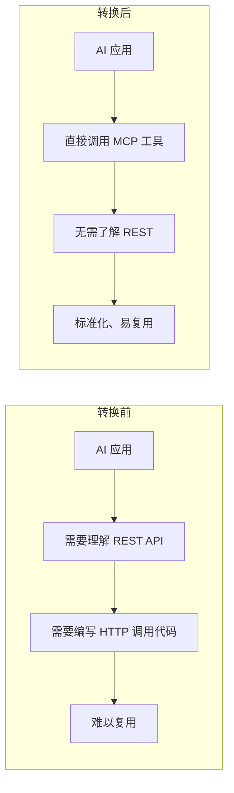
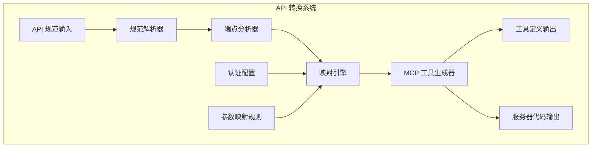

# 3.1 REST API 转 MCP：让旧系统焕发新活力

> 本章将深入探讨如何将现有的 REST API 转换为 MCP 服务。我们会解释为什么需要这种转换、转换的设计原则，以及如何构建一个自动化的 API 转 MCP 系统。

---

## 章节导航

| 阶段 | 内容 | 篇幅 |
|------|------|------|
| 问题引入 | 为什么要转换 REST API | 15% |
| 核心概念 | API 分析与映射 | 25% |
| 架构设计 | 自动化转换系统 | 25% |
| 实践指南 | 最佳实践与安全 | 25% |
| 总结 | 要点回顾 | 10% |

---

## 一、引子：遗留系统的现代化困境

### 1.1 企业的技术债务

```
┌─────────────────────────────────────────────────────────────────┐
│                    遗留系统的问题                                   │
├─────────────────────────────────────────────────────────────────┤
│                                                                 │
│  典型企业现状：                                                 │
│  ┌─────────────────────────────────────────────────────────┐   │
│  │  • 10+ 年的 REST API 积累                              │   │
│  │  • 数百个端点分布在不同服务中                          │   │
│  │  • 文档不完整或过时                                    │   │
│  │  • 维护团队可能已离职                                  │   │
│  └─────────────────────────────────────────────────────────┘   │
│                                                                 │
│  痛点：                                                        │
│  ┌─────────────────────────────────────────────────────────┐   │
│  │  • 新 AI 项目无法直接使用这些 API                      │   │
│  │  • 每个项目都要重新编写 API 调用代码                    │   │
│  │  • API 变化难以追踪和同步                             │   │
│  └─────────────────────────────────────────────────────────┘   │
│                                                                 │
└─────────────────────────────────────────────────────────────────┘
```

### 1.2 MCP 转换的价值



**转换的核心价值**：

| 维度 | 转换前 | 转换后 |
|------|--------|--------|
| 调用方式 | HTTP + 认证 | 工具调用 |
| 学习成本 | 需要看 API 文档 | AI 自动理解 |
| 复用性 | 每个项目重写 | 标准化工具 |
| 维护 | 分散在各处 | 集中管理 |

---

## 二、核心概念：API 分析与映射

### 2.1 REST API 的结构化理解

```
┌─────────────────────────────────────────────────────────────────┐
│                    REST API 组件分析                                │
├─────────────────────────────────────────────────────────────────┤
│                                                                 │
│  一个典型的 REST API 端点：                                      │
│                                                                 │
│  POST /api/v1/users/{user_id}/orders                           │
│                                                                 │
│  ┌─────────────────────────────────────────────────────────┐   │
│  │  组成部分:                                              │   │
│  │  • 方法: POST                                          │   │
│  │  • 路径: /api/v1/users/{user_id}/orders               │   │
│  │  • 路径参数: user_id                                   │   │
│  │  • 查询参数: status, page, limit                       │   │
│  │  • 请求体: {product_id, quantity}                    │   │
│  │  • 认证: Bearer Token                                 │   │
│  │  • 响应: {order_id, status, total}                   │   │
│  └─────────────────────────────────────────────────────────┘   │
│                                                                 │
│  MCP 工具映射:                                                  │
│  ┌─────────────────────────────────────────────────────────┐   │
│  │  tool: "list_user_orders"                            │   │
│  │    input: {                                          │   │
│  │      user_id: string,                               │   │
│  │      status?: string,                               │   │
│  │      page?: number,                                 │   │
│  │      limit?: number                                 │   │
│  │    }                                                  │   │
│  └─────────────────────────────────────────────────────────┘   │
│                                                                 │
└─────────────────────────────────────────────────────────────────┘
```

### 2.2 映射规则

```mermaid
flowchart TB
    subgraph "REST → MCP 映射"
        A1[HTTP 方法] --> B1[工具动作]
        A1 --> C1[GET] --> D1[get_/list_]
        A1 --> C2[POST] --> D2[create_]
        A1 --> C3[PUT/PATCH] --> D3[update_]
        A1 --> C4[DELETE] --> D4[delete_]

        A2[URL 路径] --> B2[工具名称]
        A2 --> E1[/users/{id}] --> F1[user_{id}]
        A2 --> E2[/orders] --> F2[order]

        A3[参数位置] --> B3[参数类型]
        A3 --> G1[Path] --> H1[required]
        A3 --> G2[Query] --> H2[optional]
        A3 --> G3[Body] --> H3[input]
    end
```

---

## 三、架构设计：自动化转换系统

### 3.1 系统架构



### 3.2 转换流程

```
┌─────────────────────────────────────────────────────────────────┐
│                    API 转换流程                                      │
├─────────────────────────────────────────────────────────────────┤
│                                                                 │
│  1. 输入 API 规范                                              │
│  ┌─────────────────────────────────────────────────────────┐   │
│  │  • OpenAPI/Swagger 文档                               │   │
│  │  • Postman Collection                                 │   │
│  │  • 直接分析 HTTP 流量                                 │   │
│  └─────────────────────────────────────────────────────────┘   │
│                         │                                       │
│                         ▼                                       │
│  2. 解析端点                                                   │
│  ┌─────────────────────────────────────────────────────────┐   │
│  │  • 提取路径、参数、请求/响应结构                      │   │
│  │  • 分析认证要求                                        │   │
│  │  • 识别数据类型                                        │   │
│  └─────────────────────────────────────────────────────────┘   │
│                         │                                       │
│                         ▼                                       │
│  3. 应用映射规则                                                │
│  ┌─────────────────────────────────────────────────────────┐   │
│  │  • HTTP 方法 → 工具动词                                │   │
│  │  • 路径 → 工具名称                                    │   │
│  │  • 参数 → 类型定义                                    │   │
│  │  • 响应 → 返回结构                                    │   │
│  └─────────────────────────────────────────────────────────┘   │
│                         │                                       │
│                         ▼                                       │
│  4. 生成 MCP 工具                                              │
│  ┌─────────────────────────────────────────────────────────┐   │
│  │  • 工具名称和描述                                      │   │
│  │  • 参数 schema                                        │   │
│  │  • 执行函数                                            │   │
│  │  • 错误处理                                            │   │
│  └─────────────────────────────────────────────────────────┘   │
│                                                                 │
└─────────────────────────────────────────────────────────────────┘
```

---

## 四、实践指南：最佳实践与安全

### 4.1 工具命名最佳实践

```
┌─────────────────────────────────────────────────────────────────┐
│                    命名规范化指南                                     │
├─────────────────────────────────────────────────────────────────┤
│                                                                 │
│  原始 API:                                                     │
│  ┌─────────────────────────────────────────────────────────┐   │
│  │  GET /api/v1/users/{userId}/addresses                   │   │
│  └─────────────────────────────────────────────────────────┘   │
│                                                                 │
│  转换为 MCP 工具名:                                            │
│  ┌─────────────────────────────────────────────────────────┐   │
│  │  ✅ get_user_addresses                                 │   │
│  │  ❌ listUserAddresses                                 │   │
│  │  ❌ get-addresses-by-user-id                          │   │
│  └─────────────────────────────────────────────────────────┘   │
│                                                                 │
│  规则:                                                         │
│  ┌─────────────────────────────────────────────────────────┐   │
│  │  ✓ 使用小写字母 + 下划线                               │   │
│  │  ✓ 动词 + 名词模式                                    │   │
│  │  ✓ 省略常见前缀 (get_, list_)                         │   │
│  │  ✓ 保持简洁                                            │   │
│  └─────────────────────────────────────────────────────────┘   │
│                                                                 │
└─────────────────────────────────────────────────────────────────┘
```

### 4.2 安全配置

```
┌─────────────────────────────────────────────────────────────────┐
│                    转换安全清单                                      │
├─────────────────────────────────────────────────────────────────┤
│                                                                 │
│  认证处理：                                                     │
│  ┌─────────────────────────────────────────────────────────┐   │
│  │ □ 识别 API 所需的认证类型                              │   │
│  │ □ 配置对应的 MCP 认证处理                             │   │
│  │ □ 敏感端点需要额外确认                                │   │
│  └─────────────────────────────────────────────────────────┘   │
│                                                                 │
│  访问控制：                                                     │
│  ┌─────────────────────────────────────────────────────────┐   │
│  │ □ 映射 API 的权限模型                                  │   │
│  │ □ 实现工具级别的权限检查                               │   │
│  │ □ 记录敏感操作                                        │   │
│  └─────────────────────────────────────────────────────────┘   │
│                                                                 │
│  数据安全：                                                     │
│  ┌─────────────────────────────────────────────────────────┐   │
│  │ □ 过滤敏感响应字段                                    │   │
│  │ □ 不暴露内部参数名                                    │   │
│  │ □ 验证输入边界                                        │   │
│  └─────────────────────────────────────────────────────────┘   │
│                                                                 │
└─────────────────────────────────────────────────────────────────┘
```

---

## 五、本章小结

### 5.1 核心要点

```
┌─────────────────────────────────────────────────────────────────┐
│                    本章核心要点                                    │
├─────────────────────────────────────────────────────────────────┤
│                                                                 │
│  1. 设计理念                                                    │
│     • REST API 转 MCP 让遗留系统焕发新活力                       │
│     • 标准化工具降低 AI 使用门槛                                │
│                                                                 │
│  2. 核心机制                                                    │
│     • HTTP 方法映射到工具动词                                    │
│     • URL 路径映射到工具名称                                    │
│     • 参数位置映射到参数类型                                    │
│                                                                 │
│  3. 自动化系统                                                  │
│     • 输入: OpenAPI/Postman 规范                               │
│     • 处理: 端点解析 + 映射规则                                │
│     • 输出: MCP 工具定义                                        │
│                                                                 │
│  4. 安全实践                                                    │
│     • 认证正确映射                                             │
│     • 权限正确传递                                             │
│     • 敏感数据过滤                                             │
│                                                                 │
└─────────────────────────────────────────────────────────────────┘
```

### 5.2 知识检查

1. 为什么需要将 REST API 转换为 MCP？
2. HTTP 方法如何映射到 MCP 工具动作？
3. 转换过程中需要注意哪些安全问题？

---

## 六、延伸阅读

| 资源 | 说明 |
|------|------|
| OpenAPI 规范 | API 规范标准 |
| MCP 工具定义 | 协议文档 |

---

## 七、下一章预告

下一章我们将学习 **OpenAPI 自动生成**，如何从 MCP 工具自动生成 OpenAPI 文档。

---

*本章贡献者：MCP Tutorial Team*
*版本：v3.0 出版级*
