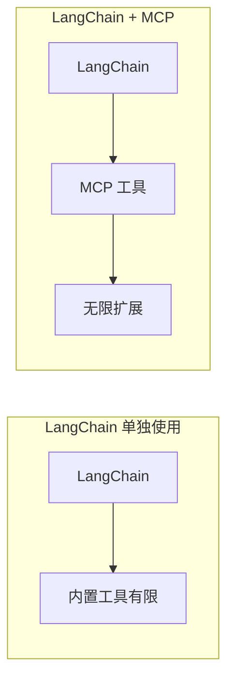
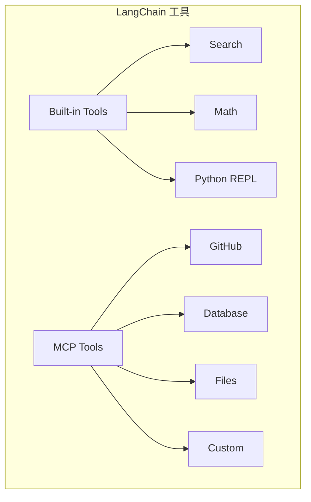

# 3.10 LangChain 集成：AI 框架的强强联合

> 本章将深入探讨 MCP 与 LangChain 的集成。我们会解释 LangChain 的核心概念、MCP 工具如何融入 LangChain 生态，以及如何构建强大的 AI 应用。

---

## 章节导航

| 阶段 | 内容 | 篇幅 |
|------|------|------|
| 问题引入 | 为什么需要集成 | 15% |
| 核心概念 | LangChain 架构 | 30% |
| 集成设计 | MCP 工具接入 | 25% |
| 实践指南 | 案例实践 | 20% |
| 总结 | 要点回顾 | 10% |

---

## 一、引子：LangChain 的魅力

### 1.1 LangChain 是什么？

```
┌─────────────────────────────────────────────────────────────────┐
│                    LangChain 定义                                      │
├─────────────────────────────────────────────────────────────────┤
│                                                                 │
│  LangChain 是一个开发 AI 应用的框架：                             │
│                                                                 │
│  ┌─────────────────────────────────────────────────────────┐   │
│  │  • 连接 LLM 与外部数据                                 │   │
│  │  • 让 LLM 调用工具                                    │   │
│  │  • 构建多步骤工作流                                    │   │
│  │  • 记忆上下文对话                                    │   │
│  └─────────────────────────────────────────────────────────┘   │
│                                                                 │
│  核心组件：                                                    │
│  ┌─────────────────────────────────────────────────────────┐   │
│  │  • LLM Interface: 连接各种 LLM                       │   │
│  │  • Prompt Templates: 提示词模板                       │   │
│  │  • Chains: 组合多个步骤                              │   │
│  │  • Agents: 自动决策和执行                            │   │
│  │  • Tools: 外部工具集成                               │   │
│  │  • Memory: 对话历史                                  │   │
│  │  • Indexes: 文档检索                                │   │
│  └─────────────────────────────────────────────────────────┘   │
│                                                                 │
└─────────────────────────────────────────────────────────────────┘
```

### 1.2 为什么要集成 MCP？



---

## 二、核心概念：LangChain 架构

### 2.1 Agent 工作原理

```
┌─────────────────────────────────────────────────────────────────┐
│                    LangChain Agent 流程                                  │
├─────────────────────────────────────────────────────────────────┤
│                                                                 │
│  1. 用户输入                                                   │
│  ┌─────────────────────────────────────────────────────────┐   │
│  │  "帮我查一下北京天气，然后给张三发邮件"                 │   │
│  └─────────────────────────────────────────────────────────┘   │
│                         │                                       │
│                         ▼                                       │
│  2. LLM 规划                                                  │
│  ┌─────────────────────────────────────────────────────────┐   │
│  │  • 任务分解: 查询天气 + 发送邮件                       │   │
│  │  • 确定工具: weather_tool + email_tool                │   │
│  └─────────────────────────────────────────────────────────┘   │
│                         │                                       │
│                         ▼                                       │
│  3. 工具执行                                                  │
│  ┌─────────────────────────────────────────────────────────┐   │
│  │  Step 1: 调用 weather_tool                            │   │
│  │  Step 2: 收到结果                                     │   │
│  │  Step 3: 调用 email_tool                             │   │
│  └─────────────────────────────────────────────────────────┘   │
│                         │                                       │
│                         ▼                                       │
│  4. 结果返回                                                  │
│  ┌─────────────────────────────────────────────────────────┐   │
│  │  "北京今天天气晴，26 度，已给张三发送邮件通知"         │   │
│  └─────────────────────────────────────────────────────────┘   │
│                                                                 │
└─────────────────────────────────────────────────────────────────┘
```

### 2.2 LangChain MCP 工具类型



---

## 三、集成设计：MCP 工具接入

### 3.1 集成方式

```python
# 方式1: 使用 MCP 服务器
from langchain.agents import load_tools
from mcp import Client

# 连接 MCP 服务器
mcp_client = Client("python mcp_server.py")

# 获取工具列表
tools = mcp_client.list_tools()

# 加载为 LangChain 工具
langchain_tools = load_tools_from_langchain(tools)
```

### 3.2 Agent 配置

```python
from langchain_openai import ChatOpenAI
from langchain.agents import AgentExecutor, create_openai_functions_agent
from langchain.tools import Tool

# 创建 LLM
llm = ChatOpenAI(model="gpt-4")

# 定义工具
tools = [
    Tool(
        name="github_mcp",
        func=lambda x: mcp_client.call_tool("github_search", {"query": x}),
        description="搜索 GitHub 仓库"
    ),
    Tool(
        name="database_mcp",
        func=lambda x: mcp_client.call_tool("db_query", {"sql": x}),
        description="查询数据库"
    ),
]

# 创建 Agent
agent = create_openai_functions_agent(llm, tools)
agent_executor = AgentExecutor(agent=agent, tools=tools)

# 执行
result = agent_executor.invoke({
    "input": "找出最近一周 GitHub 上最热门的 MCP 项目"
})
```

---

## 四、实践指南：案例实践

### 4.1 多工具协作案例

```
┌─────────────────────────────────────────────────────────────────┐
│                    多工具协作案例                                      │
├─────────────────────────────────────────────────────────────────┤
│                                                                 │
│  场景: 用户研究助手                                             │
│                                                                 │
│  流程:                                                         │
│  ┌─────────────────────────────────────────────────────────┐   │
│  │  1. 用户: "分析竞争对手 A 的产品策略"                │   │
│  │                                                          │   │
│  │  2. MCP 工具链调用:                                   │   │
│  │     • search_mcp → 搜索竞品信息                      │   │
│  │     • github_mcp → 获取 GitHub 数据                  │   │
│  │     • notion_mcp → 读取内部文档                       │   │
│  │                                                          │   │
│  │  3. LLM 分析                                          │   │
│  │     • 整合多源信息                                     │   │
│  │     • 生成分析报告                                     │   │
│  │                                                          │   │
│  │  4. 返回结果                                          │   │
│  │     • "竞品分析报告: ..."                            │   │
│  └─────────────────────────────────────────────────────────┘   │
│                                                                 │
└─────────────────────────────────────────────────────────────────┘
```

### 4.2 工具选择策略

```
┌─────────────────────────────────────────────────────────────────┐
│                    工具选择策略                                       │
├─────────────────────────────────────────────────────────────────┤
│                                                                 │
│  LLM 自动选择：                                                  │
│  ┌─────────────────────────────────────────────────────────┐   │
│  │  • Agent 根据任务自动选择工具                          │   │
│  │  • 基于工具描述理解能力                                │   │
│  │  • 适用于动态场景                                     │   │
│  └─────────────────────────────────────────────────────────┘   │
│                                                                 │
│  人工指定：                                                      │
│  ┌─────────────────────────────────────────────────────────┐   │
│  │  • Chain 中明确指定工具顺序                            │   │
│  │  • 适用于固定流程                                      │   │
│  │  • 更可控                                             │   │
│  └─────────────────────────────────────────────────────────┘   │
│                                                                 │
│  混合模式：                                                     │
│  ┌─────────────────────────────────────────────────────────┐   │
│  │  • 主流程人工指定                                      │   │
│  │  • 子步骤 LLM 自主选择                               │   │
│  │  • 平衡可控性和灵活性                                 │   │
│  └─────────────────────────────────────────────────────────┘   │
│                                                                 │
└─────────────────────────────────────────────────────────────────┘
```

---

## 五、本章小结

### 5.1 核心要点

```
┌─────────────────────────────────────────────────────────────────┐
│                    本章核心要点                                    │
├─────────────────────────────────────────────────────────────────┤
│                                                                 │
│  1. 设计理念                                                    │
│     • LangChain + MCP = 强大的 AI 应用开发                     │
│     • MCP 扩展 LangChain 的工具能力                            │
│                                                                 │
│  2. LangChain 核心                                            │
│     • Agent: 自动决策和执行                                    │
│     • Chains: 多步骤工作流                                    │
│     • Tools: 外部工具集成                                       │
│                                                                 │
│  3. 集成方式                                                   │
│     • MCP 服务器作为 LangChain 工具源                         │
│     • 支持动态工具发现                                          │
│                                                                 │
│  4. 最佳实践                                                   │
│     • 合理设计工具描述                                          │
│     • 选择合适的 Agent 类型                                      │
│     • 混合使用自动和人工指定                                   │
│                                                                 │
└─────────────────────────────────────────────────────────────────┘
```

### 5.2 知识检查

1. LangChain 的核心组件有哪些？
2. MCP 如何扩展 LangChain 的能力？
3. 工具选择有哪些策略？

---

## 六、延伸阅读

| 资源 | 说明 |
|------|------|
| LangChain 文档 | 官方文档 |
| LangChain Agents | Agent 指南 |

---

## 七、下一章预告

下一章我们将学习 **CrewAI 集成**，如何在多代理系统中使用 MCP 工具。

---

*本章贡献者：MCP Tutorial Team*
*版本：v3.0 出版级*
