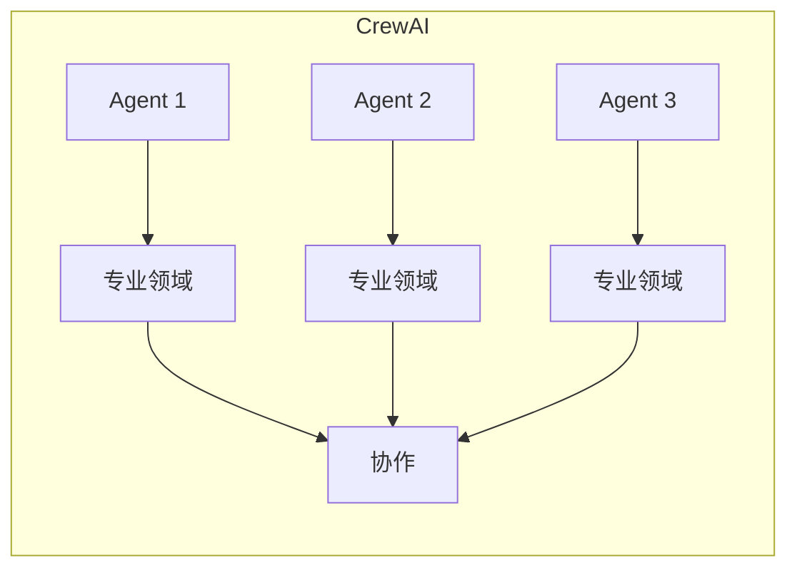
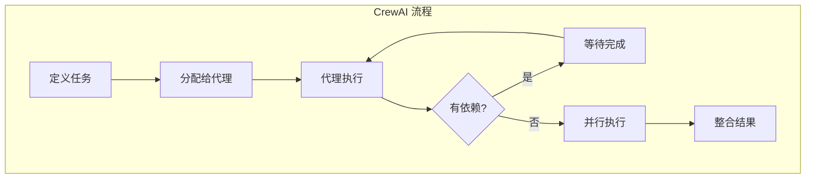

# 3.11 CrewAI 集成：多代理协作系统

> 本章将深入探讨 MCP 与 CrewAI 的集成。我们会解释 CrewAI 的多代理架构、MCP 工具如何融入团队协作，以及如何构建强大的多代理 AI 系统。

---

## 章节导航

| 阶段 | 内容 | 篇幅 |
|------|------|------|
| 问题引入 | 为什么需要多代理 | 15% |
| 核心概念 | CrewAI 架构 | 30% |
| 集成设计 | MCP 工具接入 | 25% |
| 实践指南 | 团队协作 | 20% |
| 总结 | 要点回顾 | 10% |

---

## 一、引子：单一代理的局限

### 1.1 单一代理的问题

```
┌─────────────────────────────────────────────────────────────────┐
│                    单一代理的局限                                      │
├─────────────────────────────────────────────────────────────────┤
│                                                                 │
│  问题：                                                        │
│  ┌─────────────────────────────────────────────────────────┐   │
│  │  • 单一代理难以处理复杂多任务                         │   │
│  │  • 无法并行处理多个子任务                             │   │
│  │  • 缺乏专业分工                                     │   │
│  │  • 难以实现团队协作                                 │   │
│  └─────────────────────────────────────────────────────────┘   │
│                                                                 │
│  解决：                                                        │
│  ┌─────────────────────────────────────────────────────────┐   │
│  │  ✓ 多代理系统：专业分工 + 协作                     │   │
│  │  ✓ 每个代理专注特定领域                             │   │
│  │  ✓ 并行处理提高效率                                 │   │
│  │  ✓ 模拟人类团队协作                                │   │
│  └─────────────────────────────────────────────────────────┘   │
│                                                                 │
└─────────────────────────────────────────────────────────────────┘
```

### 1.2 CrewAI 的价值



---

## 二、核心概念：CrewAI 架构

### 2.1 核心组件

```
┌─────────────────────────────────────────────────────────────────┐
│                    CrewAI 核心组件                                      │
├─────────────────────────────────────────────────────────────────┤
│                                                                 │
│  Agent (代理):                                                 │
│  ┌─────────────────────────────────────────────────────────┐   │
│  │  • 角色定义                                            │   │
│  │  • 目标和职责                                         │   │
│  │  • 工具集合                                           │   │
│  │  • 决策逻辑                                           │   │
│  └─────────────────────────────────────────────────────────┘   │
│                                                                 │
│  Task (任务):                                                  │
│  ┌─────────────────────────────────────────────────────────┐   │
│  │  • 任务描述                                           │   │
│  │  • 预期输出                                           │   │
│  │  │ 分配给哪个代理                                  │   │
│  │  • 依赖关系                                           │   │
│  └─────────────────────────────────────────────────────────┘   │
│                                                                 │
│  Crew (团队):                                                  │
│  ┌─────────────────────────────────────────────────────────┐   │
│  │  • 多个 Agent 集合                                    │   │
│  │  • 任务编排                                           │   │
│  │  • 协作流程                                           │   │
│  │  • 串行/并行执行                                     │   │
│  └─────────────────────────────────────────────────────────┘   │
│                                                                 │
└─────────────────────────────────────────────────────────────────┘
```

### 2.2 任务流程



---

## 三、集成设计：MCP 工具接入

### 3.1 工具接入方式

```python
from crewai import Agent, Task, Crew
from langchain.tools import Tool

# MCP 工具转为 LangChain Tool
def create_mcp_tool(mcp_client, tool_name: str, description: str):
    return Tool(
        name=tool_name,
        func=lambda x: mcp_client.call_tool(tool_name, x),
        description=description
    )

# 创建带 MCP 工具的代理
researcher = Agent(
    role="市场研究员",
    goal="收集和分析市场信息",
    backstory="你是一个专业市场研究员",
    tools=[
        create_mcp_tool(mcp_client, "search", "搜索信息"),
        create_mcp_tool(mcp_client, "github_search", "搜索代码")
    ]
)
```

### 3.2 多代理任务分配

```python
# 定义任务
task1 = Task(
    description="研究 MCP 技术的最新发展",
    agent=researcher,
    expected_output="研究报告"
)

task2 = Task(
    description="分析竞争对手的 MCP 实现",
    agent=analyst,
    expected_output="竞品分析报告"
)

task3 = Task(
    description="整合所有研究，生成战略建议",
    agent=strategist,
    expected_output="战略建议文档",
    context=[task1, task2]  # 依赖前面任务
)

# 创建团队
crew = Crew(
    agents=[researcher, analyst, strategist],
    tasks=[task1, task2, task3],
    process="hierarchical"  # 层级流程
)

# 执行
result = crew.kickoff()
```

---

## 四、实践指南：团队协作

### 4.1 代理角色设计

```
┌─────────────────────────────────────────────────────────────────┐
│                    典型团队配置                                      │
├─────────────────────────────────────────────────────────────────┤
│                                                                 │
│  市场分析团队:                                                  │
│  ┌─────────────────────────────────────────────────────────┐   │
│  │  • 市场研究员 (Researcher)                            │   │
│  │    - 工具: search_mcp, github_mcp                    │   │
│  │                                                          │   │
│  │  • 数据分析师 (Analyst)                                │   │
│  │    - 工具: database_mcp, analytics_mcp                │   │
│  │                                                          │   │
│  │  • 战略顾问 (Strategist)                              │   │
│  │    - 工具: report_mcp                                  │   │
│  └─────────────────────────────────────────────────────────┘   │
│                                                                 │
│  软件开发团队:                                                  │
│  ┌─────────────────────────────────────────────────────────┐   │
│  │  • 代码审查员 (Code Reviewer)                          │   │
│  │    - 工具: github_mcp                                  │   │
│  │                                                          │   │
│  │  • 测试工程师 (QA Engineer)                            │   │
│  │    - 工具: ci_mcp, test_mcp                          │   │
│  │                                                          │   │
│  │  • 运维工程师 (DevOps)                                 │   │
│  │    - 工具: deployment_mcp, monitoring_mcp             │   │
│  └─────────────────────────────────────────────────────────┘   │
│                                                                 │
└─────────────────────────────────────────────────────────────────┘
```

### 4.2 流程模式

```
┌─────────────────────────────────────────────────────────────────┐
│                    任务执行模式                                      │
├─────────────────────────────────────────────────────────────────┤
│                                                                 │
│  顺序模式 (Sequential):                                         │
│  ┌─────────────────────────────────────────────────────────┐   │
│  │  Task A → Task B → Task C                             │   │
│  │  • 任务有强依赖关系                                   │   │
│  │  • 需要前一个输出作为输入                            │   │
│  └─────────────────────────────────────────────────────────┘   │
│                                                                 │
│  并行模式 (Parallel):                                           │
│  ┌─────────────────────────────────────────────────────────┐   │
│  │  Task A ─┬─→ 整合                                    │   │
│  │  Task B ─┘                                              │   │
│  │  Task C ─┘                                              │   │
│  │  • 任务相互独立                                        │   │
│  │  • 效率最大化                                          │   │
│  └─────────────────────────────────────────────────────────┘   │
│                                                                 │
│  层级模式 (Hierarchical):                                       │
│  ┌─────────────────────────────────────────────────────────┐   │
│  │  Manager → Worker A → Worker B                         │   │
│  │  • 经理代理分配任务                                   │   │
│  │  • 工作代理执行具体任务                              │   │
│  │  • 适合复杂项目                                      │   │
│  └─────────────────────────────────────────────────────────┘   │
│                                                                 │
└─────────────────────────────────────────────────────────────────┘
```

---

## 五、本章小结

### 5.1 核心要点

```
┌─────────────────────────────────────────────────────────────────┐
│                    本章核心要点                                    │
├─────────────────────────────────────────────────────────────────┤
│                                                                 │
│  1. 设计理念                                                    │
│     • 多代理系统模拟人类团队协作                                 │
│     • 专业分工 + 协作提高效率                                    │
│                                                                 │
│  2. 核心组件                                                   │
│     • Agent: 代理角色                                          │
│     • Task: 任务定义                                           │
│     • Crew: 团队编排                                           │
│                                                                 │
│  3. MCP 集成                                                   │
│     • MCP 工具转为 LangChain Tool                              │
│     • 每个代理可拥有多个 MCP 工具                               │
│                                                                 │
│  4. 执行模式                                                   │
│     • 顺序: 强依赖                                             │
│     • 并行: 独立任务                                           │
│     • 层级: 管理-工作模式                                      │
│                                                                 │
└─────────────────────────────────────────────────────────────────┘
```

### 5.2 知识检查

1. CrewAI 的核心组件是什么？
2. MCP 工具如何接入 CrewAI？
3. 任务执行有哪些模式？

---

## 六、延伸阅读

| 资源 | 说明 |
|------|------|
| CrewAI 文档 | 官方文档 |

---

## 七、下一章预告

下一章我们将学习 **AutoGen 集成**，微软的多代理开发框架。

---

*本章贡献者：MCP Tutorial Team*
*版本：v3.0 出版级*
