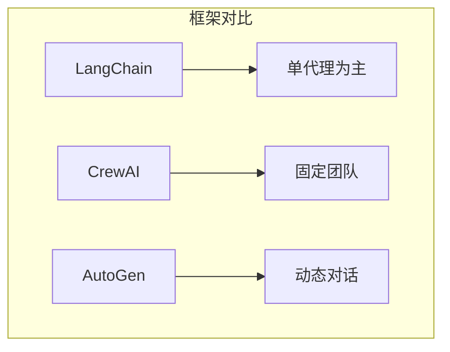
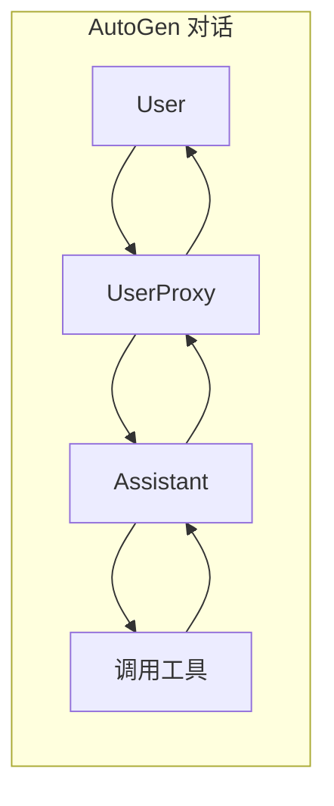

# 3.12 AutoGen 集成：微软的多代理框架

> 本章将深入探讨 MCP 与 AutoGen 的集成。我们会解释 AutoGen 的对话式代理架构、MCP 工具如何融入，以及如何构建复杂的自动化工作流。

---

## 章节导航

| 阶段 | 内容 | 篇幅 |
|------|------|------|
| 问题引入 | AutoGen 的特点 | 15% |
| 核心概念 | AutoGen 架构 | 30% |
| 集成设计 | MCP 工具接入 | 25% |
| 实践指南 | 工作流构建 | 20% |
| 总结 | 要点回顾 | 10% |

---

## 一、引子：AutoGen 的独特之处

### 1.1 AutoGen 是什么？

```
┌─────────────────────────────────────────────────────────────────┐
│                    AutoGen 定义                                      │
├─────────────────────────────────────────────────────────────────┤
│                                                                 │
│  微软开发的多代理开发框架：                                       │
│                                                                 │
│  ┌─────────────────────────────────────────────────────────┐   │
│  │  • 对话式代理 (Conversational Agents)                 │   │
│  │  • 代理间自动通信                                      │   │
│  │  • 灵活的工作流编排                                    │   │
│  │  • 支持人类参与                                        │   │
│  └─────────────────────────────────────────────────────────┘   │
│                                                                 │
│  核心特点：                                                    │
│  ┌─────────────────────────────────────────────────────────┐   │
│  │  ✓ 自动代理对话，无需手动 orchestrator                 │   │
│  │  ✓ 支持多种代理类型                                    │   │
│  │  ✓ 灵活的工具集成                                      │   │
│  │  ✓ 人类在环 (Human-in-the-loop)                       │   │
│  └─────────────────────────────────────────────────────────┘   │
│                                                                 │
└─────────────────────────────────────────────────────────────────┘
```

### 1.2 AutoGen vs CrewAI vs LangChain



---

## 二、核心概念：AutoGen 架构

### 2.1 代理类型

```
┌─────────────────────────────────────────────────────────────────┐
│                    AutoGen 代理类型                                      │
├─────────────────────────────────────────────────────────────────┤
│                                                                 │
│  AssistantAgent:                                                  │
│  ┌─────────────────────────────────────────────────────────┐   │
│  │  • LLM 驱动的对话代理                                 │   │
│  │  • 可以调用工具                                       │   │
│  │  • 自动回复消息                                       │   │
│  └─────────────────────────────────────────────────────────┘   │
│                                                                 │
│  UserProxyAgent:                                                 │
│  ┌─────────────────────────────────────────────────────────┐   │
│  │  • 模拟用户输入                                       │   │
│  │  • 可以执行代码                                       │   │
│  │  • 触发下一步操作                                     │   │
│  └─────────────────────────────────────────────────────────┘   │
│                                                                 │
│  GroupChat:                                                      │
│  ┌─────────────────────────────────────────────────────────┐   │
│  │  • 多代理群聊                                         │   │
│  │  • 自动路由消息                                       │   │
│  │  • 支持发言顺序管理                                   │   │
│  └─────────────────────────────────────────────────────────┘   │
│                                                                 │
└─────────────────────────────────────────────────────────────────┘
```

### 2.2 对话流程



---

## 三、集成设计：MCP 工具接入

### 3.1 工具注册

```python
from autogen import AssistantAgent, UserProxyAgent

# 定义 MCP 工具函数
def search_github(query: str) -> dict:
    """搜索 GitHub"""
    return mcp_client.call_tool("github_search", {"query": query})

def query_database(sql: str) -> dict:
    """查询数据库"""
    return mcp_client.call_tool("db_query", {"sql": sql})

# 创建代理
assistant = AssistantAgent(
    name="assistant",
    llm_config={
        "model": "gpt-4",
        "tools": [
            {
                "type": "function",
                "function": {
                    "name": "search_github",
                    "description": "搜索 GitHub 仓库",
                    "parameters": {
                        "type": "object",
                        "properties": {
                            "query": {"type": "string"}
                        }
                    }
                }
            },
            {
                "type": "function",
                "function": {
                    "name": "query_database",
                    "description": "执行 SQL 查询",
                    "parameters": {
                        "type": "object",
                        "properties": {
                            "sql": {"type": "string"}
                        }
                    }
                }
            }
        ]
    }
)
```

### 3.2 多代理协作

```python
from autogen import GroupChat, GroupChatManager

# 创建多个代理
researcher = AssistantAgent(name="researcher", ...)
analyst = AssistantAgent(name="analyst", ...)
reporter = AssistantAgent(name="reporter", ...)

# 创建群聊
groupchat = GroupChat(
    agents=[researcher, analyst, reporter],
    messages=[],
    max_round=10
)

# 创建管理器
manager = GroupChatManager(groupchat=groupchat)

# 启动对话
user_proxy.initiate_chat(
    manager,
    message="分析竞品的最新动态并生成报告"
)
```

---

## 四、实践指南：工作流构建

### 4.1 人类在环模式

```
┌─────────────────────────────────────────────────────────────────┐
│                    Human-in-the-loop 模式                                   │
├─────────────────────────────────────────────────────────────────┤
│                                                                 │
│  场景: 需要人类确认的操作                                       │
│                                                                 │
│  ┌─────────────────────────────────────────────────────────┐   │
│  │  1. Agent 提出建议                                     │   │
│  │  2. 暂停等待人类确认                                  │   │
│  │  3. 人类: 批准/拒绝/修改                            │   │
│  │  4. Agent 执行或调整                                 │   │
│  └─────────────────────────────────────────────────────────┘   │
│                                                                 │
│  代码示例:                                                      │
│  ┌─────────────────────────────────────────────────────────┐   │
│  │  user_proxy = UserProxyAgent(                         │   │
│  │      human_input_mode="ALWAYS"  # 总是需要确认      │   │
│  │  )                                                    │   │
│  └─────────────────────────────────────────────────────────┘   │
│                                                                 │
│  应用场景:                                                     │
│  ┌─────────────────────────────────────────────────────────┐   │
│  │  • 执行敏感操作前需要确认                             │   │
│  │  • 需要人类提供额外信息                               │   │
│  │  • 复杂决策需要人工审核                              │   │
│  └─────────────────────────────────────────────────────────┘   │
│                                                                 │
└─────────────────────────────────────────────────────────────────┘
```

### 4.2 自动化工作流

```
┌─────────────────────────────────────────────────────────────────┐
│                    自动化工作流案例                                      │
├─────────────────────────────────────────────────────────────────┤
│                                                                 │
│  场景: 代码审查自动化                                            │
│                                                                 │
│  流程:                                                         │
│  ┌─────────────────────────────────────────────────────────┐   │
│  │  1. UserProxy: 收到 PR 通知                          │   │
│  │                                                          │   │
│  │  2. CodeReviewer: 分析代码                             │   │
│  │     - 工具: github_mcp (获取 PR)                    │   │
│  │                                                          │   │
│  │  3. SecurityExpert: 检查安全                           │   │
│  │     - 工具: security_scan_mcp                         │   │
│  │                                                          │   │
│  │  4. ReportGenerator: 生成报告                         │   │
│  │     - 工具: notification_mcp (通知)                  │   │
│  │                                                          │   │
│  │  5. Human: 审核通过后合并                             │   │
│  └─────────────────────────────────────────────────────────┘   │
│                                                                 │
└─────────────────────────────────────────────────────────────────┘
```

---

## 五、本章小结

### 5.1 核心要点

```
┌─────────────────────────────────────────────────────────────────┐
│                    本章核心要点                                    │
├─────────────────────────────────────────────────────────────────┤
│                                                                 │
│  1. 设计理念                                                    │
│     • AutoGen 对话式多代理框架                                 │
│     • 代理间自动通信                                           │
│     • 支持人类在环                                             │
│                                                                 │
│  2. 核心组件                                                   │
│     • AssistantAgent: LLM 驱动                                 │
│     • UserProxyAgent: 用户代理                                │
│     • GroupChat: 群聊协作                                     │
│                                                                 │
│  3. MCP 集成                                                   │
│     • 工具注册到代理配置                                       │
│     • 支持函数调用格式                                         │
│                                                                 │
│  4. 工作流模式                                                 │
│     • 人类在环: 需要确认时暂停                                 │
│     • 自动化: 无人干预执行                                     │
│                                                                 │
└─────────────────────────────────────────────────────────────────┘
```

### 5.2 知识检查

1. AutoGen 和 CrewAI 有什么区别？
2. 人类在环模式是什么？
3. 如何在 AutoGen 中使用 MCP 工具？

---

## 六、延伸阅读

| 资源 | 说明 |
|------|------|
| AutoGen 文档 | 官方文档 |

---

## 七、下一章预告

下一章我们将学习 **LlamaIndex 集成**，如何在 RAG 应用中使用 MCP 工具。

---

*本章贡献者：MCP Tutorial Team*
*版本：v3.0 出版级*
