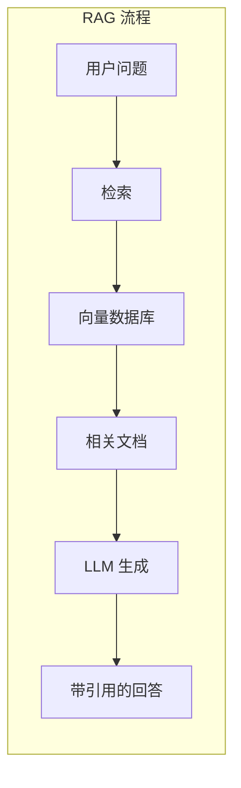
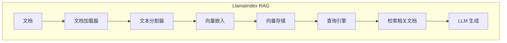

# 3.13 LlamaIndex 集成：RAG 的最佳拍档

> 本章将深入探讨 MCP 与 LlamaIndex 的集成。我们会解释 LlamaIndex 的 RAG 架构、MCP 工具如何增强检索能力，以及如何构建智能知识库应用。

---

## 章节导航

| 阶段 | 内容 | 篇幅 |
|------|------|------|
| 问题引入 | RAG 的价值 | 15% |
| 核心概念 | LlamaIndex 架构 | 30% |
| 集成设计 | MCP 工具增强 | 25% |
| 实践指南 | RAG 应用构建 | 20% |
| 总结 | 要点回顾 | 10% |

---

## 一、引子：LLM 的知识盲区

### 1.1 LLM 的局限性

```
┌─────────────────────────────────────────────────────────────────┐
│                    LLM 知识问题                                       │
├─────────────────────────────────────────────────────────────────┤
│                                                                 │
│  问题：                                                        │
│  ┌─────────────────────────────────────────────────────────┐   │
│  │  • 训练数据有截止日期                                  │   │
│  │  • 无法访问私有/内部文档                               │   │
│  │  • 长文档处理困难                                     │   │
│  │  • 可能产生幻觉                                        │   │
│  └─────────────────────────────────────────────────────────┘   │
│                                                                 │
│  解决: RAG (检索增强生成)                                      │
│  ┌─────────────────────────────────────────────────────────┐   │
│  │  ✓ 实时检索最新信息                                   │   │
│  │  ✓ 访问私有知识库                                     │   │
│  │  ✓ 提供事实依据，减少幻觉                             │   │
│  └─────────────────────────────────────────────────────────┘   │
│                                                                 │
└─────────────────────────────────────────────────────────────────┘
```

### 1.2 RAG 工作流程



---

## 二、核心概念：LlamaIndex 架构

### 2.1 核心组件

```
┌─────────────────────────────────────────────────────────────────┐
│                    LlamaIndex 核心组件                                    │
├─────────────────────────────────────────────────────────────────┤
│                                                                 │
│  数据连接器 (Connectors):                                       │
│  ┌─────────────────────────────────────────────────────────┐   │
│  │  • 读取各种数据源                                      │   │
│  │  • PDF、Markdown、Notion、Slack 等                    │   │
│  └─────────────────────────────────────────────────────────┘   │
│                                                                 │
│  索引 (Indexes):                                                │
│  ┌─────────────────────────────────────────────────────────┐   │
│  │  • 向量化数据，构建检索索引                           │   │
│  │  • 支持多种索引类型                                  │   │
│  └─────────────────────────────────────────────────────────┘   │
│                                                                 │
│  查询引擎 (Query Engine):                                       │
│  ┌─────────────────────────────────────────────────────────┐   │
│  │  • 接收问题，检索相关文档                            │   │
│  │  • 组合上下文，生成回答                              │   │
│  └─────────────────────────────────────────────────────────┘   │
│                                                                 │
│  可观测性 (Observability):                                      │
│  ┌─────────────────────────────────────────────────────────┐   │
│  │  • 追踪查询过程                                       │   │
│  │  • 评估检索效果                                      │   │
│  └─────────────────────────────────────────────────────────┘   │
│                                                                 │
└─────────────────────────────────────────────────────────────────┘
```

### 2.2 RAG 流程详解



---

## 三、集成设计：MCP 工具增强

### 3.1 MCP 增强 RAG

```python
from llama_index import VectorStoreIndex
from llama_index.tools import QueryEngineTool

# 使用 MCP 工具作为数据源
def create_mcp_data_loader(mcp_client):
    """MCP 数据加载工具"""
    def load_data():
        results = []
        # 通过 MCP 获取数据
        files = mcp_client.call_tool("list_files", {"path": "/data"})
        for file in files:
            content = mcp_client.call_tool("read_file", {"path": file})
            results.append(content)
        return results
    return load_data

# 创建索引
loader = create_mcp_data_loader(mcp_client)
documents = loader()

index = VectorStoreIndex.from_documents(documents)
query_engine = index.as_query_engine()
```

### 3.2 MCP 工具作为查询工具

```python
from llama_index.tools import ToolMetadata

# MCP 工具转为 LlamaIndex 工具
query_engine_tool = QueryEngineTool(
    query_engine=query_engine,
    metadata=ToolMetadata(
        name="company_knowledge",
        description="查询公司内部知识库"
    )
)

# 结合其他 MCP 工具
all_tools = [
    query_engine_tool,
    Tool.from_langchain(mcp_github_tool),
    Tool.from_langchain(mcp_database_tool)
]
```

---

## 四、实践指南：RAG 应用构建

### 4.1 典型 RAG 架构

```
┌─────────────────────────────────────────────────────────────────┐
│                    企业知识库 RAG 架构                                   │
├─────────────────────────────────────────────────────────────────┤
│                                                                 │
│  数据源层:                                                      │
│  ┌─────────────────────────────────────────────────────────┐   │
│  │  • Notion (文档)                                       │   │
│  │  • Slack (对话)                                       │   │
│  │  • GitHub (代码)                                       │   │
│  │  • 数据库 (结构化数据)                                 │   │
│  └─────────────────────────────────────────────────────────┘   │
│                         │                                       │
│                         ▼                                       │
│  MCP 工具层:                                                    │
│  ┌─────────────────────────────────────────────────────────┐   │
│  │  • 通过 MCP 工具访问各数据源                          │   │
│  │  • 统一的数据接口                                     │   │
│  └─────────────────────────────────────────────────────────┘   │
│                         │                                       │
│                         ▼                                       │
│  RAG 引擎:                                                      │
│  ┌─────────────────────────────────────────────────────────┐   │
│  │  • 文档加载 → 分块 → 嵌入 → 存储                   │   │
│  │  • 查询 → 检索 → 生成                                 │   │
│  └─────────────────────────────────────────────────────────┘   │
│                         │                                       │
│                         ▼                                       │
│  应用层:                                                        │
│  ┌─────────────────────────────────────────────────────────┐   │
│  │  • 内部知识问答                                        │   │
│  │  • 客服助手                                           │   │
│  │  • 代码搜索                                            │   │
│  └─────────────────────────────────────────────────────────┘   │
│                                                                 │
└─────────────────────────────────────────────────────────────────┘
```

### 4.2 检索优化策略

```
┌─────────────────────────────────────────────────────────────────┐
│                    RAG 优化技巧                                       │
├─────────────────────────────────────────────────────────────────┤
│                                                                 │
│  1. 文档分块:                                                  │
│  ┌─────────────────────────────────────────────────────────┐   │
│  │  • 固定大小分块: 512-1024 tokens                      │   │
│  │  • 语义分块: 按段落/主题分割                        │   │
│  │  • 递归分块: 尝试大块，失败则缩小                  │   │
│  └─────────────────────────────────────────────────────────┘   │
│                                                                 │
│  2. 向量优化:                                                  │
│  ┌─────────────────────────────────────────────────────────┐   │
│  │  • 选择合适的嵌入模型                                 │   │
│  │  • 考虑使用混合搜索 (向量 + 关键词)                │   │
│  │  • 元数据过滤                                         │   │
│  └─────────────────────────────────────────────────────────┘   │
│                                                                 │
│  3. 检索优化:                                                  │
│  ┌─────────────────────────────────────────────────────────┐   │
│  │  • reranking: 重新排序结果                           │   │
│  │  • 多查询: 生成多个查询变体                          │   │
│  │  • 子查询: 分解复杂问题                              │   │
│  └─────────────────────────────────────────────────────────┘   │
│                                                                 │
└─────────────────────────────────────────────────────────────────┘
```

---

## 五、本章小结

### 5.1 核心要点

```
┌─────────────────────────────────────────────────────────────────┐
│                    本章核心要点                                    │
├─────────────────────────────────────────────────────────────────┤
│                                                                 │
│  1. 设计理念                                                    │
│     • RAG 解决 LLM 知识过时/不完整问题                          │
│     • 检索 + 生成模式                                          │
│                                                                 │
│  2. LlamaIndex 架构                                           │
│     • 数据连接器: 读取多源数据                                 │
│     • 索引: 向量化存储                                        │
│     • 查询引擎: 检索 + 生成                                    │
│                                                                 │
│  3. MCP 集成                                                   │
│     • MCP 工具作为数据源                                       │
│     • MCP 工具增强查询能力                                     │
│                                                                 │
│  4. 优化策略                                                   │
│     • 文档分块                                                 │
│     • 向量优化                                                 │
│     • 检索优化                                                 │
│                                                                 │
└─────────────────────────────────────────────────────────────────┘
```

### 5.2 知识检查

1. RAG 是什么？解决什么问题？
2. LlamaIndex 的核心组件有哪些？
3. 如何用 MCP 增强 RAG？

---

## 六、延伸阅读

| 资源 | 说明 |
|------|------|
| LlamaIndex 文档 | 官方文档 |

---

## 七、下一章预告

下一章我们将学习 **MCP vs A2A 协议对比**，了解 MCP 与 Google A2A 协议的区别。

---

*本章贡献者：MCP Tutorial Team*
*版本：v3.0 出版级*
