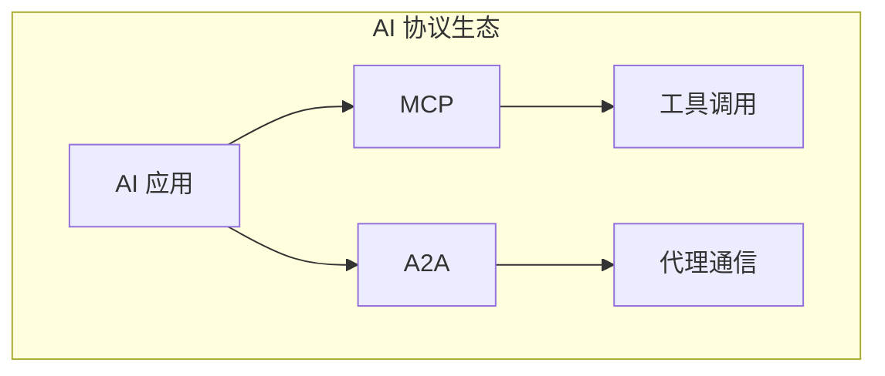
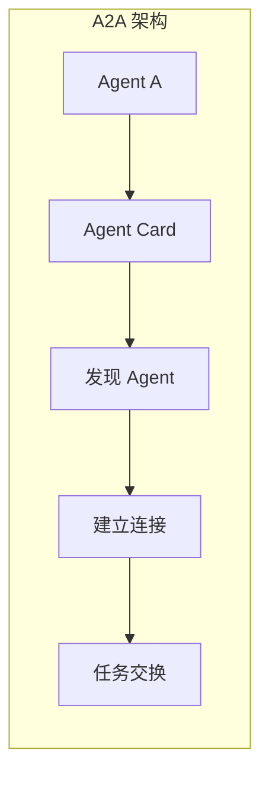
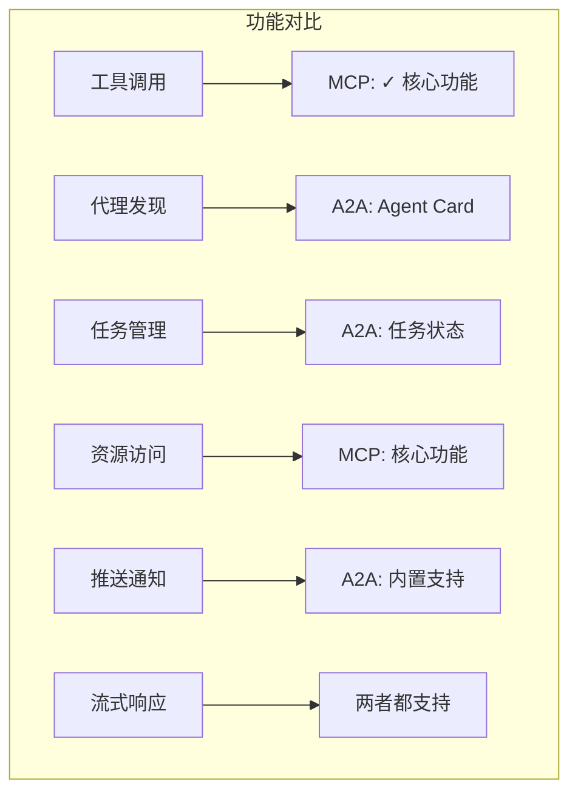

# 3.14 MCP vs A2A：两大 AI 协议的深度对比

> 本章将深入对比 MCP 和 Google A2A 两大 AI 协议。我们会解释两者的设计理念、功能差异，以及如何根据场景选择合适的协议。

---

## 章节导航

| 阶段 | 内容 | 篇幅 |
|------|------|------|
| 问题引入 | 协议生态 | 15% |
| 核心概念 | A2A 协议解析 | 30% |
| 对比分析 | 全面对比 | 25% |
| 选择指南 | 场景选择 | 20% |
| 总结 | 要点回顾 | 10% |

---

## 一、引子：AI 协议的崛起

### 1.1 为什么需要 AI 协议？

```
┌─────────────────────────────────────────────────────────────────┐
│                    AI 协议的价值                                       │
├─────────────────────────────────────────────────────────────────┤
│                                                                 │
│  问题：                                                        │
│  ┌─────────────────────────────────────────────────────────┐   │
│  │  • 每个 AI 工具需要独立集成                           │   │
│  │  • 无法互联互通                                      │   │
│  │  • 重复开发                                          │   │
│  └─────────────────────────────────────────────────────────┘   │
│                                                                 │
│  解决: 标准化协议                                              │
│  ┌─────────────────────────────────────────────────────────┐   │
│  │  ✓ 统一接口，任何 AI 都能调用                        │   │
│  │  ✓ 工具/服务可复用                                    │   │
│  │  ✓ 生态互联                                        │   │
│  └─────────────────────────────────────────────────────────┘   │
│                                                                 │
│  主要协议:                                                      │
│  ┌─────────────────────────────────────────────────────────┐   │
│  │  • MCP (Model Context Protocol) - Anthropic          │   │
│  │  • A2A (Agent to Agent) - Google                     │   │
│  └─────────────────────────────────────────────────────────┘   │
│                                                                 │
└─────────────────────────────────────────────────────────────────┘
```

### 1.2 两大协议的关系



---

## 二、核心概念：A2A 协议解析

### 2.1 A2A 是什么？

```
┌─────────────────────────────────────────────────────────────────┐
│                    A2A 协议定义                                      │
├─────────────────────────────────────────────────────────────────┤
│                                                                 │
│  Google 提出的代理间通信协议：                                    │
│                                                                 │
│  ┌─────────────────────────────────────────────────────────┐   │
│  │  • Agent to Agent 通信                                │   │
│  │  • 基于 HTTP + JSON                                   │   │
│  │  • 支持长任务和流式响应                               │   │
│  │  • 内置任务状态管理                                   │   │
│  └─────────────────────────────────────────────────────────┘   │
│                                                                 │
│  核心特性:                                                      │
│  ┌─────────────────────────────────────────────────────────┐   │
│  │  ✓ Agent Card: 代理能力描述                          │   │
│  │  ✓ Task: 任务生命周期管理                           │   │
│  │  ✓ Message: 消息传递                                 │   │
│  │  ✓ Push Notifications: 推送通知                       │   │
│  └─────────────────────────────────────────────────────────┘   │
│                                                                 │
└─────────────────────────────────────────────────────────────────┘
```

### 2.2 A2A 核心概念



---

## 三、对比分析：全面对比

### 3.1 核心设计对比

```
┌─────────────────────────────────────────────────────────────────┐
│                    MCP vs A2A 核心对比                                   │
├─────────────────────────────────────────────────────────────────┤
│                                                                 │
│  设计目标:                                                      │
│  ┌──────────────────────┬──────────────────────────────────┐   │
│  │       MCP            │           A2A                    │   │
│  ├──────────────────────┼──────────────────────────────────┤   │
│  │ AI → 工具/资源      │     Agent ↔ Agent               │   │
│  │ 工具调用协议        │     代理通信协议                 │   │
│  │ 单向/同步           │     双向/异步                   │   │
│  └──────────────────────┴──────────────────────────────────┘   │
│                                                                 │
│  通信模式:                                                      │
│  ┌──────────────────────┬──────────────────────────────────┐   │
│  │       MCP            │           A2A                    │   │
│  ├──────────────────────┼──────────────────────────────────┤   │
│  │ JSON-RPC             │   HTTP + JSON-RPC              │   │
│  │ 请求-响应            │   支持长任务                     │   │
│  │ Stdio/HTTP/SSE      │   Streaming/推送                │   │
│  └──────────────────────┴──────────────────────────────────┘   │
│                                                                 │
│  能力模型:                                                      │
│  ┌──────────────────────┬──────────────────────────────────┐   │
│  │       MCP            │           A2A                    │   │
│  ├──────────────────────┼──────────────────────────────────┤   │
│  │ Tools                │   Agent Capabilities             │   │
│  │ Resources            │   Skills                        │   │
│  │ Prompts             │   Agent Cards                   │   │
│  │ (服务器提供)         │   (代理描述)                    │   │
│  └──────────────────────┴──────────────────────────────────┘   │
│                                                                 │
└─────────────────────────────────────────────────────────────────┘
```

### 3.2 功能详细对比



---

## 四、选择指南：场景选择

### 4.1 何时选择 MCP？

```
┌─────────────────────────────────────────────────────────────────┐
│                    MCP 适用场景                                      │
├─────────────────────────────────────────────────────────────────┤
│                                                                 │
│  场景:                                                          │
│  ┌─────────────────────────────────────────────────────────┐   │
│  │  ✓ AI 需要调用外部工具                                  │   │
│  │  ✓ 访问本地/远程资源                                   │   │
│  │  ✓ 结构化数据交互                                      │   │
│  │  ✓ 简单请求-响应模式                                   │   │
│  └─────────────────────────────────────────────────────────┘   │
│                                                                 │
│  典型应用:                                                      │
│  ┌─────────────────────────────────────────────────────────┐   │
│  │  • Claude Desktop 集成 GitHub                         │   │
│  │  • AI 助手调用数据库                                   │   │
│  │  • 文件系统操作                                        │   │
│  │  • API 调用封装                                        │   │
│  └─────────────────────────────────────────────────────────┘   │
│                                                                 │
└─────────────────────────────────────────────────────────────────┘
```

### 4.2 何时选择 A2A？

```
┌─────────────────────────────────────────────────────────────────┐
│                    A2A 适用场景                                      │
├─────────────────────────────────────────────────────────────────┤
│                                                                 │
│  场景:                                                          │
│  ┌─────────────────────────────────────────────────────────┐   │
│  │  ✓ 多代理协作                                          │   │
│  │  ✓ 代理间任务分发                                     │   │
│  │  ✓ 长时任务和进度追踪                                 │   │
│  │  ✓ 异步任务处理                                        │   │
│  └─────────────────────────────────────────────────────────┘   │
│                                                                 │
│  典型应用:                                                      │
│  ┌─────────────────────────────────────────────────────────┐   │
│  │  • 代理团队协作完成复杂任务                            │   │
│  │  • 工作流编排                                          │   │
│  │  • 多步骤研究任务                                      │   │
│  │  • 分布式代理系统                                      │   │
│  └─────────────────────────────────────────────────────────┘   │
│                                                                 │
└─────────────────────────────────────────────────────────────────┘
```

### 4.3 可以同时使用

```
┌─────────────────────────────────────────────────────────────────┐
│                    MCP + A2A 组合                                         │
├─────────────────────────────────────────────────────────────────┤
│                                                                 │
│  架构:                                                          │
│  ┌─────────────────────────────────────────────────────────┐   │
│  │                                                         │   │
│  │      A2A (代理间通信)                                  │   │
│  │           │                                            │   │
│  │    ┌──────┴──────┐                                    │   │
│  │    │             │                                    │   │
│  │  Agent A       Agent B                                │   │
│  │    │             │                                    │   │
│  │    └──────┬──────┘                                    │   │
│  │           │                                            │   │
│  │      MCP (工具调用)                                    │   │
│  │                                                         │   │
│  └─────────────────────────────────────────────────────────┘   │
│                                                                 │
│  说明:                                                          │
│  ┌─────────────────────────────────────────────────────────┐   │
│  │  • A2A 处理代理间通信                                  │   │
│  │  • MCP 处理工具调用                                     │   │
│  │  • 两者互补，不冲突                                    │   │
│  └─────────────────────────────────────────────────────────┘   │
│                                                                 │
└─────────────────────────────────────────────────────────────────┘
```

---

## 五、本章小结

### 5.1 核心要点

```
┌─────────────────────────────────────────────────────────────────┐
│                    本章核心要点                                    │
├─────────────────────────────────────────────────────────────────┤
│                                                                 │
│  1. 协议定位                                                    │
│     • MCP: AI → 工具/资源调用                                  │
│     • A2A: Agent ↔ Agent 通信                                  │
│                                                                 │
│  2. 设计差异                                                    │
│     • MCP: 简单请求-响应                                        │
│     • A2A: 支持长任务、推送、流式                               │
│                                                                 │
│  3. 选择原则                                                    │
│     • 工具调用 → MCP                                            │
│     • 多代理协作 → A2A                                          │
│     • 可以组合使用                                               │
│                                                                 │
│  4. 生态趋势                                                    │
│     • 两个协议互补                                               │
│     • 共同推动 AI 互联互通                                      │
│                                                                 │
└─────────────────────────────────────────────────────────────────┘
```

### 5.2 知识检查

1. MCP 和 A2A 的核心设计目标有什么区别？
2. 什么场景适合使用 MCP？
3. MCP 和 A2A 可以组合使用吗？

---

## 六、延伸阅读

| 资源 | 说明 |
|------|------|
| MCP 规范 | Anthropic 官方 |
| A2A 协议 | Google 官方 |

---

## 七、下一章预告

下一章我们将学习 **MCP vs Agent vs Skills 三大扩展机制对比**，了解 MCP、通用 AI Agent 和 Claude Code Skills 的区别。

---

*本章贡献者：MCP Tutorial Team*
*版本：v3.0 出版级*
