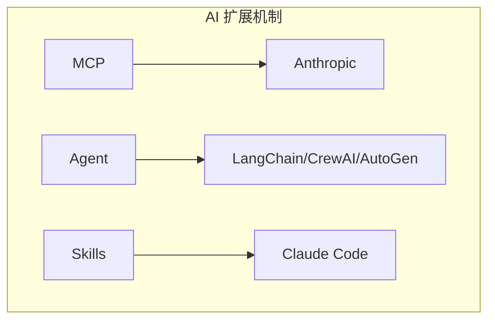
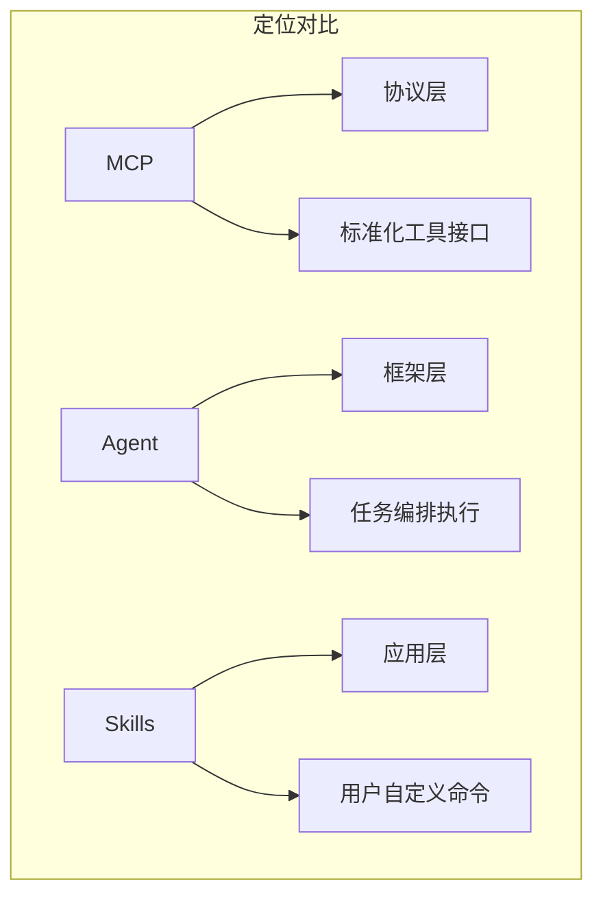

# 3.15 MCP vs Agent vs Skills：三大 AI 扩展机制的深度对比

> 本章将深入对比 MCP、通用 AI Agent 和 Claude Code Skills 三大扩展机制。我们会解释它们的设计理念、功能差异，以及如何根据场景选择合适的方案。

---

## 章节导航

| 阶段 | 内容 | 篇幅 |
|------|------|------|
| 问题引入 | 为什么需要扩展机制 | 10% |
| 核心概念 | 三种机制解析 | 25% |
| 对比分析 | 全面对比（含提示词对比）| 30% |
| 选择指南 | 场景选择 | 25% |
| 总结 | 要点回顾 | 10% |

---

## 一、引子：AI 扩展的三大流派

### 1.1 为什么需要扩展机制？

```
┌─────────────────────────────────────────────────────────────────┐
│                    AI 扩展的必要性                                       │
├─────────────────────────────────────────────────────────────────┤
│                                                                 │
│  问题：                                                        │
│  ┌─────────────────────────────────────────────────────────┐   │
│  │  • AI 模型本身能力有限                                  │   │
│  │  • 无法直接访问外部世界                                │   │
│  │  • 缺乏执行具体任务的能力                             │   │
│  └─────────────────────────────────────────────────────────┘   │
│                                                                 │
│  解决: 扩展机制                                               │
│  ┌─────────────────────────────────────────────────────────┐   │
│  │  ✓ 赋予 AI 调用工具的能力                              │   │
│  │  ✓ 让 AI 能够执行多步骤任务                            │   │
│  │  ✓ 复用已有能力和经验                                 │   │
│  └─────────────────────────────────────────────────────────┘   │
│                                                                 │
└─────────────────────────────────────────────────────────────────┘
```

### 1.2 三大扩展机制



---

## 二、核心概念：三种机制解析

### 2.1 MCP (Model Context Protocol)

```
┌─────────────────────────────────────────────────────────────────┐
│                    MCP 核心概念                                       │
├─────────────────────────────────────────────────────────────────┤
│                                                                 │
│  定义：                                                         │
│  ┌─────────────────────────────────────────────────────────┐   │
│  │  模型上下文协议 - AI 与外部工具的标准化连接方式           │   │
│  └─────────────────────────────────────────────────────────┘   │
│                                                                 │
│  设计理念：                                                     │
│  ┌─────────────────────────────────────────────────────────┐   │
│  │  • 工具/资源/提示的标准化描述                          │   │
│  │  • 服务器提供能力，客户端发现和使用                     │   │
│  │  • 协议层抽象，与传输层解耦                           │   │
│  └─────────────────────────────────────────────────────────┘   │
│                                                                 │
│  核心组件：                                                    │
│  ┌─────────────────────────────────────────────────────────┐   │
│  │  • Tools: 可调用的函数                                 │   │
│  │  • Resources: 可访问的数据                             │   │
│  │  • Prompts: 预定义模板                                │   │
│  │  • Sampling: 客户端采样能力                           │   │
│  └─────────────────────────────────────────────────────────┘   │
│                                                                 │
│  协议特点：                                                    │
│  ┌─────────────────────────────────────────────────────────┐   │
│  │  • JSON-RPC 2.0 消息格式                              │   │
│  │  • Stdio/HTTP/SSE 传输                                │   │
│  │  • 请求-响应模式                                      │   │
│  └─────────────────────────────────────────────────────────┘   │
│                                                                 │
└─────────────────────────────────────────────────────────────────┘
```

### 2.2 Agent (AI Agent)

```
┌─────────────────────────────────────────────────────────────────┐
│                    AI Agent 核心概念                                   │
├─────────────────────────────────────────────────────────────────┤
│                                                                 │
│  定义：                                                         │
│  ┌─────────────────────────────────────────────────────────┐   │
│  │  AI 代理 - 能够自主规划、执行复杂任务的智能实体          │   │
│  └─────────────────────────────────────────────────────────┘   │
│                                                                 │
│  设计理念：                                                     │
│  ┌─────────────────────────────────────────────────────────┐   │
│  │  • 自主决策和执行                                       │   │
│  │  • 多步骤任务分解                                       │   │
│  │  • 使用工具完成任务                                     │   │
│  │  • 反思和调整能力                                       │   │
│  └─────────────────────────────────────────────────────────┘   │
│                                                                 │
│  核心能力：                                                    │
│  ┌─────────────────────────────────────────────────────────┐   │
│  │  • Planning: 任务分解和规划                            │   │
│  │  • Action: 执行具体操作                                │   │
│  │  • Observation: 观察结果                               │   │
│  │  • Reflection: 反思和调整                             │   │
│  └─────────────────────────────────────────────────────────┘   │
│                                                                 │
│  典型框架：                                                    │
│  ┌─────────────────────────────────────────────────────────┐   │
│  │  • LangChain Agents                                    │   │
│  │  • CrewAI                                             │   │
│  │  • AutoGen                                            │   │
│  │  • LlamaIndex Agents                                   │   │
│  └─────────────────────────────────────────────────────────┘   │
│                                                                 │
└─────────────────────────────────────────────────────────────────┘
```

### 2.3 Claude Code Skills

```
┌─────────────────────────────────────────────────────────────────┐
│                    Claude Code Skills 核心概念                           │
├─────────────────────────────────────────────────────────────────┤
│                                                                 │
│  定义：                                                         │
│  ┌─────────────────────────────────────────────────────────┐   │
│  │  技能扩展 - 为 Claude Code 添加自定义命令和工作流        │   │
│  └─────────────────────────────────────────────────────────┘   │
│                                                                 │
│  设计理念：                                                     │
│  ┌─────────────────────────────────────────────────────────┐   │
│  │  • 用户可自定义命令                                    │   │
│  │  • 集成到 Claude Code 的 / 命令系统                    │   │
│  │  • 本地优先，安全可控                                   │   │
│  │  • 社区共享机制                                        │   │
│  └─────────────────────────────────────────────────────────┘   │
│                                                                 │
│  核心结构：                                                    │
│  ┌─────────────────────────────────────────────────────────┐   │
│  │  • SKILL.md: 技能定义和描述                           │   │
│  │  • 触发条件: /command 格式                           │   │
│  │  • 实现代码: 支持多种语言                              │   │
│  │  • evaluation: 评估函数                                │   │
│  └─────────────────────────────────────────────────────────┘   │
│                                                                 │
│  使用方式：                                                    │
│  ┌─────────────────────────────────────────────────────────┐   │
│  │  /skill_name [args]                                   │   │
│  │  例如: /commit "fix bug"                             │   │
│  └─────────────────────────────────────────────────────────┘   │
│                                                                 │
└─────────────────────────────────────────────────────────────────┘
```

---

## 三、对比分析：全面对比

### 3.1 定位对比



### 3.2 功能详细对比

```
┌─────────────────────────────────────────────────────────────────┐
│                    三者功能对比                                        │
├─────────────────────────────────────────────────────────────────┤
│                                                                 │
│  ┌────────────────┬────────────┬────────────┬──────────────────┐   │
│  │     维度       │    MCP    │   Agent   │     Skills      │   │
│  ├────────────────┼────────────┼────────────┼──────────────────┤   │
│  │  目标用户      │   模型     │    框架   │    开发者       │   │
│  ├────────────────┼────────────┼────────────┼──────────────────┤   │
│  │  核心功能      │  工具调用  │ 任务执行  │   命令扩展      │   │
│  ├────────────────┼────────────┼────────────┼──────────────────┤   │
│  │  复杂度       │    低      │    高     │      低         │   │
│  ├────────────────┼────────────┼────────────┼──────────────────┤   │
│  │  自主性       │    无      │    高     │      中         │   │
│  ├────────────────┼────────────┼────────────┼──────────────────┤   │
│  │  任务范围     │   单步     │   多步    │      灵活       │   │
│  ├────────────────┼────────────┼────────────┼──────────────────┤   │
│  │  适用场景     │  工具集成   │ 复杂任务  │   工作流自动化   │   │
│  ├────────────────┼────────────┼────────────┼──────────────────┤   │
│  │  学习曲线     │    低      │    高     │      低         │   │
│  ├────────────────┼────────────┼────────────┼──────────────────┤   │
│  │  生态成熟度   │   新兴     │   成熟    │    发展种       │   │
│  └────────────────┴────────────┴────────────┴──────────────────┘   │
│                                                                 │
└─────────────────────────────────────────────────────────────────┘
```

### 3.3 架构层次对比

```
┌─────────────────────────────────────────────────────────────────┐
│                    架构层次对比                                        │
├─────────────────────────────────────────────────────────────────┤
│                                                                 │
│  应用层                                                          │
│  ┌─────────────────────────────────────────────────────────┐   │
│  │  Skills: 用户自定义命令和工作流                          │   │
│  │  /commit, /review, /test 等                           │   │
│  └─────────────────────────────────────────────────────────┘   │
│                         │                                       │
│                         ▼                                       │
│  框架层                                                          │
│  ┌─────────────────────────────────────────────────────────┐   │
│  │  Agent: 任务规划和执行框架                              │   │
│  │  LangChain, CrewAI, AutoGen                            │   │
│  └─────────────────────────────────────────────────────────┘   │
│                         │                                       │
│                         ▼                                       │
│  协议层                                                          │
│  ┌─────────────────────────────────────────────────────────┐   │
│  │  MCP: 工具/资源标准化协议                             │   │
│  │  定义接口，传输层解耦                                  │   │
│  └─────────────────────────────────────────────────────────┘   │
│                         │                                       │
│                         ▼                                       │
│  传输层                                                          │
│  ┌─────────────────────────────────────────────────────────┐   │
│  │  HTTP, Stdio, SSE 等                                  │   │
│  └─────────────────────────────────────────────────────────┘   │
│                                                                 │
│  关系:                                                          │
│  ┌─────────────────────────────────────────────────────────┐   │
│  │  Agent 可以使用 MCP 工具                              │   │
│  │  Skills 可以调用 MCP 服务                              │   │
│  │  三者可以组合使用                                      │   │
│  └─────────────────────────────────────────────────────────┘   │
│                                                                 │
└─────────────────────────────────────────────────────────────────┘
```

### 3.4 提示词/语法对比

```
┌─────────────────────────────────────────────────────────────────┐
│                    三者提示词/语法对比                                   │
├─────────────────────────────────────────────────────────────────┤
│                                                                 │
│  ┌─────────────────────────────────────────────────────────┐   │
│  │  MCP: JSON Schema + 函数调用                              │   │
│  └─────────────────────────────────────────────────────────┘   │
│                                                                 │
│  ┌─────────────────────────────────────────────────────────┐   │
│  │  {                                                     │   │
│  │    "name": "get_weather",                             │   │
│  │    "description": "获取指定城市天气",                   │   │
│  │    "inputSchema": {                                    │   │
│  │      "type": "object",                                 │   │
│  │      "properties": {                                   │   │
│  │        "city": { "type": "string" }                    │   │
│  │      }                                                 │   │
│  │    }                                                   │   │
│  │  }                                                     │   │
│  └─────────────────────────────────────────────────────────┘   │
│                                                                 │
│  ┌─────────────────────────────────────────────────────────┐   │
│  │  Agent: 自然语言 + ReAct 推理                           │   │
│  └─────────────────────────────────────────────────────────┘   │
│                                                                 │
│  ┌─────────────────────────────────────────────────────────┐   │
│  │  用户: "帮我查下北京天气，给出穿衣建议"                   │   │
│  │                                                         │   │
│  │  Agent 推理:                                           │   │
│  │  Thought: 需要先查询天气，再给建议                       │   │
│  │  Action: get_weather(city="北京")                      │   │
│  │  Observation: 天气晴，15-25°C                          │   │
│  │  Thought: 根据天气给出穿衣建议                          │   │
│  │  Final: 建议穿薄外套...                                │   │
│  └─────────────────────────────────────────────────────────┘   │
│                                                                 │
│  ┌─────────────────────────────────────────────────────────┐   │
│  │  Skills: /命令 + 参数                                  │   │
│  └─────────────────────────────────────────────────────────┘   │
│                                                                 │
│  ┌─────────────────────────────────────────────────────────┐   │
│  │  /commit "修复登录bug"                                 │   │
│  │  /review --pr=123 --focus=security                    │   │
│  │  /test --scope=unit --verbose                         │   │
│  └─────────────────────────────────────────────────────────┘   │
│                                                                 │
└─────────────────────────────────────────────────────────────────┘
```

### 3.4.1 MCP 提示词模式

```python
# MCP 工具定义（JSON Schema）
{
    "name": "github_search",
    "description": "搜索 GitHub 仓库",
    "inputSchema": {
        "type": "object",
        "properties": {
            "query": {"type": "string"},
            "language": {"type": "string", "enum": ["python", "javascript", "go"]},
            "limit": {"type": "integer", "default": 10}
        },
        "required": ["query"]
    }
}

# 使用方式：模型自主选择调用
用户: "找些 Python 机器学习项目"
模型: 选择调用 github_search 工具
```

### 3.4.2 Agent 提示词模式

```python
# LangChain Agent Prompt
from langchain.prompts import PromptTemplate

prompt = PromptTemplate.from_template("""
你是一个{role}。

可用工具:
{tools}

用户问题: {input}

请按照以下格式思考:
Thought: 你需要做什么
Action: 你要使用的工具（如果有）
Action Input: 工具输入
Observation: 工具返回结果
...

最终回答: {agent_scratchpad}
""")

# CrewAI Agent 定义
from crewai import Agent

researcher = Agent(
    role="研究员",
    goal="找到最新的AI技术趋势",
    backstory="你是专业的技术研究员",
    tools=[search_tool, browse_tool],
    verbose=True
)
```

### 3.4.3 Skills 提示词模式

```yaml
# SKILL.md 定义
name: commit
description: 自动提交代码更改
trigger: /commit <message>

# 使用方式：显式命令触发
/com "修复了登录bug"
/commit --message "添加新功能" --files src/
```

### 3.4.4 对比总结

```
┌─────────────────────────────────────────────────────────────────┐
│                    触发方式对比                                        │
├─────────────────────────────────────────────────────────────────┤
│                                                                 │
│  ┌──────────────┬──────────────┬──────────────┬──────────────┐   │
│  │    维度      │     MCP      │    Agent     │   Skills     │   │
│  ├──────────────┼──────────────┼──────────────┼──────────────┤   │
│  │  触发方式    │   自动触发    │   自动推理    │   显式命令   │   │
│  ├──────────────┼──────────────┼──────────────┼──────────────┤   │
│  │  用户意图    │   隐式       │   隐式       │    显式      │   │
│  ├──────────────┼──────────────┼──────────────┼──────────────┤   │
│  │  交互方式    │   模型决定   │   模型决定    │   用户决定   │   │
│  ├──────────────┼──────────────┼──────────────┼──────────────┤   │
│  │  复杂度     │   低        │    高        │    低        │   │
│  ├──────────────┼──────────────┼──────────────┼──────────────┤   │
│  │  适用任务    │   工具调用   │   复杂推理    │   固定流程   │   │
│  └──────────────┴──────────────┴──────────────┴──────────────┘   │
│                                                                 │
│  示例对比:                                                        │
│  ┌───────────────────────────────────────────────────────────┐   │
│  │ MCP: 用户说"帮我查天气" → 模型自动调用 get_weather       │   │
│  │ Agent: 用户说"分析竞品" → 模型规划→搜索→分析→报告       │   │
│  │ Skills: 用户输入 /commit "fix" → 执行预设流程            │   │
│  └───────────────────────────────────────────────────────────┘   │
│                                                                 │
└─────────────────────────────────────────────────────────────────┘
```

---

## 四、选择指南：场景选择

### 4.1 何时选择 MCP？

```
┌─────────────────────────────────────────────────────────────────┐
│                    MCP 适用场景                                       │
├─────────────────────────────────────────────────────────────────┤
│                                                                 │
│  场景:                                                          │
│  ┌─────────────────────────────────────────────────────────┐   │
│  │  ✓ 需要让多个 AI 系统共享工具能力                       │   │
│  │  ✓ 标准化工具接口，跨框架使用                          │   │
│  │  ✓ 构建工具生态和 marketplace                           │   │
│  │  ✓ 服务端工具提供（远程 MCP 服务器）                   │   │
│  │  ✓ 需要协议层抽象，与具体实现解耦                       │   │
│  └─────────────────────────────────────────────────────────┘   │
│                                                                 │
│  典型案例:                                                      │
│  ┌─────────────────────────────────────────────────────────┐   │
│  │  • Claude Desktop 集成 GitHub、Notion 等               │   │
│  │  • 为多种 AI 框架提供统一工具接口                       │   │
│  │  • 构建 MCP 工具市场                                   │   │
│  │  • 企业内部工具标准化                                   │   │
│  └─────────────────────────────────────────────────────────┘   │
│                                                                 │
└─────────────────────────────────────────────────────────────────┘
```

### 4.2 何时选择 Agent？

```
┌─────────────────────────────────────────────────────────────────┐
│                    Agent 适用场景                                      │
├─────────────────────────────────────────────────────────────────┤
│                                                                 │
│  场景:                                                          │
│  ┌─────────────────────────────────────────────────────────┐   │
│  │  ✓ 复杂多步骤任务，需要自主规划和执行                    │   │
│  │  ✓ 需要 AI 自主决策下一步做什么                         │   │
│  │  ✓ 多代理协作完成任务                                  │   │
│  │  ✓ 需要反思和调整能力                                  │   │
│  │  ✓ 构建 AI 驱动的应用系统                              │   │
│  └─────────────────────────────────────────────────────────┘   │
│                                                                 │
│  典型案例:                                                      │
│  ┌─────────────────────────────────────────────────────────┐   │
│  │  • 代码审查代理                                        │   │
│  │  • 研究助手（搜索→分析→报告）                         │   │
│  │  • 多代理团队协作                                      │   │
│  │  • 自动化工作流编排                                    │   │
│  │  • RAG 问答系统                                       │   │
│  └─────────────────────────────────────────────────────────┘   │
│                                                                 │
└─────────────────────────────────────────────────────────────────┘
```

### 4.3 何时选择 Skills？

```
┌─────────────────────────────────────────────────────────────────┐
│                    Skills 适用场景                                     │
├─────────────────────────────────────────────────────────────────┤
│                                                                 │
│  场景:                                                          │
│  ┌─────────────────────────────────────────────────────────┐   │
│  │  ✓ 为 Claude Code 添加自定义命令                        │   │
│  │  ✓ 常用工作流自动化                                     │   │
│  │  ✓ 本地开发环境增强                                    │   │
│  │  ✓ 团队共享常用操作                                    │   │
│  │  ✓ 快速实现单一任务自动化                              │   │
│  └─────────────────────────────────────────────────────────┘   │
│                                                                 │
│  典型案例:                                                      │
│  ┌─────────────────────────────────────────────────────────┐   │
│  │  • /commit: 自动提交代码                              │   │
│  │  • /review: 代码审查                                   │   │
│  │  • /test: 运行测试                                     │   │
│  │  • /deploy: 部署脚本                                   │   │
│  │  • /docs: 生成文档                                     │   │
│  └─────────────────────────────────────────────────────────┘   │
│                                                                 │
└─────────────────────────────────────────────────────────────────┘
```

### 4.4 组合使用

```
┌─────────────────────────────────────────────────────────────────┐
│                    组合使用策略                                       │
├─────────────────────────────────────────────────────────────────┤
│                                                                 │
│  方案1: Agent + MCP                                             │
│  ┌─────────────────────────────────────────────────────────┐   │
│  │  • Agent 使用 MCP 工具作为执行手段                     │   │
│  │  • LangChain Agent 调用 MCP 服务器                      │   │
│  │  • 获得标准化的工具集成能力                            │   │
│  └─────────────────────────────────────────────────────────┘   │
│                                                                 │
│  方案2: Skills + MCP                                             │
│  ┌─────────────────────────────────────────────────────────┐   │
│  │  • Skill 调用本地 MCP 工具或远程 MCP 服务             │   │
│  │  • 扩展 Claude Code 命令能力                           │   │
│  │  • 快速实现自动化工作流                                │   │
│  └─────────────────────────────────────────────────────────┘   │
│                                                                 │
│  方案3: Agent + Skills + MCP                                     │
│  ┌─────────────────────────────────────────────────────────┐   │
│  │  • Skills 提供命令接口                                  │   │
│  │  • Agent 作为任务编排层                                 │   │
│  │  • MCP 作为工具协议层                                  │   │
│  │  • 完整的企业级 AI 扩展方案                           │   │
│  └─────────────────────────────────────────────────────────┘   │
│                                                                 │
└─────────────────────────────────────────────────────────────────┘
```

---

## 五、本章小结

### 5.1 核心要点

```
┌─────────────────────────────────────────────────────────────────┐
│                    本章核心要点                                        │
├─────────────────────────────────────────────────────────────────┤
│                                                                 │
│  1. 定位差异                                                    │
│     • MCP: 协议层 - 标准化工具接口                               │
│     • Agent: 框架层 - 任务规划和执行                            │
│     • Skills: 应用层 - 用户自定义命令                            │
│                                                                 │
│  2. 核心能力                                                    │
│     • MCP: 让 AI 调用工具                                       │
│     • Agent: 让 AI 自主完成任务                                  │
│     • Skills: 扩展 CLI 命令                                      │
│                                                                 │
│  3. 提示词/语法差异                                            │
│     • MCP: JSON Schema 定义，模型自动选择调用                   │
│     • Agent: 自然语言 + ReAct 推理，模型自主规划                │
│     • Skills: /命令格式，用户显式指定                          │
│                                                                 │
│  4. 触发方式                                                    │
│     • MCP/Agent: 隐式触发（用户意图驱动）                       │
│     • Skills: 显式触发（/命令驱动）                            │
│                                                                 │
│  5. 适用场景                                                    │
│     • MCP: 工具生态、系统集成                                   │
│     • Agent: 复杂任务、自动化工作流                              │
│     • Skills: 开发日常自动化、团队共享                            │
│                                                                 │
│  6. 组合价值                                                    │
│     • Agent 可以使用 MCP 工具                                   │
│     • Skills 可以调用 MCP 服务                                   │
│     • 三者互补，构建完整 AI 扩展体系                             │
│                                                                 │
└─────────────────────────────────────────────────────────────────┘
```

### 5.2 知识检查

1. MCP、Agent、Skills 的定位有什么区别？
2. 三者的提示词/语法有什么区别？
3. 什么场景适合使用 Agent？
4. Skills 和 MCP 可以组合使用吗？

---

## 六、延伸阅读

| 资源 | 说明 |
|------|------|
| MCP 规范 | Anthropic 官方 |
| Claude Code Skills | 官方文档 |
| LangChain Agents | 框架文档 |

---

## 七、下一章预告

下一章我们将学习 **MCP vs OpenAPI 对比**，了解 MCP 与传统 API 规范的关系。

---

*本章贡献者：MCP Tutorial Team*
*版本：v3.0 出版级*
