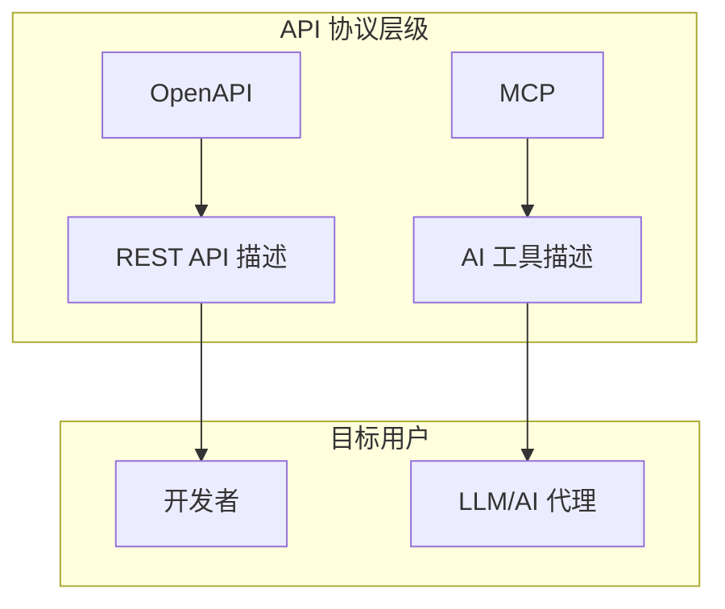
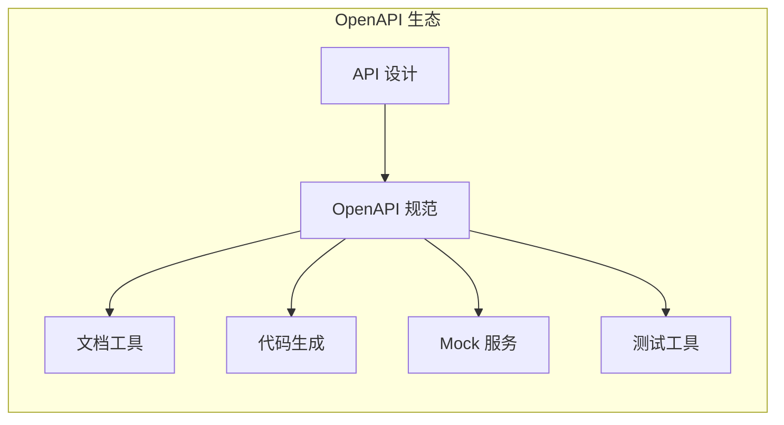
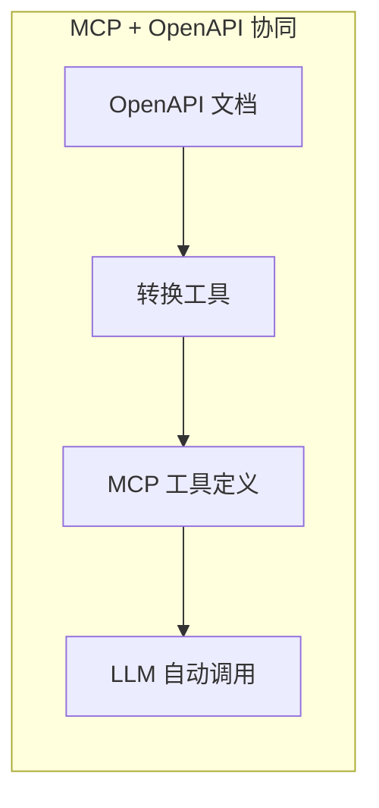

# 3.16 MCP vs OpenAPI：API 生态的新旧碰撞

> 本章将深入对比 MCP 与 OpenAPI 两大生态。我们会解释两者的关系、互补性，以及如何在现代应用中将它们结合使用。

---

## 章节导航

| 阶段 | 内容 | 篇幅 |
|------|------|------|
| 问题引入 | API 的演进 | 15% |
| 核心概念 | OpenAPI 生态 | 25% |
| 对比分析 | 互补与合作 | 25% |
| 集成实践 | MCP + OpenAPI | 25% |
| 总结 | 要点回顾 | 10% |

---

## 一、引子：API 的演进

### 1.1 API 的演变历程

```
┌─────────────────────────────────────────────────────────────────┐
│                    API 发展历程                                       │
├─────────────────────────────────────────────────────────────────┤
│                                                                 │
│  SOAP 时代:                                                     │
│  ┌─────────────────────────────────────────────────────────┐   │
│  │  • XML 结构化数据                                      │   │
│  │  • 复杂难学                                            │   │
│  └─────────────────────────────────────────────────────────┘   │
│                                                                 │
│  REST 时代:                                                     │
│  ┌─────────────────────────────────────────────────────────┐   │
│  │  • 资源导向，URL + HTTP 方法                          │   │
│  │  • 简单灵活，易于理解                                 │   │
│  │  • 事实标准                                           │   │
│  └─────────────────────────────────────────────────────────┘   │
│                                                                 │
│  OpenAPI 时代:                                                  │
│  ┌─────────────────────────────────────────────────────────┐   │
│  │  • REST API 的规范化描述                              │   │
│  │  • Swagger/OpenAPI 规范                               │   │
│  │  • 文档、代码生成的基础                               │   │
│  └─────────────────────────────────────────────────────────┘   │
│                                                                 │
│  MCP 时代:                                                      │
│  ┌─────────────────────────────────────────────────────────┐   │
│  │  • AI 原生的工具描述协议                             │   │
│  │  • LLM 可理解的工具 schema                           │   │
│  │  • 智能 API 调用                                      │   │
│  └─────────────────────────────────────────────────────────┘   │
│                                                                 │
└─────────────────────────────────────────────────────────────────┘
```

### 1.2 协议关系图



---

## 二、核心概念：OpenAPI 生态

### 2.1 OpenAPI 是什么？

```
┌─────────────────────────────────────────────────────────────────┐
│                    OpenAPI 定义                                      │
├─────────────────────────────────────────────────────────────────┤
│                                                                 │
│  REST API 的机器可读描述规范：                                   │
│                                                                 │
│  ┌─────────────────────────────────────────────────────────┐   │
│  │  openapi: 3.0.0                                       │   │
│  │  info:                                                │   │
│  │    title: User API                                    │   │
│  │    version: 1.0.0                                     │   │
│  │  paths:                                               │   │
│  │    /users:                                            │   │
│  │      get:                                             │   │
│  │        summary: List users                            │   │
│  │        responses:                                     │   │
│  │          200:                                          │   │
│  │            description: Success                        │   │
│  └─────────────────────────────────────────────────────────┘   │
│                                                                 │
│  核心价值:                                                      │
│  ┌─────────────────────────────────────────────────────────┐   │
│  │  ✓ 文档自动生成                                       │   │
│  │  ✓ SDK 代码生成                                       │   │
│  │  ✓ API 测试                                           │   │
│  │  ✓ 服务发现                                           │   │
│  └─────────────────────────────────────────────────────────┘   │
│                                                                 │
└─────────────────────────────────────────────────────────────────┘
```

### 2.2 OpenAPI 工具链



---

## 三、对比分析：互补与合作

### 3.1 核心对比

```
┌─────────────────────────────────────────────────────────────────┐
│                    MCP vs OpenAPI 对比                                   │
├─────────────────────────────────────────────────────────────────┤
│                                                                 │
│  设计目标:                                                      │
│  ┌──────────────────────┬──────────────────────────────────┐   │
│  │       MCP            │          OpenAPI                  │   │
│  ├──────────────────────┼──────────────────────────────────┤   │
│  │ AI 工具描述          │    REST API 描述                │   │
│  │ LLM 可理解          │    开发者可理解                  │   │
│  │ 自动调用            │    手动调用                      │   │
│  └──────────────────────┴──────────────────────────────────┘   │
│                                                                 │
│  描述内容:                                                      │
│  ┌──────────────────────┬──────────────────────────────────┐   │
│  │       MCP            │          OpenAPI                  │   │
│  ├──────────────────────┼──────────────────────────────────┤   │
│  │ 工具名称             │    HTTP 路径 + 方法              │   │
│  │ 工具描述            │    操作描述                       │   │
│  │ 参数 schema         │    参数 schema                   │   │
│  │ 返回 schema         │    响应 schema                  │   │
│  │ 认证方式           │    安全定义                       │   │
│  └──────────────────────┴──────────────────────────────────┘   │
│                                                                 │
│  使用方式:                                                      │
│  ┌──────────────────────┬──────────────────────────────────┐   │
│  │       MCP            │          OpenAPI                  │   │
│  ├──────────────────────┼──────────────────────────────────┤   │
│  │ LLM 自动调用        │    开发者编写代码调用            │   │
│  │ 动态发现           │    静态定义                       │   │
│  │ 协议绑定灵活       │    绑定 HTTP/REST                │   │
│  └──────────────────────┴──────────────────────────────────┘   │
│                                                                 │
└─────────────────────────────────────────────────────────────────┘
```

### 3.2 互补关系



---

## 四、集成实践：MCP + OpenAPI

### 4.1 自动转换

```
┌─────────────────────────────────────────────────────────────────┐
│                    OpenAPI → MCP 转换                                   │
├─────────────────────────────────────────────────────────────────┤
│                                                                 │
│  转换流程:                                                      │
│  ┌─────────────────────────────────────────────────────────┐   │
│  │  1. 解析 OpenAPI 规范文件                             │   │
│  │  2. 提取路径、方法、参数、响应                        │   │
│  │  3. 映射为 MCP 工具定义                              │   │
│  │  4. 生成 MCP 服务器代码                              │   │
│  └─────────────────────────────────────────────────────────┘   │
│                                                                 │
│  工具:                                                          │
│  ┌─────────────────────────────────────────────────────────┐   │
│  │  • openapi-to-mcp CLI                                 │   │
│  │  • 自动生成 MCP 工具                                 │   │
│  └─────────────────────────────────────────────────────────┘   │
│                                                                 │
│  示例:                                                          │
│  ┌─────────────────────────────────────────────────────────┐   │
│  │  OpenAPI: GET /users/{id}                            │   │
│  │                                                          │   │
│  │  MCP: tool: get_user                                  │   │
│  │    input: { id: string }                             │   │
│  └─────────────────────────────────────────────────────────┘   │
│                                                                 │
└─────────────────────────────────────────────────────────────────┘
```

### 4.2 典型架构

```
┌─────────────────────────────────────────────────────────────────┐
│                    MCP + OpenAPI 架构                                   │
├─────────────────────────────────────────────────────────────────┤
│                                                                 │
│  企业 API:                                                      │
│  ┌─────────────────────────────────────────────────────────┐   │
│  │  • 已有 REST API (OpenAPI 描述)                        │   │
│  │  • 开发者手动调用                                      │   │
│  └─────────────────────────────────────────────────────────┘   │
│                         │                                       │
│                         ▼                                       │
│  转换层:                                                        │
│  ┌─────────────────────────────────────────────────────────┐   │
│  │  • openapi-to-mcp 转换器                              │   │
│  │  • 自动生成 MCP 工具定义                              │   │
│  └─────────────────────────────────────────────────────────┘   │
│                         │                                       │
│                         ▼                                       │
│  AI 应用:                                                       │
│  ┌─────────────────────────────────────────────────────────┐   │
│  │  • 通过 MCP 调用企业 API                             │   │
│  │  • 无需了解 REST 协议                                │   │
│  │  • 自然语言交互                                      │   │
│  └─────────────────────────────────────────────────────────┘   │
│                                                                 │
│  优势:                                                          │
│  ┌─────────────────────────────────────────────────────────┐   │
│  │  ✓ 保护现有 API 投资                                 │   │
│  │  ✓ 快速为 AI 提供能力                               │   │
│  │  ✓ 无需重写现有系统                                  │   │
│  └─────────────────────────────────────────────────────────┘   │
│                                                                 │
└─────────────────────────────────────────────────────────────────┘
```

---

## 五、本章小结

### 5.1 核心要点

```
┌─────────────────────────────────────────────────────────────────┐
│                    本章核心要点                                    │
├─────────────────────────────────────────────────────────────────┤
│                                                                 │
│  1. 协议关系                                                    │
│     • OpenAPI: REST API 描述 → 开发者使用                       │
│     • MCP: AI 工具描述 → LLM 使用                              │
│     • 两者互补，不冲突                                          │
│                                                                 │
│  2. 核心差异                                                    │
│     • 目标用户: 开发者 vs LLM                                   │
│     • 使用方式: 手动 vs 自动                                    │
│     • 设计理念: 文档化 vs 自动化                                │
│                                                                 │
│  3. 集成实践                                                    │
│     • OpenAPI → MCP 自动化转换                                  │
│     • 保护现有 API 投资                                        │
│     • 快速赋能 AI 应用                                          │
│                                                                 │
│  4. 最佳实践                                                    │
│     • 现有 OpenAPI 可快速转换为 MCP                            │
│     • 新 API 同时提供 OpenAPI 和 MCP 描述                       │
│                                                                 │
└─────────────────────────────────────────────────────────────────┘
```

### 5.2 知识检查

1. OpenAPI 和 MCP 的目标用户有什么区别？
2. 如何将 OpenAPI 转换为 MCP 工具？
3. MCP + OpenAPI 组合的优势是什么？

---

## 六、延伸阅读

| 资源 | 说明 |
|------|------|
| OpenAPI 规范 | 官方文档 |
| MCP 规范 | Anthropic 官方 |

---

## 卷三总结

恭喜完成卷三 **企业级应用** 的学习！你现在已经掌握：

- ✅ REST API 转 MCP
- ✅ OpenAPI 自动生成
- ✅ 多租户服务与 SSO
- ✅ 审计日志与限流
- ✅ MCP Gateway 与微服务架构
- ✅ 云原生部署
- ✅ LangChain/CrewAI/AutoGen/LlamaIndex 集成
- ✅ MCP vs A2A / Agent / Skills / OpenAPI 协议对比

---

## 教程总结

恭喜完成整套 MCP 教程的学习！

### 你学到了什么

**卷一：基础入门**
- AI 助手的局限性
- MCP 核心概念与生态
- 客户端使用与配置

**卷二：开发实战**
- 四大开发框架
- JSON-RPC 与传输层
- 多种场景实战

**卷三：企业级应用**
- 生产级架构设计
- AI 框架集成
- 协议对比

---

*本章贡献者：MCP Tutorial Team*
*版本：v3.0 出版级*
