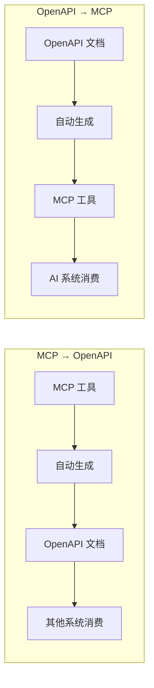
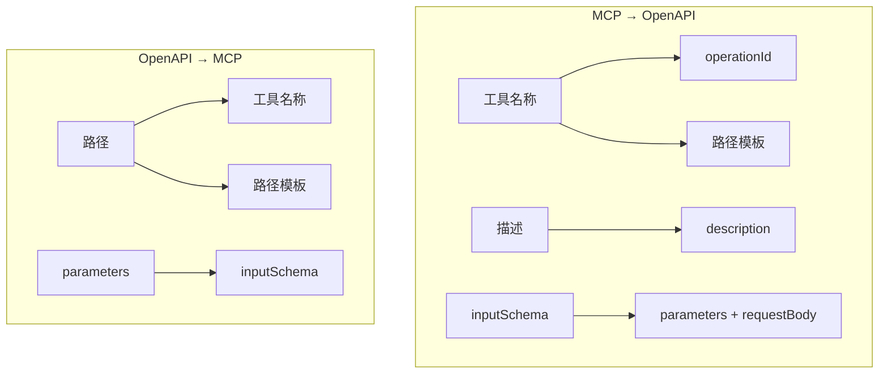
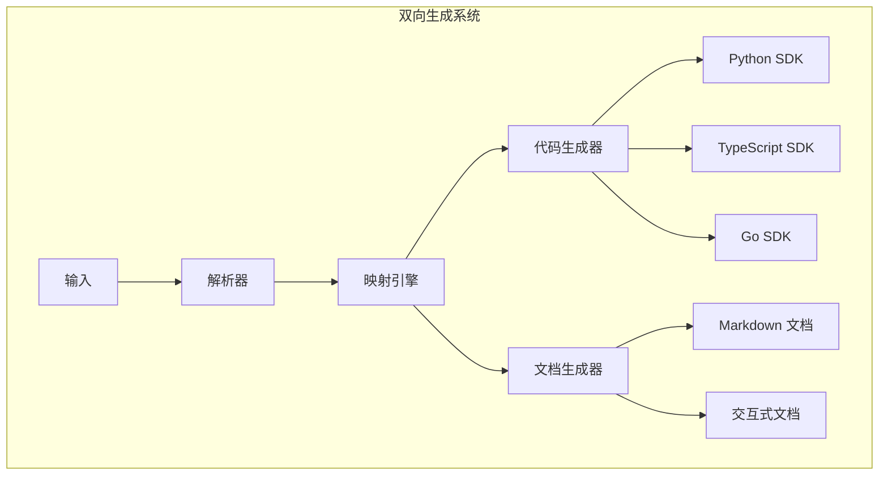

# 3.2 OpenAPI 自动生成：双向互通的桥梁

> 本章将深入探讨 OpenAPI 与 MCP 的双向转换。我们会解释为什么需要这种互通、转换的设计原则，以及如何实现自动化的代码生成。

---

## 章节导航

| 阶段 | 内容 | 篇幅 |
|------|------|------|
| 问题引入 | 标准化互通的必要性 | 15% |
| 核心概念 | OpenAPI 与 MCP 的对应关系 | 25% |
| 架构设计 | 双向转换系统 | 25% |
| 实践指南 | 代码生成实践 | 25% |
| 总结 | 要点回顾 | 10% |

---

## 一、引子：生态孤岛的困境

### 1.1 API 生态的碎片化

```
┌─────────────────────────────────────────────────────────────────┐
│                    API 生态的现状                                   │
├─────────────────────────────────────────────────────────────────┤
│                                                                 │
│  现状：                                                        │
│  ┌─────────────────────────────────────────────────────────┐   │
│  │  • REST API (OpenAPI)                                   │   │
│  │  • GraphQL                                              │   │
│  │  • gRPC                                                 │   │
│  │  • MCP                                                  │   │
│  │  • (还有更多...)                                        │   │
│  └─────────────────────────────────────────────────────────┘   │
│                                                                 │
│  问题：                                                        │
│  ┌─────────────────────────────────────────────────────────┐   │
│  │  • 每种协议都需要不同的工具来消费                       │   │
│  │  • 开发者需要学习多种规范                               │   │
│  │  • 文档和SDK 需要分别维护                              │   │
│  └─────────────────────────────────────────────────────────┘   │
│                                                                 │
│  解决思路：                                                    │
│  ┌─────────────────────────────────────────────────────────┐   │
│  │  ✓ 标准化转换层                                        │   │
│  │  ✓ OpenAPI 作为"通用语"                               │   │
│  │  ✓ MCP ↔ OpenAPI 双向互通                            │   │
│  └─────────────────────────────────────────────────────────┘   │
│                                                                 │
└─────────────────────────────────────────────────────────────────┘
```

### 1.2 双向转换的价值



---

## 二、核心概念：规范对比与映射

### 2.1 MCP 与 OpenAPI 的对应关系

```
┌─────────────────────────────────────────────────────────────────┐
│                    MCP ↔ OpenAPI 映射                                │
├─────────────────────────────────────────────────────────────────┤
│                                                                 │
│  MCP 工具定义：                                                │
│  ┌─────────────────────────────────────────────────────────┐   │
│  │  {                                                      │   │
│  │    "name": "get_user",                                │   │
│  │    "description": "获取用户信息",                     │   │
│  │    "inputSchema": {                                   │   │
│  │      "type": "object",                                │   │
│  │      "properties": {                                   │   │
│  │        "user_id": {"type": "string"}                 │   │
│  │      }                                                │   │
│  │    }                                                  │   │
│  │  }                                                      │   │
│  └─────────────────────────────────────────────────────────┘   │
│                                                                 │
│  OpenAPI 操作：                                                │
│  ┌─────────────────────────────────────────────────────────┐   │
│  │  paths:                                               │   │
│  │    /users/{user_id}:                                  │   │
│  │      get:                                              │   │
│  │        operationId: getUser                          │   │
│  │        description: 获取用户信息                       │   │
│  │        parameters:                                    │   │
│  │          - name: user_id                             │   │
│  │            in: path                                   │   │
│  │            schema:                                    │   │
│  │              type: string                             │   │
│  └─────────────────────────────────────────────────────────┘   │
│                                                                 │
└─────────────────────────────────────────────────────────────────┘
```

### 2.2 映射规则详解



---

## 三、架构设计：自动生成系统

### 3.1 系统架构



### 3.2 生成流程

```
┌─────────────────────────────────────────────────────────────────┐
│                    OpenAPI 生成流程                                   │
├─────────────────────────────────────────────────────────────────┤
│                                                                 │
│  1. 注册 MCP 工具                                               │
│  ┌─────────────────────────────────────────────────────────┐   │
│  │  @app.tool()                                           │   │
│  │  def get_user(user_id: str) -> dict:                  │   │
│  │      """获取用户信息"""                                │   │
│  │      ...                                               │   │
│  └─────────────────────────────────────────────────────────┘   │
│                         │                                       │
│                         ▼                                       │
│  2. 解析工具定义                                                │
│  ┌─────────────────────────────────────────────────────────┐   │
│  │  • 提取名称: get_user                                  │   │
│  │  • 提取描述: 获取用户信息                               │   │
│  │  • 提取参数: {user_id: string}                       │   │
│  └─────────────────────────────────────────────────────────┘   │
│                         │                                       │
│                         ▼                                       │
│  3. 转换为 OpenAPI                                              │
│  ┌─────────────────────────────────────────────────────────┐   │
│  │  paths:                                               │   │
│  │    /users/{user_id}:                                  │   │
│  │      get:                                              │   │
│  │        operationId: getUser                          │   │
│  │        description: 获取用户信息                       │   │
│  │        parameters:                                    │   │
│  │          - name: user_id                             │   │
│  │            in: path                                   │   │
│  └─────────────────────────────────────────────────────────┘   │
│                         │                                       │
│                         ▼                                       │
│  4. 生成产物                                                    │
│  ┌─────────────────────────────────────────────────────────┐   │
│  │  • openapi.yaml                                       │   │
│  │  • SDK 代码                                           │   │
│  │  • API 文档                                           │   │
│  └─────────────────────────────────────────────────────────┘   │
│                                                                 │
└─────────────────────────────────────────────────────────────────┘
```

---

## 四、实践指南：SDK 生成

### 4.1 多语言 SDK 生成

```
┌─────────────────────────────────────────────────────────────────┐
│                    SDK 生成支持                                       │
├─────────────────────────────────────────────────────────────────┤
│                                                                 │
│  Python SDK:                                                   │
│  ┌─────────────────────────────────────────────────────────┐   │
│  │  from my_api import Client                             │   │
│  │                                                          │   │
│  │  client = Client(api_key="xxx")                       │   │
│  │  user = client.users.get(user_id="123")               │   │
│  └─────────────────────────────────────────────────────────┘   │
│                                                                 │
│  TypeScript SDK:                                               │
│  ┌─────────────────────────────────────────────────────────┐   │
│  │  import { Client } from 'my-api';                     │   │
│  │                                                          │   │
│  │  const client = new Client({ apiKey: 'xxx' });        │   │
│  │  const user = await client.users.get('123');         │   │
│  └─────────────────────────────────────────────────────────┘   │
│                                                                 │
│  Go SDK:                                                       │
│  ┌─────────────────────────────────────────────────────────┐   │
│  │  import "github.com/my-api/client"                    │   │
│  │                                                          │   │
│  │  client := myapi.NewClient("xxx")                    │   │
│  │  user, err := client.Users.Get("123")                 │   │
│  └─────────────────────────────────────────────────────────┘   │
│                                                                 │
│  工具: openapi-generator-cli                                   │
│                                                                 │
└─────────────────────────────────────────────────────────────────┘
```

### 4.2 文档生成

```
┌─────────────────────────────────────────────────────────────────┐
│                    文档生成选项                                      │
├─────────────────────────────────────────────────────────────────┤
│                                                                 │
│  静态文档：                                                     │
│  ┌─────────────────────────────────────────────────────────┐   │
│  │  • Markdown 文档                                        │   │
│  │  • HTML 文档                                           │   │
│  │  • PDF 手册                                            │   │
│  └─────────────────────────────────────────────────────────┘   │
│                                                                 │
│  交互式文档：                                                   │
│  ┌─────────────────────────────────────────────────────────┐   │
│  │  • Swagger UI                                          │   │
│  │  • Redoc                                               │   │
│  │  • Postman Collection                                  │   │
│  └─────────────────────────────────────────────────────────┘   │
│                                                                 │
│  代码集成：                                                     │
│  ┌─────────────────────────────────────────────────────────┐   │
│  │  • TypeDoc (TypeScript)                                │   │
│  │  • Sphinx (Python)                                      │   │
│  │  • GoDoc                                               │   │
│  └─────────────────────────────────────────────────────────┘   │
│                                                                 │
└─────────────────────────────────────────────────────────────────┘
```

---

## 五、本章小结

### 5.1 核心要点

```
┌─────────────────────────────────────────────────────────────────┐
│                    本章核心要点                                    │
├─────────────────────────────────────────────────────────────────┤
│                                                                 │
│  1. 设计理念                                                    │
│     • OpenAPI 作为 API 生态的"通用语"                          │
│     • MCP ↔ OpenAPI 双向转换实现生态互通                        │
│                                                                 │
│  2. 核心机制                                                    │
│     • MCP 工具名 → operationId                                 │
│     • MCP inputSchema → parameters + requestBody               │
│     • 双向映射保持语义一致                                      │
│                                                                 │
│  3. 自动生成                                                    │
│     • SDK 代码生成（Python/TypeScript/Go）                     │
│     • API 文档生成                                              │
│     • 使用 openapi-generator-cli                               │
│                                                                 │
│  4. 价值                                                        │
│     • 一次定义，多处生成                                        │
│     • 文档和代码保持同步                                        │
│     • 生态互通无障碍                                            │
│                                                                 │
└─────────────────────────────────────────────────────────────────┘
```

### 5.2 知识检查

1. MCP 和 OpenAPI 有什么对应关系？
2. 为什么需要双向转换？
3. openapi-generator-cli 支持哪些语言？

---

## 六、延伸阅读

| 资源 | 说明 |
|------|------|
| OpenAPI 规范 | 官方文档 |
| openapi-generator | 代码生成工具 |

---

## 七、下一章预告

下一章我们将学习 **多租户 MCP 服务**，如何在共享基础设施上隔离不同客户的数据和访问。

---

*本章贡献者：MCP Tutorial Team*
*版本：v3.0 出版级*
