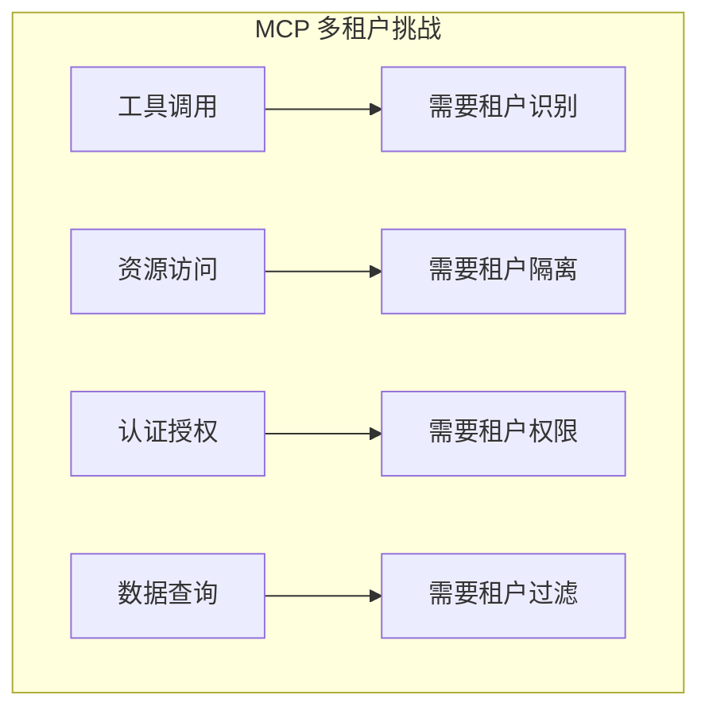
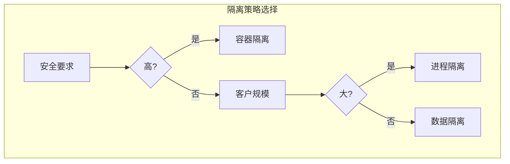
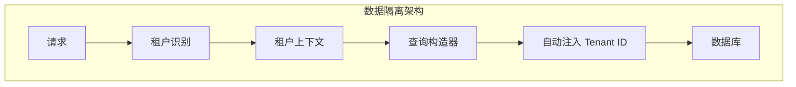

# 3.3 多租户 MCP 服务：共享基础设施的隔离艺术

> 本章将深入探讨多租户 MCP 服务的设计。我们会解释为什么需要多租户支持、隔离策略，以及如何在共享基础设施上保障安全和性能。

---

## 章节导航

| 阶段 | 内容 | 篇幅 |
|------|------|------|
| 问题引入 | 为什么需要多租户 | 15% |
| 核心概念 | 隔离模型与策略 | 30% |
| 架构设计 | 隔离实现方案 | 25% |
| 实践指南 | 安全与性能 | 20% |
| 总结 | 要点回顾 | 10% |

---

## 一、引子：共享经济的挑战

### 1.1 SaaS 模式的优势

```
┌─────────────────────────────────────────────────────────────────┐
│                    多租户的价值                                       │
├─────────────────────────────────────────────────────────────────┤
│                                                                 │
│  单租户模式：                                                   │
│  ┌─────────────────────────────────────────────────────────┐   │
│  │  • 每客户独立服务器                                      │   │
│  │  • 成本高                                               │   │
│  │  • 维护复杂                                             │   │
│  │  • 资源利用率低                                         │   │
│  └─────────────────────────────────────────────────────────┘   │
│                                                                 │
│  多租户模式：                                                   │
│  ┌─────────────────────────────────────────────────────────┐   │
│  │  ✓ 共享服务器资源，成本低                               │   │
│  │  ✓ 统一维护和升级                                       │   │
│  │  ✓ 资源利用率高                                         │   │
│  │  ✓ 弹性扩展方便                                         │   │
│  └─────────────────────────────────────────────────────────┘   │
│                                                                 │
│  挑战：                                                        │
│  ┌─────────────────────────────────────────────────────────┐   │
│  │  ⚠️ 数据隔离必须可靠                                    │   │
│  │  ⚠️ 性能不能互相影响                                   │   │
│  │  ⚠️ 权限控制必须严格                                    │   │
│  └─────────────────────────────────────────────────────────┘   │
│                                                                 │
└─────────────────────────────────────────────────────────────────┘
```

### 1.2 MCP 多租户的特殊性



---

## 二、核心概念：隔离模型与策略

### 2.1 隔离层级

```
┌─────────────────────────────────────────────────────────────────┐
│                    多租户隔离层级                                      │
├─────────────────────────────────────────────────────────────────┤
│                                                                 │
│  1. 容器隔离（最强）                                           │
│  ┌─────────────────────────────────────────────────────────┐   │
│  │  • 每个租户独立容器/虚拟机                              │   │
│  │  • 完全隔离的操作系统                                   │   │
│  │  • 成本最高，安全性最强                                │   │
│  │  • 适用：高安全要求、大客户                            │   │
│  └─────────────────────────────────────────────────────────┘   │
│                                                                 │
│  2. 进程隔离                                                   │
│  ┌─────────────────────────────────────────────────────────┐   │
│  │  • 每个租户独立进程                                     │   │
│  │  • 共享操作系统                                         │   │
│  │  • 中等成本，良好隔离                                  │   │
│  │  • 适用：大多数 SaaS 应用                             │   │
│  └─────────────────────────────────────────────────────────┘   │
│                                                                 │
│  3. 数据隔离（最常见）                                          │
│  ┌─────────────────────────────────────────────────────────┐   │
│  │  • 共享服务器，逻辑隔离数据                             │   │
│  │  • 租户 ID 作为过滤条件                                │   │
│  │  • 成本最低，依赖应用层正确实现                        │   │
│  │  • 适用：中小客户、内部工具                            │   │
│  └─────────────────────────────────────────────────────────┘   │
│                                                                 │
└─────────────────────────────────────────────────────────────────┘
```

### 2.2 隔离策略选择



---

## 三、架构设计：隔离实现方案

### 3.1 租户识别机制

```
┌─────────────────────────────────────────────────────────────────┐
│                    租户识别机制                                       │
├─────────────────────────────────────────────────────────────────┤
│                                                                 │
│  方式1: Token 包含租户信息                                       │
│  ┌─────────────────────────────────────────────────────────┐   │
│  │  Authorization: Bearer tenant_id:token                │   │
│  └─────────────────────────────────────────────────────────┘   │
│                                                                 │
│  方式2: 独立租户 Token                                          │
│  ┌─────────────────────────────────────────────────────────┐   │
│  │  Authorization: Bearer token_xxx                      │   │
│  │  (Token 中包含租户 ID)                                 │   │
│  └─────────────────────────────────────────────────────────┘   │
│                                                                 │
│  方式3: Header 传递                                              │
│  ┌─────────────────────────────────────────────────────────┐   │
│  │  X-Tenant-ID: tenant_123                              │   │
│  │  Authorization: Bearer token_xxx                       │   │
│  └─────────────────────────────────────────────────────────┘   │
│                                                                 │
│  推荐: 方式2（安全且简单）                                       │
│                                                                 │
└─────────────────────────────────────────────────────────────────┘
```

### 3.2 数据隔离架构



---

## 四、实践指南：安全与性能

### 4.1 安全检查清单

```
┌─────────────────────────────────────────────────────────────────┐
│                    多租户安全清单                                      │
├─────────────────────────────────────────────────────────────────┤
│                                                                 │
│  身份验证：                                                     │
│  ┌─────────────────────────────────────────────────────────┐   │
│  │ □ 验证 Token 合法性                                   │   │
│  │ □ 验证租户 ID 存在且有效                              │   │
│  │ □ 验证 Token 未过期                                   │   │
│  └─────────────────────────────────────────────────────────┘   │
│                                                                 │
│  授权检查：                                                     │
│  ┌─────────────────────────────────────────────────────────┐   │
│  │ □ 验证租户有权限访问该资源                            │   │
│  │ □ 验证工具调用在允许范围内                            │   │
│  │ □ 验证操作类型被允许                                  │   │
│  └─────────────────────────────────────────────────────────┘   │
│                                                                 │
│  数据隔离：                                                     │
│  ┌─────────────────────────────────────────────────────────┐   │
│  │ □ 所有查询自动注入租户过滤                            │   │
│  │ □ 日志不泄露其他租户信息                              │   │
│  │ □ 错误消息不包含敏感信息                             │   │
│  └─────────────────────────────────────────────────────────┘   │
│                                                                 │
└─────────────────────────────────────────────────────────────────┘
```

### 4.2 性能优化

```
┌─────────────────────────────────────────────────────────────────┐
│                    多租户性能优化                                      │
├─────────────────────────────────────────────────────────────────┤
│                                                                 │
│  连接池优化：                                                   │
│  ┌─────────────────────────────────────────────────────────┐   │
│  │  • 按租户分组连接池                                   │   │
│  │  • 设置每租户最小连接数                               │   │
│  │  • 设置租户最大并发数                                 │   │
│  └─────────────────────────────────────────────────────────┘   │
│                                                                 │
│  缓存策略：                                                     │
│  ┌─────────────────────────────────────────────────────────┐   │
│  │  • 租户隔离的缓存空间                                 │   │
│  │  • 租户级别的缓存策略                                 │   │
│  │  • 防止缓存穿透到其他租户                            │   │
│  └─────────────────────────────────────────────────────────┘   │
│                                                                 │
│  限流策略：                                                     │
│  ┌─────────────────────────────────────────────────────────┐   │
│  │  • 按租户限流                                         │   │
│  │  • 租户级别配额管理                                   │   │
│  │  • 防止单一租户占满资源                              │   │
│  └─────────────────────────────────────────────────────────┘   │
│                                                                 │
└─────────────────────────────────────────────────────────────────┘
```

---

## 五、本章小结

### 5.1 核心要点

```
┌─────────────────────────────────────────────────────────────────┐
│                    本章核心要点                                    │
├─────────────────────────────────────────────────────────────────┤
│                                                                 │
│  1. 设计理念                                                    │
│     • 多租户实现 SaaS 成本优化                                   │
│     • 隔离是核心挑战                                            │
│                                                                 │
│  2. 隔离层级                                                    │
│     • 容器隔离：最强但成本高                                     │
│     • 进程隔离：平衡选择                                         │
│     • 数据隔离：最常见                                           │
│                                                                 │
│  3. 实现机制                                                    │
│     • Token 包含租户信息                                        │
│     • 所有查询自动注入租户过滤                                   │
│                                                                 │
│  4. 安全实践                                                    │
│     • 身份验证、授权检查、数据隔离                               │
│                                                                 │
└─────────────────────────────────────────────────────────────────┘
```

### 5.2 知识检查

1. 多租户模式的优势是什么？
2. 三种隔离层级有什么区别？
3. 租户识别有哪些方式？

---

## 六、延伸阅读

| 资源 | 说明 |
|------|------|
| 多租户架构模式 | 设计模式参考 |
| SaaS 安全指南 | 安全最佳实践 |

---

## 七、下一章预告

下一章我们将学习 **SSO 集成**，如何在 MCP 服务中实现企业级单点登录。

---

*本章贡献者：MCP Tutorial Team*
*版本：v3.0 出版级*
