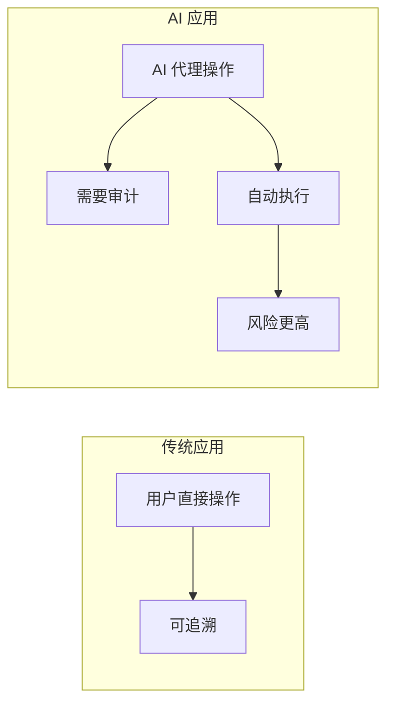
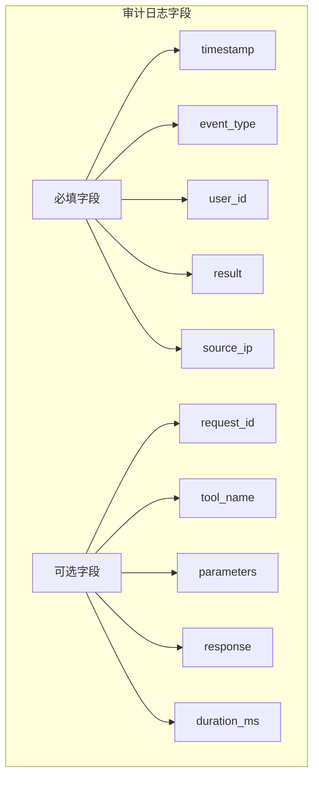
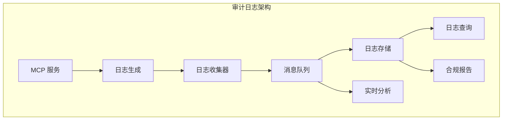

# 3.5 审计日志系统：企业合规的守护者

> 本章将深入探讨 MCP 服务的审计日志系统。我们会解释为什么需要审计日志、日志的内容设计，以及如何构建符合合规要求的日志系统。

---

## 章节导航

| 阶段 | 内容 | 篇幅 |
|------|------|------|
| 问题引入 | 为什么需要审计日志 | 15% |
| 核心概念 | 审计日志的内容设计 | 30% |
| 架构设计 | 日志收集与分析 | 25% |
| 实践指南 | 合规与安全 | 20% |
| 总结 | 要点回顾 | 10% |

---

## 一、引子：审计日志的价值

### 1.1 什么是审计日志？

```
┌─────────────────────────────────────────────────────────────────┐
│                    审计日志的定义                                   │
├─────────────────────────────────────────────────────────────────┤
│                                                                 │
│  审计日志 = 记录"谁在什么时候做了什么"                           │
│                                                                 │
│  核心要素：                                                    │
│  ┌─────────────────────────────────────────────────────────┐   │
│  │  WHO   - 谁 (用户/系统)                               │   │
│  │  WHAT  - 做了什么 (操作/事件)                         │   │
│  │  WHEN  - 什么时候 (时间戳)                             │   │
│  │  WHERE - 从哪里 (来源 IP)                             │   │
│  │  RESULT - 结果如何 (成功/失败)                        │   │
│  └─────────────────────────────────────────────────────────┘   │
│                                                                 │
│  示例：                                                        │
│  ┌─────────────────────────────────────────────────────────┐   │
│  │  [2024-01-15 10:30:25]                               │   │
│  │  用户: zhangsan@example.com                          │   │
│  │  操作: 调用工具 create_issue                          │   │
│  │  参数: {owner: "my-org", repo: "my-repo"}           │   │
│  │  结果: 成功                                           │   │
│  │  来源: 192.168.1.100                                │   │
│  └─────────────────────────────────────────────────────────┘   │
│                                                                 │
└─────────────────────────────────────────────────────────────────┘
```

### 1.2 为什么 AI 服务特别需要审计？



**AI 服务的特殊风险**：

```
┌─────────────────────────────────────────────────────────────────┐
│                    AI 服务审计的特殊性                              │
├─────────────────────────────────────────────────────────────────┤
│                                                                 │
│  风险1: 操作自动化                                              │
│  ┌─────────────────────────────────────────────────────────┐   │
│  │  • AI 可能批量执行操作                                │   │
│  │  • 难以人工逐个确认                                   │   │
│  │  → 需要完整日志追溯                                   │   │
│  └─────────────────────────────────────────────────────────┘   │
│                                                                 │
│  风险2: 权限提升                                                │
│  ┌─────────────────────────────────────────────────────────┐   │
│  │  • AI 可能访问超出预期的资源                          │   │
│  │  → 需要记录访问的每个资源                            │   │
│  └─────────────────────────────────────────────────────────┘   │
│                                                                 │
│  风险3: Prompt 注入                                            │
│  ┌─────────────────────────────────────────────────────────┐   │
│  │  • 恶意指令可能影响 AI 行为                           │   │
│  │  → 需要记录输入来源                                  │   │
│  └─────────────────────────────────────────────────────────┘   │
│                                                                 │
└─────────────────────────────────────────────────────────────────┘
```

---

## 二、核心概念：审计日志的内容设计

### 2.1 日志层级

```
┌─────────────────────────────────────────────────────────────────┐
│                    审计日志层级                                      │
├─────────────────────────────────────────────────────────────────┤
│                                                                 │
│  层级1: 认证日志                                                │
│  ┌─────────────────────────────────────────────────────────┐   │
│  │  • 登录成功/失败                                      │   │
│  │  • Token 刷新                                         │   │
│  │  • 登出                                               │   │
│  └─────────────────────────────────────────────────────────┘   │
│                                                                 │
│  层级2: 授权日志                                               │
│  ┌─────────────────────────────────────────────────────────┐   │
│  │  • 权限检查成功/失败                                  │   │
│  │  • 角色变更                                           │   │
│  │  • 资源访问授权                                       │   │
│  └─────────────────────────────────────────────────────────┘   │
│                                                                 │
│  层级3: 操作日志                                               │
│  ┌─────────────────────────────────────────────────────────┐   │
│  │  • 工具调用                                           │   │
│  │  • 参数和返回值                                       │   │
│  │  • 执行时间和结果                                     │   │
│  └─────────────────────────────────────────────────────────┘   │
│                                                                 │
│  层级4: 数据日志                                               │
│  ┌─────────────────────────────────────────────────────────┐   │
│  │  • 数据读取/修改/删除                                │   │
│  │  • 敏感数据访问                                       │   │
│  │  • 数据导出                                           │   │
│  └─────────────────────────────────────────────────────────┘   │
│                                                                 │
└─────────────────────────────────────────────────────────────────┘
```

### 2.2 日志字段设计



---

## 三、架构设计：日志收集与分析

### 3.1 日志架构



### 3.2 日志流转

```
┌─────────────────────────────────────────────────────────────────┐
│                    日志处理流程                                      │
├─────────────────────────────────────────────────────────────────┤
│                                                                 │
│  1. 日志生成                                                   │
│  ┌─────────────────────────────────────────────────────────┐   │
│  │  MCP 服务在关键点写入审计日志                          │   │
│  │  • 工具调用前后                                      │   │
│  │  • 认证/授权检查                                     │   │
│  │  • 错误发生                                          │   │
│  └─────────────────────────────────────────────────────────┘   │
│                         │                                       │
│                         ▼                                       │
│  2. 日志收集                                                   │
│  ┌─────────────────────────────────────────────────────────┐   │
│  │  • 结构化日志格式 (JSON)                              │   │
│  │  • 异步写入，不阻塞主流程                            │   │
│  │  • 本地缓冲 + 批量发送                               │   │
│  └─────────────────────────────────────────────────────────┘   │
│                         │                                       │
│                         ▼                                       │
│  3. 日志存储                                                   │
│  ┌─────────────────────────────────────────────────────────┐   │
│  │  • Elasticsearch: 全文搜索                           │   │
│  │  • ClickHouse: 分析查询                              │   │
│  │  • S3: 长期归档                                      │   │
│  └─────────────────────────────────────────────────────────┘   │
│                         │                                       │
│                         ▼                                       │
│  4. 日志分析                                                   │
│  ┌─────────────────────────────────────────────────────────┐   │
 • 异常检测│  │                                           │   │
│  │  • 趋势分析                                          │   │
│  │  • 合规报告生成                                      │   │
│  └─────────────────────────────────────────────────────────┘   │
│                                                                 │
└─────────────────────────────────────────────────────────────────┘
```

---

## 四、实践指南：合规与安全

### 4.1 合规要求

```
┌─────────────────────────────────────────────────────────────────┐
│                    常见合规标准                                      │
├─────────────────────────────────────────────────────────────────┤
│                                                                 │
│  SOC 2:                                                        │
│  ┌─────────────────────────────────────────────────────────┐   │
│  │  ✓ 记录所有系统访问                                   │   │
│  │  ✓ 记录操作活动                                       │   │
│  │  ✓ 保留日志至少 90 天                                │   │
│  └─────────────────────────────────────────────────────────┘   │
│                                                                 │
│  GDPR:                                                         │
│  ┌─────────────────────────────────────────────────────────┐   │
│  │  ✓ 记录数据访问                                       │   │
│  │  ✓ 支持数据删除请求                                   │   │
│  │  ✓ 记录同意授权                                       │   │
│  └─────────────────────────────────────────────────────────┘   │
│                                                                 │
│  ISO 27001:                                                   │
│  ┌─────────────────────────────────────────────────────────┐   │
│  │  ✓ 记录安全事件                                       │   │
│  │  ✓ 记录特权访问                                       │   │
│  │  ✓ 保护日志完整性                                     │   │
│  └─────────────────────────────────────────────────────────┘   │
│                                                                 │
└─────────────────────────────────────────────────────────────────┘
```

### 4.2 安全配置清单

```
┌─────────────────────────────────────────────────────────────────┐
│                    审计日志安全清单                                  │
├─────────────────────────────────────────────────────────────────┤
│                                                                 │
│  完整性保护：                                                   │
│  ┌─────────────────────────────────────────────────────────┐   │
│  │ □ 日志签名，防止篡改                                   │   │
│  │ □ 只读存储，防止删除                                  │   │
│  │ □ 定期备份                                            │   │
│  └─────────────────────────────────────────────────────────┘   │
│                                                                 │
│  访问控制：                                                     │
│  ┌─────────────────────────────────────────────────────────┐   │
│  │ □ 日志访问需要单独授权                                │   │
│  │ □ 分离管理员和审计员权限                              │   │
│  │ □ 记录日志访问行为                                    │   │
│  └─────────────────────────────────────────────────────────┘   │
│                                                                 │
│  隐私保护：                                                    │
│  ┌─────────────────────────────────────────────────────────┐   │
│  │ □ 敏感字段脱敏 (密码、Token)                         │   │
│  │ □ 记录用户 ID 而非 PII                               │   │
│  │ □ 符合数据最小化原则                                 │   │
│  └─────────────────────────────────────────────────────────┘   │
│                                                                 │
│  保留策略：                                                    │
│  ┌─────────────────────────────────────────────────────────┐   │
│  │ □ 根据合规要求设置保留期限                            │   │
│  │ □ 长期归档使用低成本存储                             │   │
│  │ □ 到期安全删除                                        │   │
│  └─────────────────────────────────────────────────────────┘   │
│                                                                 │
└─────────────────────────────────────────────────────────────────┘
```

---

## 五、本章小结

### 5.1 核心要点

```
┌─────────────────────────────────────────────────────────────────┐
│                    本章核心要点                                    │
├─────────────────────────────────────────────────────────────────┤
│                                                                 │
│  1. 设计理念                                                    │
│     • 审计日志记录"谁在什么时候做了什么"                        │
│     • AI 服务更需要完整审计，因为操作自动化                      │
│                                                                 │
│  2. 日志层级                                                    │
│     • 认证日志、授权日志、操作日志、数据日志                    │
│                                                                 │
│  3. 架构设计                                                   │
│     • 日志生成 → 收集 → 存储 → 分析                            │
│     • 使用消息队列解耦                                         │
│                                                                 │
│  4. 合规实践                                                    │
│     • 符合 SOC 2、GDPR、ISO 27001 等标准                       │
│     • 完整性保护、访问控制、隐私保护                           │
│                                                                 │
└─────────────────────────────────────────────────────────────────┘
```

### 5.2 知识检查

1. 审计日志的核心要素是什么？
2. AI 服务为什么特别需要审计？
3. 审计日志需要防止哪些安全风险？

---

## 六、延伸阅读

| 资源 | 说明 |
|------|------|
| SOC 2 合规指南 | 合规标准 |
| Elasticsearch 审计 | 日志存储方案 |

---

## 七、下一章预告

下一章我们将学习 **限流与配额管理**，如何保护 MCP 服务不被过度使用。

---

*本章贡献者：MCP Tutorial Team*
*版本：v3.0 出版级*
