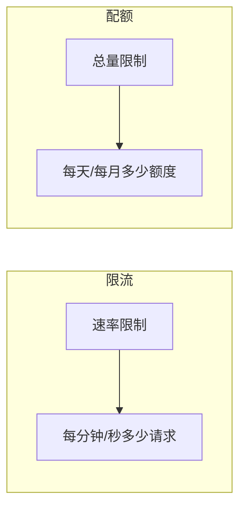
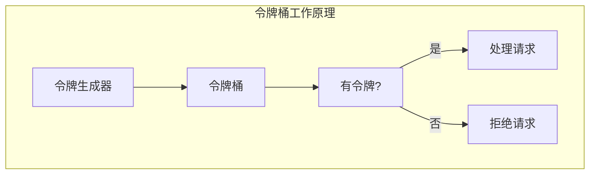
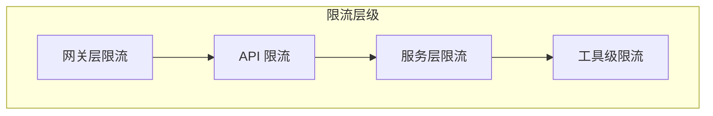

# 3.6 限流与配额管理：保护服务不被"吃垮"

> 本章将深入探讨 MCP 服务的限流与配额管理。我们会解释为什么需要限流、限流算法，以及如何设计一个公平、高效的配额系统。

---

## 章节导航

| 阶段 | 内容 | 篇幅 |
|------|------|------|
| 问题引入 | 为什么需要限流 | 15% |
| 核心概念 | 限流算法与策略 | 30% |
| 架构设计 | 配额管理系统 | 25% |
| 实践指南 | 配置与监控 | 20% |
| 总结 | 要点回顾 | 10% |

---

## 一、引子：服务保护的必要性

### 1.1 资源耗尽的场景

```
┌─────────────────────────────────────────────────────────────────┐
│                    限流的必要性                                      │
├─────────────────────────────────────────────────────────────────┤
│                                                                 │
│  问题场景：                                                      │
│  ┌─────────────────────────────────────────────────────────┐   │
│  │  • 某个用户发了 10000 次请求/分钟                      │   │
│  │  • 某个 AI 循环调用工具导致无限循环                   │   │
│  │  • 竞争对手的恶意攻击                                  │   │
│  │  • 突发流量导致服务雪崩                               │   │
│  └─────────────────────────────────────────────────────────┘   │
│                                                                 │
│  后果：                                                        │
│  ┌─────────────────────────────────────────────────────────┐   │
│  │  ⚠️ 服务响应变慢                                       │   │
│  │  ⚠️ 其他用户受影响                                    │   │
│  │  ⚠️ 云成本暴增                                        │   │
│  │  ⚠️ 甚至服务完全不可用                                │   │
│  └─────────────────────────────────────────────────────────┘   │
│                                                                 │
│  解决：                                                        │
│  ┌─────────────────────────────────────────────────────────┐   │
│  ✓ 限流保护单用户过度使用                                   │   │
│  ✓ 配额控制整体资源消耗                                     │   │
│  ✓ 保障公平的服务质量                                       │   │
│  └─────────────────────────────────────────────────────────┘   │
│                                                                 │
└─────────────────────────────────────────────────────────────────┘
```

### 1.2 限流 vs 配额



---

## 二、核心概念：限流算法与策略

### 2.1 常见限流算法

```
┌─────────────────────────────────────────────────────────────────┐
│                    限流算法对比                                      │
├─────────────────────────────────────────────────────────────────┤
│                                                                 │
│  1. 固定窗口 (Fixed Window)                                    │
│  ┌─────────────────────────────────────────────────────────┐   │
│  │  原理: 每分钟计数，结束后重置                           │   │
│  │  优点: 简单                                            │   │
│  │  缺点: 窗口边界可能出现突发流量                       │   │
│  └─────────────────────────────────────────────────────────┘   │
│                                                                 │
│  2. 滑动窗口 (Sliding Window)                                  │
│  ┌─────────────────────────────────────────────────────────┐   │
│  │ 原理: 统计滑动时间窗口内的请求数                         │   │
│  │ 优点: 平滑流量                                          │   │
│  │ 缺点: 实现稍复杂                                         │   │
│  └─────────────────────────────────────────────────────────┘   │
│                                                                 │
│  3. 令牌桶 (Token Bucket)                                      │
│  ┌─────────────────────────────────────────────────────────┐   │
│  │ 原理: 令牌以固定速率生成，消耗令牌处理请求              │   │
│  │ 优点: 允许突发流量                                     │   │
│  │ 适用: 需要允许一定突发的情况                             │   │
│  └─────────────────────────────────────────────────────────┘   │
│                                                                 │
│  4. 漏桶 (Leaky Bucket)                                        │
│  ┌─────────────────────────────────────────────────────────┐   │
│  │ 原理: 请求像水一样流入，以固定速率流出                   │   │
│  │ 优点: 严格限速                                         │   │
│  │ 适用: 需要严格平滑流量的场景                            │   │
│  └─────────────────────────────────────────────────────────┘   │
│                                                                 │
└─────────────────────────────────────────────────────────────────┘
```

### 2.2 算法可视化



---

## 三、架构设计：配额管理系统

### 3.1 多层限流架构



### 3.2 限流决策流程

```
┌─────────────────────────────────────────────────────────────────┐
│                    限流决策流程                                      │
├─────────────────────────────────────────────────────────────────┤
│                                                                 │
│  1. 接收请求                                                   │
│  ┌─────────────────────────────────────────────────────────┐   │
│  │  POST /mcp/tools/call                                  │   │
│  └─────────────────────────────────────────────────────────┘   │
│                         │                                       │
│                         ▼                                       │
│  2. 检查全局限流                                               │
│  ┌─────────────────────────────────────────────────────────┐   │
│  │  当前 QPS < 全局上限?                                   │   │
│  └─────────────────────────────────────────────────────────┘   │
│                         │                                       │
│                         ▼                                       │
│  3. 检查租户限流                                               │
│  ┌─────────────────────────────────────────────────────────┐   │
│  │  当前租户 QPS < 租户上限?                              │   │
│  └─────────────────────────────────────────────────────────┘   │
│                         │                                       │
│                         ▼                                       │
│  4. 检查用户限流                                               │
│  ┌─────────────────────────────────────────────────────────┐   │
│  │  当前用户 QPS < 用户上限?                               │   │
│  └─────────────────────────────────────────────────────────┘   │
│                         │                                       │
│                         ▼                                       │
│  5. 检查配额                                                   │
│  ┌─────────────────────────────────────────────────────────┐   │
│  │  已用配额 < 配额上限?                                   │   │
│  └─────────────────────────────────────────────────────────┘   │
│                         │                                       │
│                         ▼                                       │
│  6. 执行或拒绝                                                 │
│  ┌─────────────────────────────────────────────────────────┐   │
│  │  ✓ 全部通过 → 执行请求                                 │   │
│  │  ✗ 任意失败 → 返回 429                                │   │
│  └─────────────────────────────────────────────────────────┘   │
│                                                                 │
└─────────────────────────────────────────────────────────────────┘
```

---

## 四、实践指南：配置与监控

### 4.1 限流配置策略

```
┌─────────────────────────────────────────────────────────────────┐
│                    限流配置建议                                      │
├─────────────────────────────────────────────────────────────────┤
│                                                                 │
│  全局限流：                                                    │
│  ┌─────────────────────────────────────────────────────────┐   │
│  │  • 设置系统最大 QPS (如 10000)                        │   │
│  │  • 超过后返回 503 Service Unavailable                │   │
│  └─────────────────────────────────────────────────────────┘   │
│                                                                 │
│  租户限流：                                                    │
│  ┌─────────────────────────────────────────────────────────┐   │
│  │  • 根据套餐设置不同上限                                │   │
│  │  • 免费版: 60 QPS                                     │   │
│  │  • 专业版: 600 QPS                                    │   │
│  │  • 企业版: 自定义                                      │   │
│  └─────────────────────────────────────────────────────────┘   │
│                                                                 │
│  用户限流：                                                    │
│  ┌─────────────────────────────────────────────────────────┐   │
│  │  • 防止单用户"跑满"租户配额                          │   │
│  │  • 建议上限: 租户限流的 20%                         │   │
│  └─────────────────────────────────────────────────────────┘   │
│                                                                 │
│  工具限流：                                                    │
│  ┌─────────────────────────────────────────────────────────┐   │
│  │  • 敏感工具设置更严格上限                            │   │
│  │  • 昂贵工具(如 AI 生成)设置配额限制                 │   │
│  └─────────────────────────────────────────────────────────┘   │
│                                                                 │
└─────────────────────────────────────────────────────────────────┘
```

### 4.2 配额设计

```
┌─────────────────────────────────────────────────────────────────┐
│                    配额设计方案                                      │
├─────────────────────────────────────────────────────────────────┤
│                                                                 │
│  配额类型：                                                    │
│  ┌─────────────────────────────────────────────────────────┐   │
│  │  1. 请求次数配额                                      │   │
│  │     • 每天/每月可以调用的次数                        │   │
│  │                                                          │   │
│  │  2. 工具调用配额                                     │   │
│  │     • 每种工具的调用次数                              │   │
│  │                                                          │   │
│  │  3. 计算配额                                          │   │
│  │     • _token 使用量、计算时间等                       │   │
│  │                                                          │   │
│  │  4. 存储配额                                          │   │
│  │     • 用户数据存储空间                                │   │
│  └─────────────────────────────────────────────────────────┘   │
│                                                                 │
│  配额耗尽处理：                                                │
│  ┌─────────────────────────────────────────────────────────┐   │
│  │  • 返回 429 Too Many Requests                         │   │
│  │  • 在响应头中包含重试时间                            │   │
│  │  • 提供配额升级选项                                   │   │
│  └─────────────────────────────────────────────────────────┘   │
│                                                                 │
└─────────────────────────────────────────────────────────────────┘
```

---

## 五、本章小结

### 5.1 核心要点

```
┌─────────────────────────────────────────────────────────────────┐
│                    本章核心要点                                    │
├─────────────────────────────────────────────────────────────────┤
│                                                                 │
│  1. 设计理念                                                    │
│     • 限流保护服务不被过度使用                                  │
│     • 配额控制资源消耗成本                                      │
│                                                                 │
│  2. 限流算法                                                  │
│     • 固定窗口: 简单但有边界问题                                │
│     • 滑动窗口: 平滑流量                                        │
│     • 令牌桶: 允许突发流量                                      │
│     • 漏桶: 严格限速                                           │
│                                                                 │
│  3. 架构设计                                                   │
│     • 多层限流: 网关→租户→用户→工具                           │
│     • 决策流程: 逐层检查                                        │
│                                                                 │
│  4. 实践要点                                                  │
│     • 根据业务设置合理上限                                     │
│     • 配额耗尽提供友好反馈                                     │
│     • 监控限流状态                                            │
│                                                                 │
└─────────────────────────────────────────────────────────────────┘
```

### 5.2 知识检查

1. 令牌桶算法和漏桶算法的区别是什么？
2. 为什么需要多层级限流？
3. 配额耗尽后应该如何处理？

---

## 六、延伸阅读

| 资源 | 说明 |
|------|------|
| 限流算法详解 | 技术文章 |
| Redis 限流 | 实现方案 |

---

## 七、下一章预告

下一章我们将学习 **MCP Gateway 设计**，如何构建统一的 MCP 服务入口。

---

*本章贡献者：MCP Tutorial Team*
*版本：v3.0 出版级*
