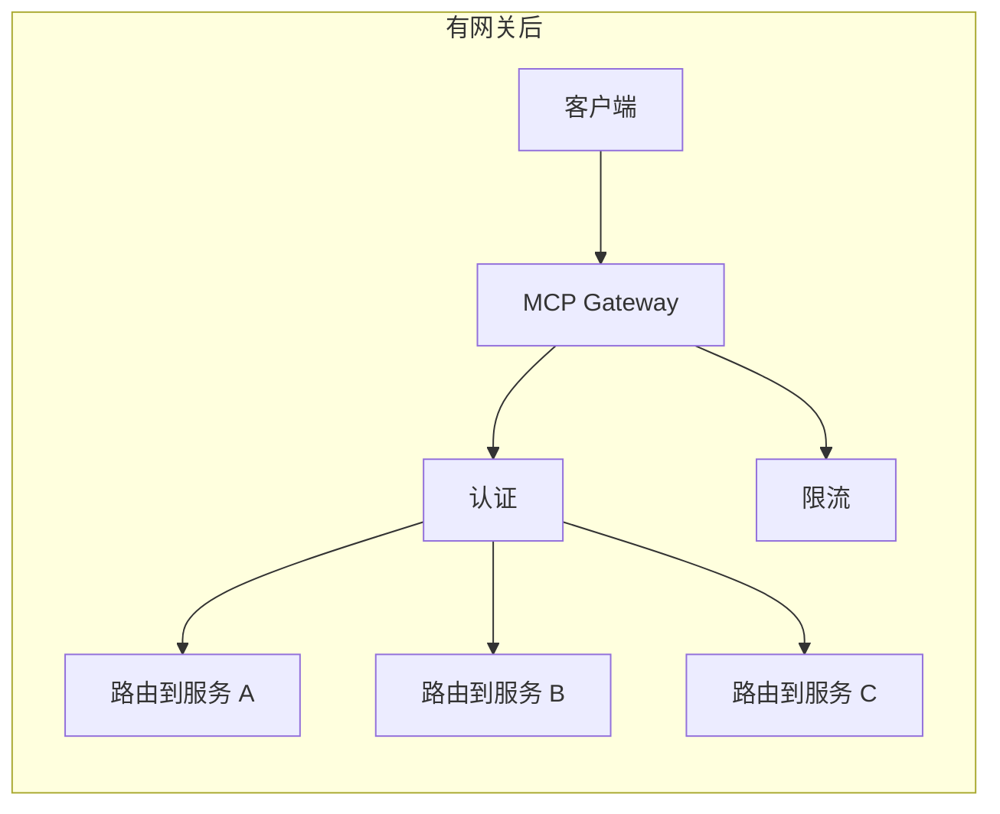
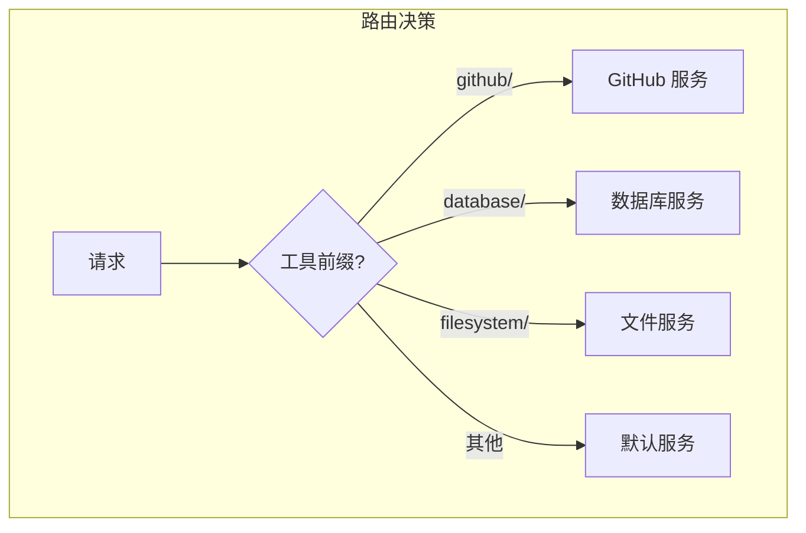
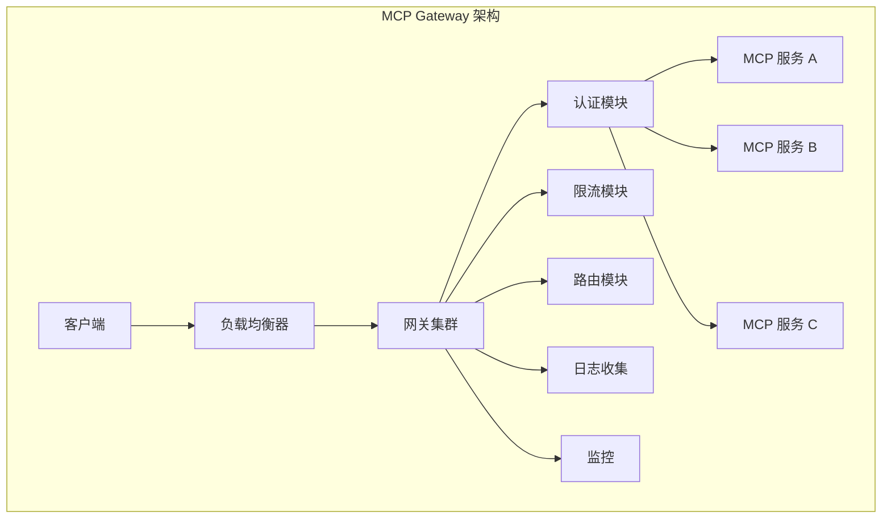

# 3.7 MCP Gateway 设计：统一入口的艺术

> 本章将深入探讨 MCP Gateway 的设计。我们会解释为什么需要网关、网关的核心功能，以及如何构建一个高性能、可扩展的 MCP 网关。

---

## 章节导航

| 阶段 | 内容 | 篇幅 |
|------|------|------|
| 问题引入 | 为什么需要网关 | 15% |
| 核心概念 | 网关功能解析 | 30% |
| 架构设计 | 网关架构设计 | 25% |
| 实践指南 | 部署与运维 | 20% |
| 总结 | 要点回顾 | 10% |

---

## 一、引子：微服务时代的网关

### 1.1 没有网关的困境

```
┌─────────────────────────────────────────────────────────────────┐
│                    无网关的问题                                      │
├─────────────────────────────────────────────────────────────────┤
│                                                                 │
│  问题场景：                                                      │
│  ┌─────────────────────────────────────────────────────────┐   │
│  │  • 多个 MCP 服务需要单独管理                           │   │
│  │  • 每个服务都需要认证、限流                            │   │
│  │  • 客户端需要知道所有服务的地址                       │   │
│  │  • 跨服务调用难以追踪                                 │   │
│  └─────────────────────────────────────────────────────────┘   │
│                                                                 │
│  痛点：                                                        │
│  ┌─────────────────────────────────────────────────────────┐   │
│  │  ⚠️ 客户端配置复杂                                    │   │
│  │  ⚠️ 安全策略分散，难以统一                            │   │
│  │  ⚠️ 无法跨服务追踪问题                                │   │
│  │  ⚠️ 扩展困难                                         │   │
│  └─────────────────────────────────────────────────────────┘   │
│                                                                 │
└─────────────────────────────────────────────────────────────────┘
```

### 1.2 网关的价值



---

## 二、核心概念：网关功能解析

### 2.1 核心功能

```
┌─────────────────────────────────────────────────────────────────┐
│                    MCP Gateway 核心功能                                │
├─────────────────────────────────────────────────────────────────┤
│                                                                 │
│  1. 请求路由                                                   │
│  ┌─────────────────────────────────────────────────────────┐   │
│  │  • 根据工具名称/命名空间路由                          │   │
│  │  • 支持服务版本管理                                   │   │
│  │  • A/B 测试路由                                      │   │
│  └─────────────────────────────────────────────────────────┘   │
│                                                                 │
│  2. 负载均衡                                                   │
│  ┌─────────────────────────────────────────────────────────┐   │
│  │  • 健康检查                                           │   │
│  │  • 流量分配                                           │   │
│  │  • 故障转移                                           │   │
│  └─────────────────────────────────────────────────────────┘   │
│                                                                 │
│  3. 安全控制                                                   │
│  ┌─────────────────────────────────────────────────────────┐   │
│  │  • 统一认证                                           │   │
│  │  • 授权检查                                           │   │
│  │  • 限流和配额                                         │   │
│  │  • DDoS 防护                                          │   │
│  └─────────────────────────────────────────────────────────┘   │
│                                                                 │
│  4. 可观测性                                                   │
│  ┌─────────────────────────────────────────────────────────┐   │
│  │  • 请求日志                                           │   │
│  │  • 性能指标                                           │   │
│  │  • 分布式追踪                                         │   │
│  └─────────────────────────────────────────────────────────┘   │
│                                                                 │
│  5. 协议转换                                                   │
│  ┌─────────────────────────────────────────────────────────┐   │
│  │  • HTTP ↔ Stdio 转换                                │   │
│  │  • 版本兼容                                           │   │
│  └─────────────────────────────────────────────────────────┘   │
│                                                                 │
└─────────────────────────────────────────────────────────────────┘
```

### 2.2 路由策略



---

## 三、架构设计：网关架构

### 3.1 网关架构图



### 3.2 请求处理流程

```
┌─────────────────────────────────────────────────────────────────┐
│                    网关请求处理流程                                   │
├─────────────────────────────────────────────────────────────────┤
│                                                                 │
│  1. 负载均衡                                                   │
│  ┌─────────────────────────────────────────────────────────┐   │
│  │  选择一个网关节点处理请求                              │   │
│  └─────────────────────────────────────────────────────────┘   │
│                         │                                       │
│                         ▼                                       │
│  2. 认证验证                                                   │
│  ┌─────────────────────────────────────────────────────────┐   │
│  │  • 验证 JWT Token                                      │   │
│  │  • 提取用户/租户信息                                  │   │
│  └─────────────────────────────────────────────────────────┘   │
│                         │                                       │
│                         ▼                                       │
│  3. 限流检查                                                   │
│  ┌─────────────────────────────────────────────────────────┐   │
│  │  • 检查用户/租户配额                                  │   │
│  │  • 检查全局限流                                       │   │
│  └─────────────────────────────────────────────────────────┘   │
│                         │                                       │
│                         ▼                                       │
│  4. 路由决策                                                   │
│  ┌─────────────────────────────────────────────────────────┐   │
│  │  • 根据工具名称确定目标服务                           │   │
│  │  • 选择健康的后端实例                                 │   │
│  └─────────────────────────────────────────────────────────┘   │
│                         │                                       │
│                         ▼                                       │
│  5. 转发请求                                                   │
│  ┌─────────────────────────────────────────────────────────┐   │
│  │  • 转换协议（如需要）                                 │   │
│  │  • 添加跟踪头信息                                      │   │
│  │  • 转发到后端服务                                    │   │
│  └─────────────────────────────────────────────────────────┘   │
│                         │                                       │
│                         ▼                                       │
│  6. 返回响应                                                   │
│  ┌─────────────────────────────────────────────────────────┐   │
│  │  • 记录响应时间和状态                                │   │
│  │  • 返回给客户端                                      │   │
│  └─────────────────────────────────────────────────────────┘   │
│                                                                 │
└─────────────────────────────────────────────────────────────────┘
```

---

## 四、实践指南：部署与运维

### 4.1 高可用部署

```
┌─────────────────────────────────────────────────────────────────┐
│                    网关高可用部署                                       │
├─────────────────────────────────────────────────────────────────┤
│                                                                 │
│  组件：                                                        │
│  ┌─────────────────────────────────────────────────────────┐   │
│  │  • 网关集群: 3+ 节点                                  │   │
│  │  • 负载均衡器: 前端负载均衡                          │   │
│  │  • 服务注册中心: 后端服务发现                        │   │
│  │  • 分布式限流: 统一限流状态                         │   │
│  └─────────────────────────────────────────────────────────┘   │
│                                                                 │
│  部署拓扑：                                                    │
│  ┌─────────────────────────────────────────────────────────┐   │
│  │                                                         │   │
│  │    [客户端]                                             │   │
│  │        │                                               │   │
│  │    [负载均衡器]                                        │   │
│  │        │                                               │   │
│  │  ┌───┴───┐                                           │   │
│  │  │       │                                           │   │
│  │ [GW1] [GW2] [GW3]                                    │   │
│  │  │       │                                           │   │
│  │  └───┬───┘                                           │   │
│  │        │                                               │   │
│  │  [后端 MCP 服务]                                      │   │
│  │                                                         │   │
│  └─────────────────────────────────────────────────────────┘   │
│                                                                 │
│  监控指标：                                                    │
│  ┌─────────────────────────────────────────────────────────┐   │
│  │  • 请求延迟 (p50, p95, p99)                          │   │
│  │  • 请求成功率                                         │   │
│  │  • 限流触发次数                                      │   │
│  │  • 后端服务健康状态                                   │   │
│  └─────────────────────────────────────────────────────────┘   │
│                                                                 │
└─────────────────────────────────────────────────────────────────┘
```

### 4.2 配置最佳实践

```
┌─────────────────────────────────────────────────────────────────┐
│                    网关配置建议                                      │
├─────────────────────────────────────────────────────────────────┤
│                                                                 │
│  路由配置：                                                     │
│  ┌─────────────────────────────────────────────────────────┐   │
│  │  routes:                                                │   │
│  │    - path: /tools/github.*                           │   │
│  │      backend: github-mcp-service                       │   │
│  │    - path: /tools/database.*                          │   │
│  │      backend: database-mcp-service                    │   │
│  └─────────────────────────────────────────────────────────┘   │
│                                                                 │
│  限流配置：                                                    │
│  ┌─────────────────────────────────────────────────────────┐   │
│  │  rate_limit:                                           │   │
│  │    global: 10000 QPS                                   │   │
│  │    per_tenant: 100 QPS                                  │   │
│  │    burst: 20%                                         │   │
│  └─────────────────────────────────────────────────────────┘   │
│                                                                 │
│  超时配置：                                                    │
│  ┌─────────────────────────────────────────────────────────┐   │
│  │  timeouts:                                             │   │
│  │    read: 30s                                          │   │
│  │    write: 30s                                         │   │
│  │    idle: 60s                                          │   │
│  └─────────────────────────────────────────────────────────┘   │
│                                                                 │
│  重试配置：                                                    │
│  ┌─────────────────────────────────────────────────────────┐   │
│  │  retry:                                                │   │
│  │    attempts: 3                                         │   │
│  │    backoff: exponential                               │   │
│  │    retry_on: 5xx, timeout                            │   │
│  └─────────────────────────────────────────────────────────┘   │
│                                                                 │
└─────────────────────────────────────────────────────────────────┘
```

---

## 五、本章小结

### 5.1 核心要点

```
┌─────────────────────────────────────────────────────────────────┐
│                    本章核心要点                                    │
├─────────────────────────────────────────────────────────────────┤
│                                                                 │
│  1. 设计理念                                                    │
│     • 网关作为 MCP 服务的统一入口                               │
│     • 简化客户端配置，统一安全管理                              │
│                                                                 │
│  2. 核心功能                                                   │
│     • 路由、负载均衡、安全控制                                  │
│     • 可观测性、协议转换                                        │
│                                                                 │
│  3. 架构设计                                                   │
│     • 认证 → 限流 → 路由 → 转发 → 日志                      │
│     • 高可用部署: 集群 + 负载均衡                              │
│                                                                 │
│  4. 实践要点                                                   │
│     • 合理配置超时和重试                                       │
│     • 监控关键指标                                              │
│     • 定期健康检查                                              │
│                                                                 │
└─────────────────────────────────────────────────────────────────┘
```

### 5.2 知识检查

1. MCP Gateway 的核心功能有哪些？
2. 网关请求处理流程是什么？
3. 如何保证网关的高可用？

---

## 六、延伸阅读

| 资源 | 说明 |
|------|------|
| Kong Gateway | 开源网关 |
| Envoy 代理 | 高性能网关 |

---

## 七、下一章预告

下一章我们将学习 **MCP 微服务架构**，如何将 MCP 拆分为独立的微服务。

---

*本章贡献者：MCP Tutorial Team*
*版本：v3.0 出版级*
