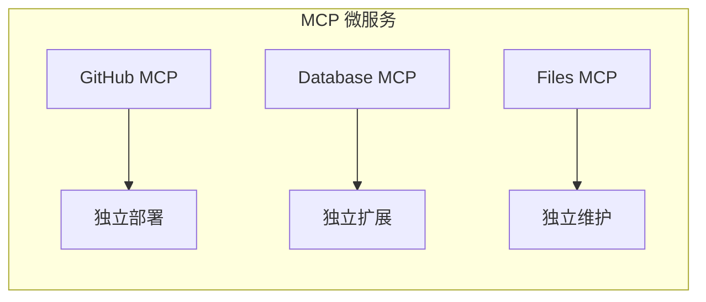
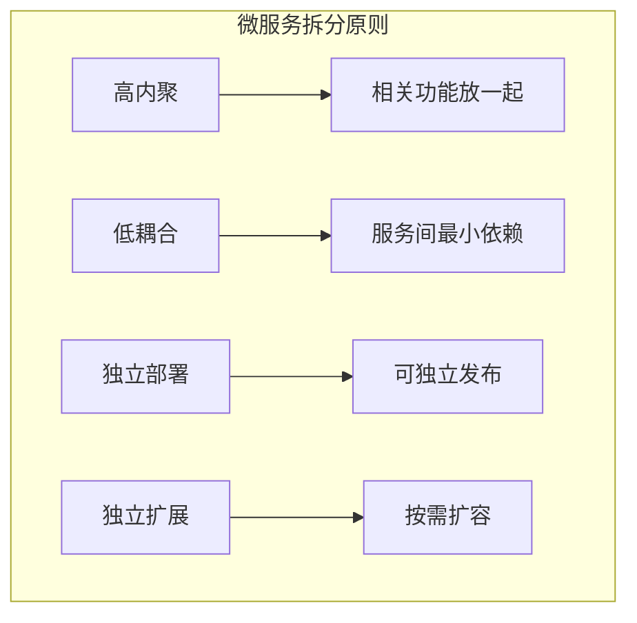
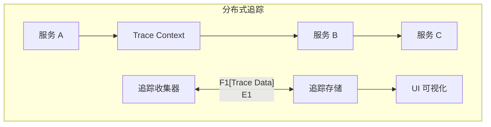

# 3.8 MCP 微服务架构：拆分与治理的艺术

> 本章将深入探讨 MCP 微服务架构的设计。我们会解释为什么需要微服务、如何拆分服务，以及服务间如何通信和治理。

---

## 章节导航

| 阶段 | 内容 | 篇幅 |
|------|------|------|
| 问题引入 | 为什么需要微服务 | 15% |
| 核心概念 | 服务拆分策略 | 30% |
| 架构设计 | 服务通信与治理 | 25% |
| 实践指南 | 分布式追踪 | 20% |
| 总结 | 要点回顾 | 10% |

---

## 一、引子：单体架构的困境

### 1.1 什么时候需要微服务？

```
┌─────────────────────────────────────────────────────────────────┐
│                    单体 vs 微服务                                       │
├─────────────────────────────────────────────────────────────────┤
│                                                                 │
│  单体架构特点：                                                 │
│  ┌─────────────────────────────────────────────────────────┐   │
│  │  • 所有功能在一个应用中                                │   │
│  │  • 部署简单                                            │   │
│  │  • 初期开发快                                          │   │
│  │  • 规模变大后难以维护                                  │   │
│  └─────────────────────────────────────────────────────────┘   │
│                                                                 │
│  何时拆分：                                                    │
│  ┌─────────────────────────────────────────────────────────┐   │
│  │  ✓ 团队超过 10 人                                      │   │
│  │  ✓ 部署频率成为瓶颈                                   │   │
│  │  ✓ 需要独立扩展不同功能                               │   │
│  │  ✓ 技术栈需要多样化                                   │   │
│  │  ✓ 故障需要隔离                                        │   │
│  └─────────────────────────────────────────────────────────┘   │
│                                                                 │
└─────────────────────────────────────────────────────────────────┘
```

### 1.2 MCP 微服务的优势



---

## 二、核心概念：服务拆分策略

### 2.1 拆分维度

```
┌─────────────────────────────────────────────────────────────────┐
│                    MCP 服务拆分策略                                    │
├─────────────────────────────────────────────────────────────────┤
│                                                                 │
│  按功能域拆分：                                                 │
│  ┌─────────────────────────────────────────────────────────┐   │
│  │  • GitHub MCP (代码管理)                                │   │
│  │  • Database MCP (数据访问)                            │   │
│  │  • Files MCP (文件操作)                                │   │
│  │  • Communication MCP (通讯)                           │   │
│  └─────────────────────────────────────────────────────────┘   │
│                                                                 │
│  按团队拆分：                                                  │
│  ┌─────────────────────────────────────────────────────────┐   │
│  │  • 基础设施团队 → Auth MCP, Gateway MCP               │   │
│  │  • 业务团队 A → CRM MCP                              │   │
│  │  • 业务团队 B → Analytics MCP                        │   │
│  └─────────────────────────────────────────────────────────┘   │
│                                                                 │
│  按资源拆分：                                                  │
│  ┌─────────────────────────────────────────────────────────┐   │
│  │  • 每个外部 API → 独立 MCP 服务                       │   │
│  │  • GitHub API → github-mcp                           │   │
│  │  • Slack API → slack-mcp                            │   │
│  │  • Notion API → notion-mcp                          │   │
│  └─────────────────────────────────────────────────────────┘   │
│                                                                 │
└─────────────────────────────────────────────────────────────────┘
```

### 2.2 拆分原则



---

## 三、架构设计：服务通信与治理

### 3.1 服务通信模式

```
┌─────────────────────────────────────────────────────────────────┐
│                    服务通信方式                                       │
├─────────────────────────────────────────────────────────────────┤
│                                                                 │
│  同步通信 (REST/gRPC):                                          │
│  ┌─────────────────────────────────────────────────────────┐   │
│  │  • 请求-响应模式                                       │   │
│  │  • 延迟低                                            │   │
│  │  • 强一致性                                          │   │
│  │  • 适用：实时操作                                     │   │
│  └─────────────────────────────────────────────────────────┘   │
│                                                                 │
│  异步通信 (消息队列):                                           │
│  ┌─────────────────────────────────────────────────────────┐   │
│  │  • 发布-订阅模式                                      │   │
│  │  • 解耦服务                                          │   │
│  │  • 最终一致性                                        │   │
│  │  • 适用：事件驱动                                     │   │
│  └─────────────────────────────────────────────────────────┘   │
│                                                                 │
│  MCP 协议通信：                                                │
│  ┌─────────────────────────────────────────────────────────┐   │
│  │  • 内部服务间使用 MCP 协议                           │   │
│  │  • 统一工具调用方式                                   │   │
│  │  • 支持流式响应                                      │   │
│  └─────────────────────────────────────────────────────────┘   │
│                                                                 │
└─────────────────────────────────────────────────────────────────┘
```

### 3.2 服务治理

```
┌─────────────────────────────────────────────────────────────────┐
│                    服务治理组件                                       │
├─────────────────────────────────────────────────────────────────┤
│                                                                 │
│  服务注册与发现：                                               │
│  ┌─────────────────────────────────────────────────────────┐   │
│  │  • 服务启动时注册到注册中心                           │   │
│  │  • 客户端查询注册中心获取服务地址                     │   │
│  │  • 支持健康检查和自动下线                            │   │
│  └─────────────────────────────────────────────────────────┘   │
│                                                                 │
│  负载均衡：                                                    │
│  ┌─────────────────────────────────────────────────────────┐   │
│  │  • 轮询、随机、最少连接                               │   │
│  │  • 地域感知负载均衡                                   │   │
│  │  • 故障实例自动移除                                   │   │
│  └─────────────────────────────────────────────────────────┘   │
│                                                                 │
│  熔断器：                                                       │
│  ┌─────────────────────────────────────────────────────────┐   │
│  │  • 快速失败，防止雪崩                                 │   │
│  │  • 失败次数超过阈值 → 打开熔断                      │   │
│  │  • 熔断期间直接返回降级响应                          │   │
│  └─────────────────────────────────────────────────────────┘   │
│                                                                 │
└─────────────────────────────────────────────────────────────────┘
```

---

## 四、实践指南：分布式追踪

### 4.1 追踪架构



### 4.2 追踪数据模型

```
┌─────────────────────────────────────────────────────────────────┐
│                    追踪数据结构                                      │
├─────────────────────────────────────────────────────────────────┤
│                                                                 │
│  Trace: 完整的请求链路                                          │
│  ┌─────────────────────────────────────────────────────────┐   │
│  │  trace_id: "abc123"  (全链路唯一 ID)                │   │
│  │  span_id: "span456"  (当前Span ID)                  │   │
│  │  parent_id: "span789" (父Span ID)                   │   │
│  │  service_name: "github-mcp"                        │   │
│  │  operation_name: "tools/call"                       │   │
│  │  start_time: 1234567890000                         │   │
│  │  duration: 150ms                                   │   │
│  │  tags: {http.method: "POST", ...}                 │   │
│  └─────────────────────────────────────────────────────────┘   │
│                                                                 │
│  关键信息：                                                    │
│  ┌─────────────────────────────────────────────────────────┐   │
│  │  • trace_id: 串联整个请求                            │   │
│  │  • span_id: 标记单个操作                            │   │
│  │  • parent_id: 构建调用层级                          │   │
│  │  • tags: 附加业务信息                                │   │
│  └─────────────────────────────────────────────────────────┘   │
│                                                                 │
└─────────────────────────────────────────────────────────────────┘
```

---

## 五、本章小结

### 5.1 核心要点

```
┌─────────────────────────────────────────────────────────────────┐
│                    本章核心要点                                    │
├─────────────────────────────────────────────────────────────────┤
│                                                                 │
│  1. 设计理念                                                    │
│     • 微服务解决单体架构的可扩展性问题                           │
│     • 拆分需要平衡团队、技术、业务因素                          │
│                                                                 │
│  2. 拆分策略                                                   │
│     • 按功能域、团队、资源拆分                                  │
│     • 高内聚低耦合原则                                         │
│                                                                 │
│  3. 服务治理                                                   │
│     • 服务注册与发现                                            │
│     • 负载均衡、熔断器                                          │
│                                                                 │
│  4. 分布式追踪                                                 │
│     • trace_id 串联整个请求                                    │
│     • span_id 标记单个操作                                     │
│                                                                 │
└─────────────────────────────────────────────────────────────────┘
```

### 5.2 知识检查

1. 什么时候需要从单体拆分为微服务？
2. 服务拆分有哪些策略？
3. 熔断器的作用是什么？

---

## 六、延伸阅读

| 资源 | 说明 |
|------|------|
| 微服务设计模式 | 架构参考 |
| Jaeger 追踪 | 追踪工具 |

---

## 七、下一章预告

下一章我们将学习 **云原生部署**，如何在 Kubernetes 上部署 MCP 服务。

---

*本章贡献者：MCP Tutorial Team*
*版本：v3.0 出版级*
