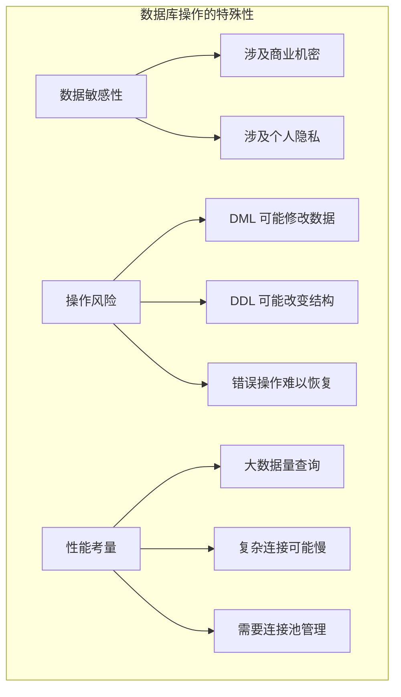
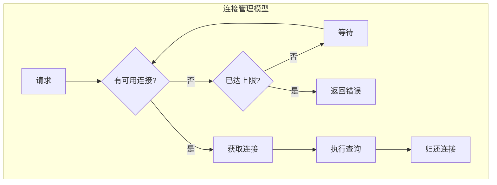
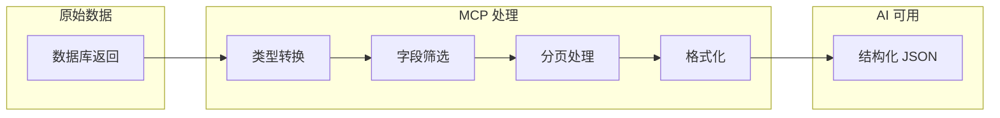
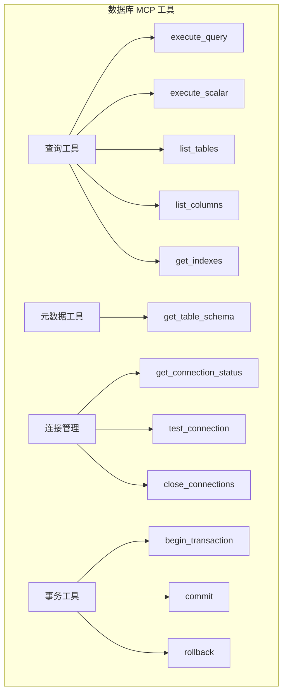
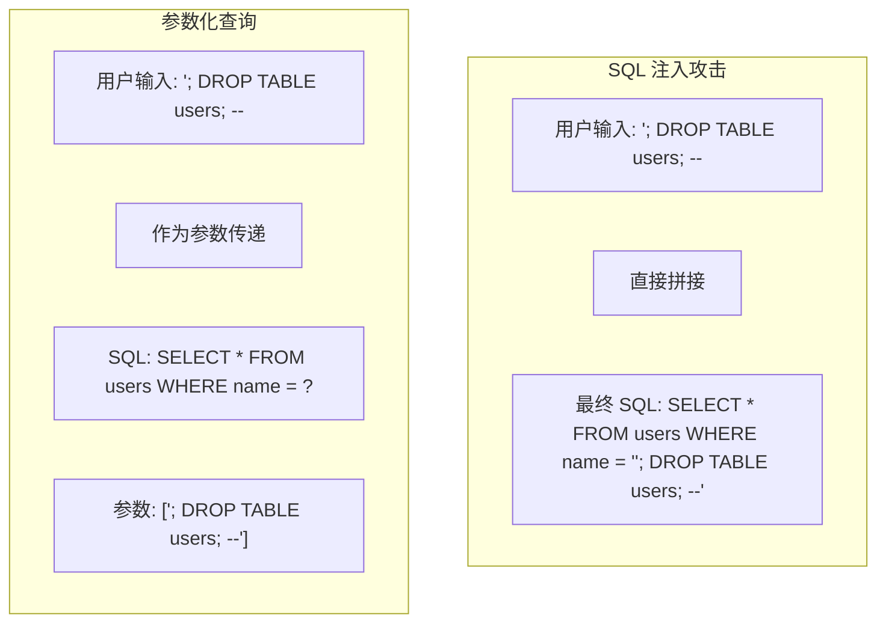
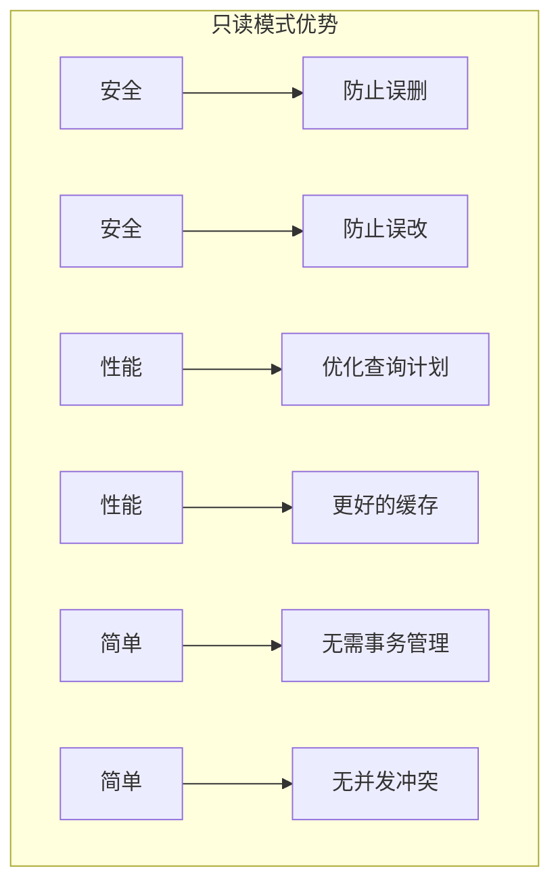

# 2.10 数据库访问：让 AI 成为数据分析师

> 本章将深入探讨如何让 AI 与数据库交互。我们会解释数据库 MCP 的设计理念、连接管理策略，以及如何构建一个安全高效的数据库集成。

---

## 章节导航

| 阶段 | 内容 | 篇幅 |
|------|------|------|
| 问题引入 | AI 为什么需要数据库访问 | 15% |
| 核心概念 | 数据库连接与查询模型 | 25% |
| 架构设计 | SQLite vs PostgreSQL 选择 | 25% |
| 实践指南 | 安全配置与性能优化 | 25% |
| 总结 | 要点回顾 | 10% |

---

## 一、引子：AI 与数据的距离

### 1.1 从文本分析到数据分析

想象你在运营一家电商公司。传统的 AI 助手可以帮你写邮件、整理文档，但它能否回答这样的问题？

```
┌─────────────────────────────────────────────────────────────────┐
│                    AI 数据分析的价值                              │
├─────────────────────────────────────────────────────────────────┤
│                                                                 │
│  传统 AI 能做的：                                               │
│  ┌─────────────────────────────────────────────────────────┐   │
│  │  • "帮我总结这份销售报告"                               │   │
│  │  • "写一封客户回访邮件"                                 │   │
│  │  • "解释这段代码的意思"                                 │   │
│  └─────────────────────────────────────────────────────────┘   │
│                                                                 │
│  配备数据库 MCP 后，AI 还能：                                   │
│  ┌─────────────────────────────────────────────────────────┐   │
│  │  • "上个月销售额是多少？"                                │   │
│  │  • "找出购买频率最高的客户"                             │   │
│  │  • "分析库存周转率"                                     │   │
│  │  • "预测下季度收入"                                     │   │
│  └─────────────────────────────────────────────────────────┘   │
│                                                                 │
│  区别：                                                         │
│  ┌─────────────────────────────────────────────────────────┐   │
│  │  传统 AI：处理已有文档                                  │   │
│  │  数据库 AI：直接查询原始数据                             │   │
│  │  → 更准确、更实时、更多分析可能                        │   │
│  └─────────────────────────────────────────────────────────┘   │
│                                                                 │
└─────────────────────────────────────────────────────────────────┘
```

### 1.2 为什么数据库访问需要特别设计？

数据库操作与其他 MCP 场景有本质不同：



---

## 二、核心概念：数据库访问的设计智慧

### 2.1 为什么需要两种数据库支持？

```
┌─────────────────────────────────────────────────────────────────┐
│                    SQLite vs PostgreSQL 选择                       │
├─────────────────────────────────────────────────────────────────┤
│                                                                 │
│  SQLite: 轻量级选择                                            │
│  ┌─────────────────────────────────────────────────────────┐   │
│  │  ✓ 零配置，无需单独服务                                  │   │
│  │  ✓ 单文件，部署简单                                     │   │
│  │  ✓ 读性能优秀                                           │   │
│  │  ✗ 并发写入能力有限                                     │   │
│  │  ✗ 功能相对简单                                         │   │
│  │                                                          │   │
│  │  适用场景：                                              │   │
│  │  • 本地数据分析                                          │   │
│  │  • 小型应用                                              │   │
│  │  • 嵌入式数据库                                          │   │
│  │  • 快速原型开发                                          │   │
│  └─────────────────────────────────────────────────────────┘   │
│                                                                 │
│  PostgreSQL: 企业级选择                                         │
│  ┌─────────────────────────────────────────────────────────┐   │
│  │  ✓ 功能丰富 (事务、存储过程、全文搜索)                   │   │
│  │  ✓ 并发处理能力强                                       │   │
│  │  ✓ 扩展生态丰富                                         │   │
│  │  ✗ 需要单独部署                                         │   │
│  │  ✗ 配置相对复杂                                         │   │
│  │                                                          │   │
│  │  适用场景：                                              │   │
│  │  • 生产环境应用                                          │   │
│  │  • 复杂业务逻辑                                          │   │
│  │  • 高并发场景                                            │   │
│  │  • 需要高级特性的应用                                    │   │
│  └─────────────────────────────────────────────────────────┘   │
│                                                                 │
└─────────────────────────────────────────────────────────────────┘
```

### 2.2 连接管理的艺术

数据库连接是稀缺资源，必须精心管理：



**关键设计原则**：

| 原则 | 说明 | 实现 |
|------|------|------|
| 连接池 | 复用连接，减少开销 | 预创建 N 个连接 |
| 超时保护 | 防止无限等待 | 设置连接获取超时 |
| 自动归还 | 防止连接泄漏 | 使用上下文管理器 |
| 健康检查 | 确保连接可用 | 定期检测连接状态 |

### 2.3 查询结果的处理艺术

数据库返回的数据往往很复杂，MCP 需要对其进行智能处理：



**设计要点**：
- 自动转换数据类型（日期、二进制等）
- 只返回必要的字段
- 大结果集自动分页
- 保持返回结构一致性

---

## 三、架构设计：工具分类与操作模型

### 3.1 工具分类体系



### 3.2 查询执行流程

```
┌─────────────────────────────────────────────────────────────────┐
│                    查询执行流程                                   │
├─────────────────────────────────────────────────────────────────┤
│                                                                 │
│  1. 接收自然语言请求                                            │
│  ┌─────────────────────────────────────────────────────────┐   │
│  │  "找出销售额超过 10000 的订单"                          │   │
│  └─────────────────────────────────────────────────────────┘   │
│                         │                                       │
│                         ▼                                       │
│  2. AI 转换为 SQL                                               │
│  ┌─────────────────────────────────────────────────────────┐   │
│  │  SELECT * FROM orders WHERE amount > 10000             │   │
│  └─────────────────────────────────────────────────────────┘   │
│                         │                                       │
│                         ▼                                       │
│  3. MCP 执行查询                                                │
│  ┌─────────────────────────────────────────────────────────┐   │
│  │  • 获取连接                                              │   │
│  │  • 执行查询                                              │   │
│  │  • 处理结果                                              │   │
│  │  • 归还连接                                              │   │
│  └─────────────────────────────────────────────────────────┘   │
│                         │                                       │
│                         ▼                                       │
│  4. 返回结构化结果                                              │
│  ┌─────────────────────────────────────────────────────────┐   │
│  │  {                                                      │   │
│  │    "success": true,                                    │   │
│  │    "columns": ["id", "amount", "customer"],           │   │
│  │    "rows": [...],                                      │   │
│  │    "row_count": 42                                     │   │
│  │  }                                                      │   │
│  └─────────────────────────────────────────────────────────┘   │
│                                                                 │
└─────────────────────────────────────────────────────────────────┘
```

---

## 四、实践指南：安全配置与最佳实践

### 4.1 SQL 注入防护

SQL 注入是数据库最大的安全威胁：



**防护最佳实践**：

```
┌─────────────────────────────────────────────────────────────────┐
│                    SQL 注入防护清单                                │
├─────────────────────────────────────────────────────────────────┤
│                                                                 │
│  ✅ 必须做：                                                     │
│  ┌─────────────────────────────────────────────────────────┐   │
│  │ □ 使用参数化查询                                         │   │
│  │ □ 验证输入数据类型                                       │   │
│  │ □ 限制数据库用户权限                                     │   │
│  │ □ 启用查询日志审计                                        │   │
│  └─────────────────────────────────────────────────────────┘   │
│                                                                 │
│  ❌ 禁止做：                                                     │
│  ┌─────────────────────────────────────────────────────────┐   │
│  │ □ 直接拼接用户输入到 SQL                                  │   │
│  │ □ 使用动态 SQL（EXECUTE）                                │   │
│  │ □ 在查询中暴露数据库错误信息                             │   │
│  └─────────────────────────────────────────────────────────┘   │
│                                                                 │
└─────────────────────────────────────────────────────────────────┘
```

### 4.2 只读模式配置

对于数据分析场景，推荐配置只读模式：



### 4.3 性能优化策略

```
┌─────────────────────────────────────────────────────────────────┐
│                    数据库查询性能优化                               │
├─────────────────────────────────────────────────────────────────┤
│                                                                 │
│  1. 限制返回行数                                                │
│  ┌─────────────────────────────────────────────────────────┐   │
│  │  • 默认限制 1000 行                                     │   │
│  │  • 支持分页查询                                         │   │
│  │  • 大结果集警告                                          │   │
│  └─────────────────────────────────────────────────────────┘   │
│                                                                 │
│  2. 查询超时                                                    │
│  ┌─────────────────────────────────────────────────────────┐   │
│  │  • 设置最大执行时间（如 30 秒）                          │   │
│  │  • 超时返回友好错误                                     │   │
│  └─────────────────────────────────────────────────────────┘   │
│                                                                 │
│  3. 慢查询日志                                                  │
│  ┌─────────────────────────────────────────────────────────┐   │
│  │  • 记录执行时间长的查询                                 │   │
│  │  • 定期分析优化                                        │   │
│  └─────────────────────────────────────────────────────────┘   │
│                                                                 │
│  4. 连接池调优                                                  │
│  ┌─────────────────────────────────────────────────────────┐   │
│  │  • 根据并发量调整池大小                                 │   │
│  │  • 设置合理的最小/最大连接数                            │   │
│  │  • 配置连接超时和空闲回收                              │   │
│  └─────────────────────────────────────────────────────────┘   │
│                                                                 │
└─────────────────────────────────────────────────────────────────┘
```

---

## 五、典型应用场景

### 5.1 智能数据分析助手

```
┌─────────────────────────────────────────────────────────────────┐
│                    数据分析工作流                                  │
├─────────────────────────────────────────────────────────────────┤
│                                                                 │
│  用户: "分析上季度的销售趋势"                                    │
│                                                                 │
│  步骤1: 理解数据结构                                             │
│  ┌─────────────────────────────────────────────────────────┐   │
│  │  list_tables()                                          │   │
│  │  → 返回: orders, products, customers, ...               │   │
│  └─────────────────────────────────────────────────────────┘   │
│                          │                                       │
│                          ▼                                       │
│  步骤2: 了解表结构                                              │
│  ┌─────────────────────────────────────────────────────────┐   │
│  │  get_table_schema("orders")                            │   │
│  │  → 返回: id, amount, date, customer_id, product_id     │   │
│  └─────────────────────────────────────────────────────────┘   │
│                          │                                       │
│                          ▼                                       │
│  步骤3: 执行分析查询                                             │
│  ┌─────────────────────────────────────────────────────────┐   │
│  │  SELECT DATE_TRUNC('month', order_date) as month,      │   │
│  │         SUM(amount) as total                            │   │
│  │  FROM orders                                            │   │
│  │  WHERE order_date >= '2024-01-01'                      │   │
│  │  GROUP BY 1                                             │   │
│  │  ORDER BY 1                                             │   │
│  └─────────────────────────────────────────────────────────┘   │
│                          │                                       │
│                          ▼                                       │
│  步骤4: 生成分析报告                                             │
│  ┌─────────────────────────────────────────────────────────┐   │
│  │  AI 根据数据生成:                                        │   │
│  │  • 销售趋势图表                                         │   │
│  │  • 增长/下降分析                                        │   │
│  │  • 建议和结论                                           │   │
│  └─────────────────────────────────────────────────────────┘   │
│                                                                 │
└─────────────────────────────────────────────────────────────────┘
```

---

## 六、本章小结

### 6.1 核心要点

```
┌─────────────────────────────────────────────────────────────────┐
│                    本章核心要点                                    │
├─────────────────────────────────────────────────────────────────┤
│                                                                 │
│  1. 设计理念                                                    │
│     • AI 需要数据库访问来执行数据分析                            │
│     • SQLite 适合轻量场景，PostgreSQL 适合企业场景              │
│                                                                 │
│  2. 核心机制                                                    │
│     • 连接池管理是性能关键                                      │
│     • 参数化查询防止 SQL 注入                                    │
│     • 查询结果需要智能处理                                      │
│                                                                 │
│  3. 安全实践                                                    │
│     • 优先使用只读模式                                          │
│     • 限制返回行数                                              │
│     • 设置查询超时                                              │
│                                                                 │
│  4. 工具分类                                                    │
│     • 查询工具、元数据工具、连接管理、事务工具                   │
│                                                                 │
└─────────────────────────────────────────────────────────────────┘
```

### 6.2 知识检查

1. 为什么需要参数化查询？
2. SQLite 和 PostgreSQL 的适用场景有什么区别？
3. 连接池的作用是什么？
4. 如何防止 SQL 注入攻击？

---

## 七、延伸阅读

| 资源 | 说明 |
|------|------|
| SQL 注入防护 OWASP | 安全最佳实践 |
| PostgreSQL 文档 | 官方文档 |
| 连接池原理 | 性能优化指南 |

---

## 八、下一章预告

下一章我们将学习 **浏览器自动化 MCP**，让 AI 能够控制浏览器进行自动化操作——这是构建 UI 测试和网页数据抓取助手的基础。

---

*本章贡献者：MCP Tutorial Team*
*版本：v3.0 出版级*
