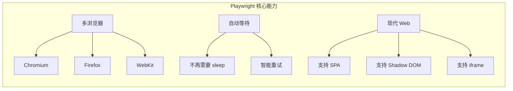
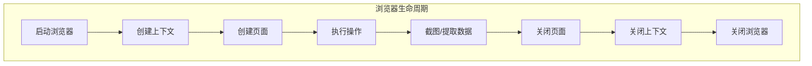
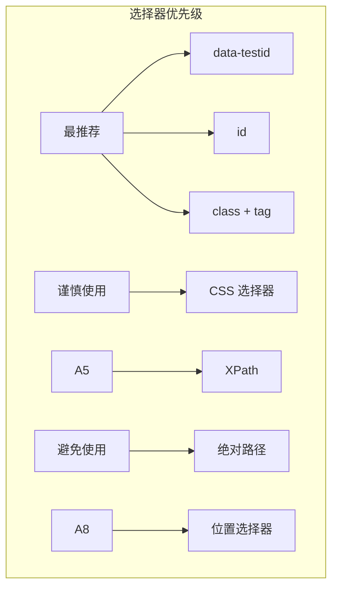
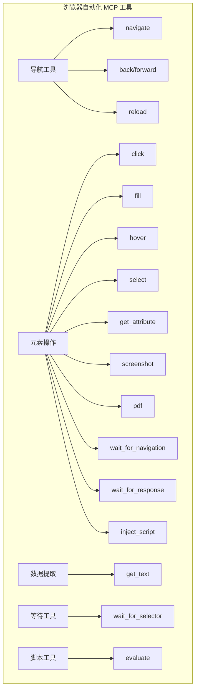
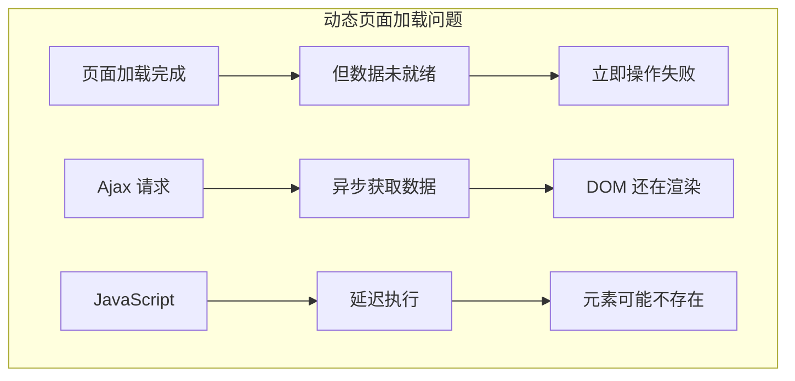

# 2.11 浏览器自动化：让 AI 掌控 Web 世界

> 本章将深入探讨浏览器自动化的设计理念。我们会解释为什么需要浏览器自动化、MCP 如何与浏览器交互，以及如何构建安全高效的浏览器自动化 MCP。

---

## 章节导航

| 阶段 | 内容 | 篇幅 |
|------|------|------|
| 问题引入 | AI 为什么需要浏览器 | 15% |
| 核心概念 | Playwright 与浏览器控制 | 25% |
| 架构设计 | 工具分类与操作模型 | 25% |
| 实践指南 | 等待策略与安全 | 25% |
| 总结 | 要点回顾 | 10% |

---

## 一、引子：AI 与浏览器的距离

### 1.1 为什么 AI 需要浏览器？

很多信息只存在于网页上，API 并不开放：

```
┌─────────────────────────────────────────────────────────────────┐
│                    浏览器自动化的价值                              │
├─────────────────────────────────────────────────────────────────┤
│                                                                 │
│  传统数据获取方式：                                             │
│  ┌─────────────────────────────────────────────────────────┐   │
│  │  • API 接口 → 需要申请 access                          │   │
│  │  • 数据库 → 需要直接访问权限                           │   │
│  │  • 文件下载 → 需要手动操作                             │   │
│  └─────────────────────────────────────────────────────────┘   │
│                                                                 │
│  浏览器可以做到：                                               │
│  ┌─────────────────────────────────────────────────────────┐   │
│  │  ✓ 模拟人类操作，绕过登录                              │   │
│  │  ✓ 抓取任何公开网页                                    │   │
│  │  ✓ 执行 JavaScript 获取动态内容                        │   │
│  │  ✓ 自动化测试 Web 应用                                 │   │
│  │  ✓ 截图和 PDF 生成                                    │   │
│  └─────────────────────────────────────────────────────────┘   │
│                                                                 │
│  典型应用场景：                                                 │
│  ┌─────────────────────────────────────────────────────────┐   │
│  │  • 价格监控（电商比价）                               │   │
│  │  • 新闻聚合                                             │   │
│  │  • UI 自动化测试                                        │   │
│  │  • 表单批量提交                                         │   │
│  │  • 网页截图存档                                         │   │
│  └─────────────────────────────────────────────────────────┘   │
│                                                                 │
└─────────────────────────────────────────────────────────────────┘
```

### 1.2 为什么选择 Playwright？

Playwright 是微软推出的自动化测试工具，专为现代 Web 设计：



**Playwright vs Selenium vs Puppeteer**：

```
┌─────────────────────────────────────────────────────────────────┐
│                    自动化工具对比                                  │
├──────────────────┬────────────┬────────────┬─────────────────────┤
│     维度         │ Playwright │  Selenium  │    Puppeteer       │
├──────────────────┼────────────┼────────────┼─────────────────────┤
│ 多浏览器支持     │ ✓ 全部     │ ✓ 全部     │ ✗ 仅 Chromium      │
├──────────────────┼────────────┼────────────┼─────────────────────┤
│ 速度             │  快        │   慢       │      快             │
├──────────────────┼────────────┼────────────┼─────────────────────┤
│ 等待机制         │  自动      │  手动      │      手动          │
├──────────────────┼────────────┼────────────┼─────────────────────┤
│ 录制功能         │  ✓        │   ✓        │      ✗             │
├──────────────────┼────────────┼────────────┼─────────────────────┤
│ MCP 集成         │  简单      │   复杂     │      简单          │
└──────────────────┴────────────┴────────────┴─────────────────────┘
```

---

## 二、核心概念：浏览器控制的设计智慧

### 2.1 浏览器实例的生命周期



**关键设计原则**：

| 阶段 | 说明 | 最佳实践 |
|------|------|----------|
| 启动 | 浏览器启动较慢 | 使用全局实例复用 |
| 上下文 | 隔离 cookies/存储 | 每个任务独立上下文 |
| 页面 | 执行主要操作 | 操作完及时关闭 |
| 清理 | 资源释放 | 使用 try/finally |

### 2.2 选择器的艺术

浏览器自动化的核心挑战是**如何找到元素**：



**选择器最佳实践**：

```
┌─────────────────────────────────────────────────────────────────┐
│                    选择器最佳实践                                   │
├─────────────────────────────────────────────────────────────────┤
│                                                                 │
│  推荐优先级：                                                   │
│  ┌─────────────────────────────────────────────────────────┐   │
│  │  1. data-testid (最稳定)                               │   │
│  │     <button data-testid="submit-btn">提交</button>    │   │
│  │                                                          │   │
│  │  2. id (唯一标识)                                       │   │
│  │     <input id="username">                              │   │
│  │                                                          │   │
│  │  3. 语义化选择器                                        │   │
│  │     button:has-text("提交")                             │   │
│  │                                                          │   │
│  │  4. CSS 类名（带标签）                                 │   │
│  │     input.form-control                                  │   │
│  └─────────────────────────────────────────────────────────┘   │
│                                                                 │
│  应避免：                                                      │
│  ┌─────────────────────────────────────────────────────────┐   │
│  │  ✗ 绝对路径: div > div > div > button:nth-child(3)    │   │
│  │  ✗ 动态类名: .MuiButton-root- │   │
│123                        │  ✗ 位置索引: button:nth-child(5)                       │   │
│  └─────────────────────────────────────────────────────────┘   │
│                                                                 │
└─────────────────────────────────────────────────────────────────┘
```

---

## 三、架构设计：工具分类与操作模型

### 3.1 工具分类体系



### 3.2 操作执行流程

```
┌─────────────────────────────────────────────────────────────────┐
│                    浏览器操作执行流程                              │
├─────────────────────────────────────────────────────────────────┤
│                                                                 │
│  1. 用户请求                                                    │
│  ┌─────────────────────────────────────────────────────────┐   │
│  │  "帮我登录 GitHub 并查看我的仓库列表"                  │   │
│  └─────────────────────────────────────────────────────────┘   │
│                         │                                       │
│                         ▼                                       │
│  2. AI 分解任务                                                 │
│  ┌─────────────────────────────────────────────────────────┐   │
│  │  步骤1: navigate("https://github.com/login")          │   │
│  │  步骤2: fill("#username", "your_user")                │   │
│  │  步骤3: fill("#password", "your_pass")                │   │
│  │  步骤4: click('[data-testid="login-button"]')         │   │
│  │  步骤5: wait_for_selector(".repo-list")              │   │
│  │  步骤6: get_text(".repo-list")                       │   │
│  └─────────────────────────────────────────────────────────┘   │
│                         │                                       │
│                         ▼                                       │
│  3. MCP 执行（带自动等待）                                       │
│  ┌─────────────────────────────────────────────────────────┐   │
│  │  • Playwright 自动等待元素可见                        │   │
│  │  • 自动重试失败的操作                                  │   │
│  │  • 智能等待网络请求完成                               │   │
│  └─────────────────────────────────────────────────────────┘   │
│                         │                                       │
│                         ▼                                       │
│  4. 返回结果                                                    │
│  ┌─────────────────────────────────────────────────────────┐   │
│  │  {                                                      │   │
│  │    "success": true,                                    │   │
│  │    "repos": ["repo1", "repo2", "repo3"]              │   │
│  │  }                                                      │   │
│  └─────────────────────────────────────────────────────────┘   │
│                                                                 │
└─────────────────────────────────────────────────────────────────┘
```

---

## 四、实践指南：等待策略与安全

### 4.1 为什么等待如此重要？

现代 Web 应用大量使用 JavaScript 动态渲染内容：



**Playwright 的智能等待**：

```
┌─────────────────────────────────────────────────────────────────┐
│                    Playwright 自动等待机制                         │
├─────────────────────────────────────────────────────────────────┤
│                                                                 │
│  click() 自动等待：                                            │
│  ┌─────────────────────────────────────────────────────────┐   │
│  │  ✓ 元素可见                                              │   │
│  │  ✓ 元素可点击                                           │   │
│  │  ✓ 元素不在动画中                                        │   │
│  │  ✓ 事件处理器已绑定                                     │   │
│  └─────────────────────────────────────────────────────────┘   │
│                                                                 │
│  fill() 自动等待：                                             │
│  ┌─────────────────────────────────────────────────────────┐   │
│  │  ✓ 元素可见                                              │   │
│  │  ✓ 元素可交互                                           │   │
│  │  ✓ 输入事件已触发                                        │   │
│  └─────────────────────────────────────────────────────────┘   │
│                                                                 │
│  goto() 等待策略：                                             │
│  ┌─────────────────────────────────────────────────────────┐   │
│  │  • load      - 默认，等待 load 事件                     │   │
│  │  • domcontentloaded - DOM 解析完成                     │   │
│  │  • networkidle - 无网络请求 500ms                      │   │
│  │  • commit    - 响应开始                                 │   │
│  └─────────────────────────────────────────────────────────┘   │
│                                                                 │
└─────────────────────────────────────────────────────────────────┘
```

### 4.2 安全考虑

```
┌─────────────────────────────────────────────────────────────────┐
│                    浏览器自动化安全指南                             │
├─────────────────────────────────────────────────────────────────┤
│                                                                 │
│  风险1: 敏感数据泄露                                           │
│  ┌─────────────────────────────────────────────────────────┐   │
│  │  • 浏览器可访问所有页面数据                              │   │
│  │  • Cookie/Session 可能被提取                           │   │
│  │  • LocalStorage 敏感信息                               │   │
│  │                                                          │   │
│  │  防护: 使用独立浏览器上下文，不复用登录状态             │   │
│  └─────────────────────────────────────────────────────────┘   │
│                                                                 │
│  风险2: 恶意脚本执行                                           │
│  ┌─────────────────────────────────────────────────────────┐   │
│  │  • 执行用户提供的 JavaScript 可能危险                   │   │
│  │  • 可能窃取浏览器数据                                   │   │
│  │                                                          │   │
│  │  防护: 限制可执行的脚本，禁用敏感 API                  │   │
│  └─────────────────────────────────────────────────────────┘   │
│                                                                 │
│  风险3: 资源耗尽                                               │
│  ┌─────────────────────────────────────────────────────────┐   │
│  │  • 大量页面可能耗尽内存                                 │   │
│  │  • 无限循环操作                                         │   │
│  │                                                          │   │
│  │  防护: 设置超时，限制并发                               │   │
│  └─────────────────────────────────────────────────────────┘   │
│                                                                 │
└─────────────────────────────────────────────────────────────────┘
```

---

## 五、本章小结

### 5.1 核心要点

```
┌─────────────────────────────────────────────────────────────────┐
│                    本章核心要点                                    │
├─────────────────────────────────────────────────────────────────┤
│                                                                 │
│  1. 设计理念                                                    │
│     • 浏览器是 AI 访问 Web 的桥梁                               │
│     • Playwright 是现代 Web 自动化的最佳选择                    │
│                                                                 │
│  2. 核心机制                                                    │
│     • 浏览器实例复用提升性能                                    │
│     • 选择器需要稳定可靠                                       │
│     • 自动等待是核心能力                                        │
│                                                                 │
│  3. 工具分类                                                    │
│     • 导航、元素操作、数据提取、等待、脚本                      │
│                                                                 │
│  4. 安全实践                                                    │
│     • 独立上下文隔离数据                                       │
│     • 限制脚本执行范围                                         │
│     • 设置超时防止资源耗尽                                      │
│                                                                 │
└─────────────────────────────────────────────────────────────────┘
```

### 5.2 知识检查

1. 为什么现代 Web 自动化需要 Playwright 而不是 Selenium？
2. Playwright 的自动等待机制是什么？
3. 为什么选择器稳定性很重要？
4. 浏览器自动化有哪些安全风险？

---

## 六、延伸阅读

| 资源 | 说明 |
|------|------|
| Playwright 文档 | 官方文档 |
| 选择器最佳实践 | 稳定性指南 |
| Web 自动化设计模式 | 架构参考 |

---

## 七、下一章预告

下一章我们将学习 **Notion 集成 MCP**，让 AI 能够管理笔记和知识库。

---

*本章贡献者：MCP Tutorial Team*
*版本：v3.0 出版级*
