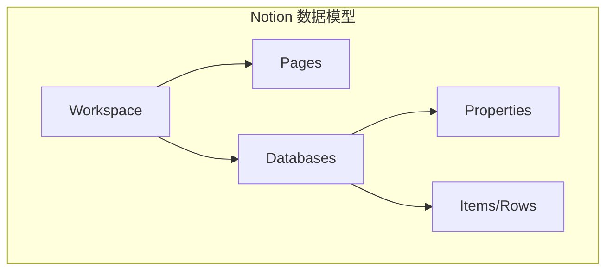
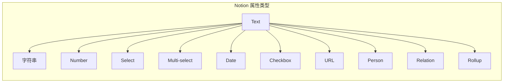
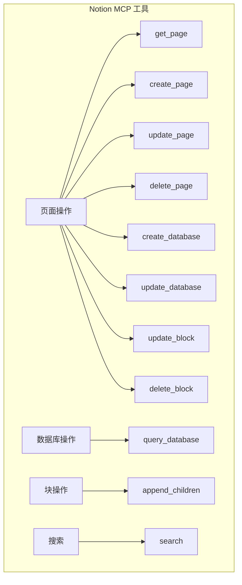

# 2.12 Notion 集成：让 AI 管理你的知识库

> 本章将深入探讨 Notion API 的 MCP 封装设计。我们会解释 Notion 的数据模型、MCP 如何映射其概念，以及如何构建一个实用的 Notion 集成。

---

## 章节导航

| 阶段 | 内容 | 篇幅 |
|------|------|------|
| 问题引入 | AI 与知识管理的结合 | 15% |
| 核心概念 | Notion 数据模型 | 25% |
| 架构设计 | API 映射与工具设计 | 25% |
| 实践指南 | 配置与使用 | 25% |
| 总结 | 要点回顾 | 10% |

---

## 一、引子：为什么让 AI 管理 Notion？

### 1.1 知识管理的困境

```
┌─────────────────────────────────────────────────────────────────┐
│                    知识管理挑战                                    │
├─────────────────────────────────────────────────────────────────┤
│                                                                 │
│  问题1: 信息过载                                                │
│  ┌─────────────────────────────────────────────────────────┐   │
│  │  • Notion 页面越来越多                                  │   │
│  │  • 难以快速找到需要的内容                                │   │
│  │  • 跨页面关联困难                                        │   │
│  └─────────────────────────────────────────────────────────┘   │
│                                                                 │
│  问题2: 更新滞后                                                │
│  ┌─────────────────────────────────────────────────────────┐   │
│  │  • 手动整理笔记耗时                                     │   │
│  │  • 同步多个来源困难                                     │   │
│  │  • 定期回顾难以坚持                                     │   │
│  └─────────────────────────────────────────────────────────┘   │
│                                                                 │
│  AI + Notion 能做到：                                          │
│  ┌─────────────────────────────────────────────────────────┐   │
│  │  ✓ 语义搜索，快速定位                                   │   │
│  ✓  自动整理和关联笔记                                      │   │
│  │  ✓ 智能摘要和更新提醒                                   │   │
│  │  ✓ 跨数据库关联分析                                     │   │
│  └─────────────────────────────────────────────────────────┘   │
│                                                                 │
└─────────────────────────────────────────────────────────────────┘
```

### 1.2 Notion API 的特殊性



**Notion 与传统 API 的区别**：

| 传统 API | Notion API |
|----------|------------|
| 表格/JSON | Block 块结构 |
| 固定字段 | 属性 (Properties) |
| 简单查询 | Filter + Sorts |
| 直线更新 | Page 合并更新 |

---

## 二、核心概念：Notion 数据模型解析

### 2.1 页面 vs 数据库

```
┌─────────────────────────────────────────────────────────────────┐
│                    Notion 核心概念                                  │
├─────────────────────────────────────────────────────────────────┤
│                                                                 │
│  页面 (Page):                                                   │
│  ┌─────────────────────────────────────────────────────────┐   │
│  │  • 内容的容器                                          │   │
│  │  • 由 Block 块组成                                     │   │
│  │  • 可以包含子页面                                       │   │
│  │  • 可以附加属性（在数据库中）                          │   │
│  └─────────────────────────────────────────────────────────┘   │
│                                                                 │
│  数据库 (Database):                                             │
│  ┌─────────────────────────────────────────────────────────┐   │
│  │  • 页面集合，带有结构化属性                            │   │
│  │  • 类似表格，每行是一个页面                            │   │
│  │  • 支持过滤、排序、视图                                │   │
│  │  • 支持多种视图（表格、看板、日历等）                 │   │
│  └─────────────────────────────────────────────────────────┘   │
│                                                                 │
│  块 (Block):                                                    │
│  ┌─────────────────────────────────────────────────────────┐   │
│  │  • 页面内容的最小单位                                  │   │
│  │  • 类型：段落、标题、列表、代码、图片等                │   │
│  │  • 支持嵌套                                            │   │
│  │  • 可以转换类型                                        │   │
│  └─────────────────────────────────────────────────────────┘   │
│                                                                 │
└─────────────────────────────────────────────────────────────────┘
```

### 2.2 属性的复杂性



**MCP 设计策略**：将复杂的属性结构简化为易用的工具。

---

## 三、架构设计：工具分类与操作模型

### 3.1 工具分类



### 3.2 查询模型设计

```
┌─────────────────────────────────────────────────────────────────┐
│                    数据库查询设计                                   │
├─────────────────────────────────────────────────────────────────┤
│                                                                 │
│  Notion 查询特点：                                              │
│  ┌─────────────────────────────────────────────────────────┐   │
│  │  • Filter: 按属性过滤                                  │   │
│  │  • Sorts: 排序                                         │   │
│  │  • Pagination: 分页                                    │   │
│  │  • Property Sorts: 按属性排序                         │   │
│  └─────────────────────────────────────────────────────────┘   │
│                                                                 │
│  MCP 简化设计：                                                │
│  ┌─────────────────────────────────────────────────────────┐   │
│  │  {                                                      │   │
│  │    "database_id": "xxx",                              │   │
│  │    "filter": {"property": "Status", "select": {...}}, │   │
│  │    "sorts": [{"property": "Date", "direction": "desc"}],│   │
│  │    "page_size": 100                                   │   │
│  │  }                                                      │   │
│  └─────────────────────────────────────────────────────────┘   │
│                                                                 │
└─────────────────────────────────────────────────────────────────┘
```

---

## 四、实践指南：认证与配置

### 4.1 认证机制

```
┌─────────────────────────────────────────────────────────────────┐
│                    Notion 认证流程                                  │
├─────────────────────────────────────────────────────────────────┤
│                                                                 │
│  1. 创建 Integration                                           │
│  ┌─────────────────────────────────────────────────────────┐   │
│  │  https://www.notion.so/my-integrations                 │   │
│  └─────────────────────────────────────────────────────────┘   │
│                          │                                       │
│                          ▼                                       │
│  2. 获取 Token                                                │
│  ┌─────────────────────────────────────────────────────────┐   │
│  │  secret_xxx...                                         │   │
│  └─────────────────────────────────────────────────────────┘   │
│                          │                                       │
│                          ▼                                       │
│  3. 分享页面给 Integration                                     │
│  ┌─────────────────────────────────────────────────────────┐   │
│  │  页面右上角 → Share → Add connections                  │   │
│  └─────────────────────────────────────────────────────────┘   │
│                                                                 │
└─────────────────────────────────────────────────────────────────┘
```

### 4.2 典型使用场景

```
┌─────────────────────────────────────────────────────────────────┐
│                    Notion MCP 典型场景                              │
├─────────────────────────────────────────────────────────────────┤
│                                                                 │
│  场景1: 会议记录自动整理                                        │
│  ┌─────────────────────────────────────────────────────────┐   │
│  │  • 搜索相关会议页面                                     │   │
│  │  • 提取关键要点                                        │   │
│  │  • 创建待办事项页面                                     │   │
│  └─────────────────────────────────────────────────────────┘   │
│                                                                 │
│  场景2: 项目进度追踪                                           │
│  ┌─────────────────────────────────────────────────────────┐   │
│  │  • 查询项目数据库                                       │   │
│  │  • 统计完成进度                                        │   │
│  │  • 生成进度报告                                         │   │
│  └─────────────────────────────────────────────────────────┘   │
│                                                                 │
│  场景3: 知识库增强                                             │
│  ┌─────────────────────────────────────────────────────────┐   │
│  │  • 搜索相关笔记                                         │   │
│  │  • AI 生成摘要                                         │   │
│  │  • 自动添加关联标签                                     │   │
│  └─────────────────────────────────────────────────────────┘   │
│                                                                 │
└─────────────────────────────────────────────────────────────────┘
```

---

## 五、本章小结

### 5.1 核心要点

```
┌─────────────────────────────────────────────────────────────────┐
│                    本章核心要点                                    │
├─────────────────────────────────────────────────────────────────┤
│                                                                 │
│  1. 设计理念                                                    │
│     • Notion 是结构化知识管理的优秀平台                         │
│     • AI + Notion 实现智能知识管理                              │
│                                                                 │
│  2. 核心机制                                                    │
│     • 页面、数据库、块三层模型                                  │
│     • 属性类型丰富多样                                         │
│     • API 需要 Integration Token                                │
│                                                                 │
│  3. 工具设计                                                    │
│     • 页面 CRUD 操作                                           │
│     • 数据库查询与过滤                                         │
│     • 块内容管理                                               │
│                                                                 │
│  4. 实践要点                                                    │
│     • 需要分享页面给 Integration                                │
│     • 理解 Block 和 Property 的区别                           │
│                                                                 │
└─────────────────────────────────────────────────────────────────┘
```

### 5.2 知识检查

1. Notion 的页面和数据库有什么区别？
2. Block 和 Property 是什么关系？
3. Notion API 认证需要什么？

---

## 六、延伸阅读

| 资源 | 说明 |
|------|------|
| Notion API 文档 | 官方文档 |
| Notion Block 指南 | 块操作指南 |

---

## 七、下一章预告

下一章我们将学习 **Slack 集成 MCP**，让 AI 能够参与团队协作和即时通讯。

---

*本章贡献者：MCP Tutorial Team*
*版本：v3.0 出版级*
