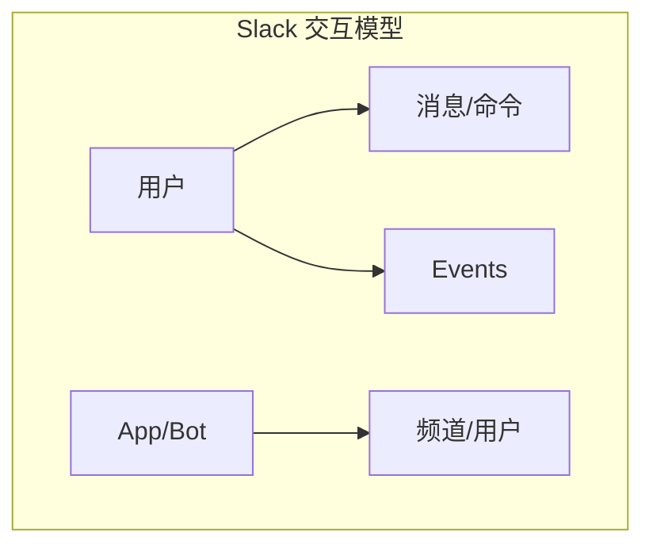
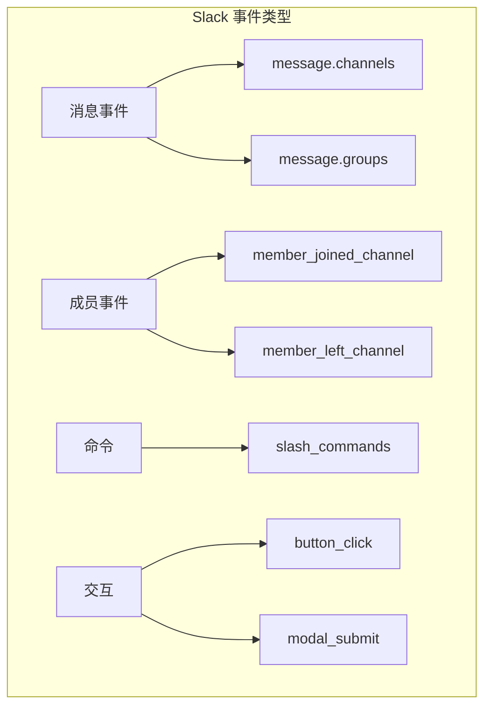
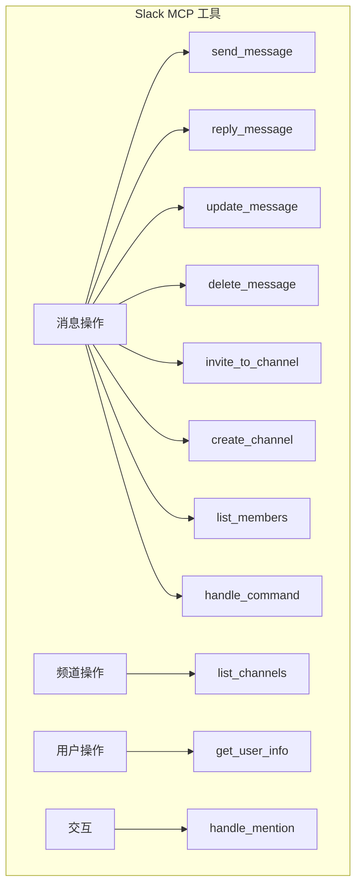

# 2.13 Slack 集成：让 AI 成为团队协作者

> 本章将深入探讨 Slack 集成的设计理念。我们会解释 Slack 的事件模型、MCP 如何与 Slack 交互，以及如何构建一个实用的团队协作 MCP。

---

## 章节导航

| 阶段 | 内容 | 篇幅 |
|------|------|------|
| 问题引入 | AI 为什么需要消息平台 | 15% |
| 核心概念 | Slack 数据模型 | 25% |
| 架构设计 | 事件与操作设计 | 25% |
| 实践指南 | Bot 开发与安全 | 25% |
| 总结 | 要点回顾 | 10% |

---

## 一、引子：AI 与团队协作

### 1.1 为什么 AI 需要消息平台？

```
┌─────────────────────────────────────────────────────────────────┐
│                    AI 加入消息平台的价值                             │
├─────────────────────────────────────────────────────────────────┤
│                                                                 │
│  传统 AI 助手：                                                │
│  ┌─────────────────────────────────────────────────────────┐   │
│  │  • 只能一对一对话                                        │   │
│  │  • 需要用户主动发起                                     │   │
│  │  • 信息孤岛                                              │   │
│  └─────────────────────────────────────────────────────────┘   │
│                                                                 │
│  集成 Slack 后：                                               │
│  ┌─────────────────────────────────────────────────────────┐   │
│  ✓ 可以参与群组讨论                                          │   │
│  ✓ 主动推送通知                                             │   │
│  ✓ 响应 @ 提及                                             │   │
│  ✓ 执行命令完成任务                                         │   │
│  └─────────────────────────────────────────────────────────┘   │
│                                                                 │
│  典型场景：                                                    │
│  ┌─────────────────────────────────────────────────────────┐   │
│  │  • "@AI 帮我总结这个讨论"                               │   │
│  │  • "项目有新人加入，发送欢迎消息"                       │   │
│  │  • "CI 失败时自动通知相关人员"                         │   │
│  │  • "定时发送每日站会提醒"                               │   │
│  └─────────────────────────────────────────────────────────┘   │
│                                                                 │
└─────────────────────────────────────────────────────────────────┘
```

### 1.2 Slack API 的特殊性



**Slack 核心概念**：

| 概念 | 说明 |
|------|------|
| Workspace | 工作区 |
| Channel | 频道（公开/私聊） |
| Message | 消息（含格式） |
| Thread | 话题线程 |
| Reaction | 表情回应 |
| App/Bot | 机器人应用 |

---

## 二、核心概念：Slack 数据模型

### 2.1 消息模型

```
┌─────────────────────────────────────────────────────────────────┐
│                    Slack 消息结构                                    │
├─────────────────────────────────────────────────────────────────┤
│                                                                 │
│  基本消息：                                                    │
│  ┌─────────────────────────────────────────────────────────┐   │
│  │  {                                                      │   │
│  │    "type": "message",                                 │   │
│  │    "channel": "C123456",                              │   │
│  │    "text": "Hello World",                             │   │
│  │    "user": "U123456",                                 │   │
│  │    "ts": "1234567890.123456"                         │   │
│  │  }                                                      │   │
│  └─────────────────────────────────────────────────────────┘   │
│                                                                 │
│  富文本消息 (Block Kit):                                        │
│  ┌─────────────────────────────────────────────────────────┐   │
│  │  {                                                      │   │
│  │    "blocks": [                                         │   │
│  │      {                                                  │   │
│  │        "type": "section",                             │   │
│  │        "text": {"type": "mrkdwn", "text": "..."}     │   │
│  │      },                                                 │   │
│  │      {                                                  │   │
│  │        "type": "actions",                             │   │
│  │        "elements": [...]                              │   │
│  │      }                                                 │   │
│  │    ]                                                   │   │
│  │  }                                                      │   │
│  └─────────────────────────────────────────────────────────┘   │
│                                                                 │
└─────────────────────────────────────────────────────────────────┘
```

### 2.2 事件模型



---

## 三、架构设计：工具分类与操作

### 3.1 工具分类



### 3.2 MCP vs Webhook 模式

```
┌─────────────────────────────────────────────────────────────────┐
│                    Slack 连接模式对比                               │
├─────────────────────────────────────────────────────────────────┤
│                                                                 │
│  Webhook 模式（单向）：                                          │
│  ┌─────────────────────────────────────────────────────────┐   │
│  │  MCP Server → Slack                                    │   │
│  │  • 只能发送消息                                        │   │
│  │  • 无法响应用户输入                                    │   │
│  │  • 简单配置即可使用                                    │   │
│  └─────────────────────────────────────────────────────────┘   │
│                                                                 │
│  Socket Mode（双向）：                                           │
│  ┌─────────────────────────────────────────────────────────┐   │
│  │  MCP Client ↔ Slack                                   │   │
│  │  • 可以发送和接收消息                                  │   │
│  │  • 支持交互式组件                                      │   │
│  │  • 需要长期运行                                        │   │
│  └─────────────────────────────────────────────────────────┘   │
│                                                                 │
│  Events API（事件驱动）：                                        │
│  ┌─────────────────────────────────────────────────────────┐   │
│  │  Slack → MCP Server                                    │   │
│  │  • 订阅事件类型                                        │   │
│  │  • 实时响应                                            │   │
│  │  • 需要公网 URL                                         │   │
│  └─────────────────────────────────────────────────────────┘   │
│                                                                 │
└─────────────────────────────────────────────────────────────────┘
```

---

## 四、实践指南：Bot 开发与安全

### 4.1 Bot 开发流程

```
┌─────────────────────────────────────────────────────────────────┐
│                    Slack Bot 开发流程                               │
├─────────────────────────────────────────────────────────────────┤
│                                                                 │
│  1. 创建 Slack App                                              │
│  ┌─────────────────────────────────────────────────────────┐   │
│  │  https://api.slack.com/apps                          │   │
│  └─────────────────────────────────────────────────────────┘   │
│                          │                                       │
│                          ▼                                       │
│  2. 配置权限 (OAuth Scopes)                                     │
│  ┌─────────────────────────────────────────────────────────┐   │
│  │  • chat:write - 发送消息                              │   │
│  │  • channels:read - 读取频道                          │   │
│  │  • users:read - 读取用户                             │   │
│  │  • commands - 添加命令                                │   │
│  └─────────────────────────────────────────────────────────┘   │
│                          │                                       │
│                          ▼                                       │
│  3. 安装到工作区                                                │
│  ┌─────────────────────────────────────────────────────────┐   │
│  │  生成 Bot User OAuth Token                            │   │
│  └─────────────────────────────────────────────────────────┘   │
│                          │                                       │
│                          ▼                                       │
│  4. 实现功能                                                    │
│  ┌─────────────────────────────────────────────────────────┐   │
│  │  • 处理消息                                            │   │
│  │  • 响应命令                                            │   │
│  │  • 发送通知                                            │   │
│  └─────────────────────────────────────────────────────────┘   │
│                                                                 │
└─────────────────────────────────────────────────────────────────┘
```

### 4.2 安全最佳实践

```
┌─────────────────────────────────────────────────────────────────┐
│                    Slack Bot 安全指南                              │
├─────────────────────────────────────────────────────────────────┤
│                                                                 │
│  权限原则：                                                     │
│  ┌─────────────────────────────────────────────────────────┐   │
│  │ □ 只申请必要的 OAuth Scope                              │   │
│  │ □ 区分 Bot Token 和 User Token                         │   │
│  │ □ 定期审查权限                                           │   │
│  └─────────────────────────────────────────────────────────┘   │
│                                                                 │
│  消息安全：                                                     │
│  ┌─────────────────────────────────────────────────────────┐   │
│  │ □ 验证请求来源（signature）                            │   │
│  │ □ 不信任用户输入                                        │   │
│  │ □ 防止命令注入                                          │   │
│  └─────────────────────────────────────────────────────────┘   │
│                                                                 │
│  隐私保护：                                                     │
│  ┌─────────────────────────────────────────────────────────┐   │
│  │ □ 不存储敏感消息内容                                    │   │
│  │ □ 日志脱敏处理                                         │   │
│  │ □ 消息处理后及时清理                                    │   │
│  └─────────────────────────────────────────────────────────┘   │
│                                                                 │
└─────────────────────────────────────────────────────────────────┘
```

---

## 五、本章小结

### 5.1 核心要点

```
┌─────────────────────────────────────────────────────────────────┐
│                    本章核心要点                                    │
├─────────────────────────────────────────────────────────────────┤
│                                                                 │
│  1. 设计理念                                                    │
│     • AI 加入 Slack 实现团队协作                               │
│     • 支持消息、命令、交互多种模式                              │
│                                                                 │
│  2. 核心机制                                                    │
│     • Workspace/Channel/Message 层级结构                        │
│     • Webhook vs Socket Mode vs Events API                     │
│     • Block Kit 富文本消息                                      │
│                                                                 │
│  3. 工具设计                                                    │
│     • 消息发送/回复/编辑/删除                                  │
│     • 频道管理                                                 │
│     • 用户信息获取                                             │
│                                                                 │
│  4. 安全实践                                                    │
│     • 最小权限 Scope                                          │
│     • 请求来源验证                                             │
│     • 隐私数据保护                                             │
│                                                                 │
└─────────────────────────────────────────────────────────────────┘
```

### 5.2 知识检查

1. Slack 的 Webhook 模式和 Socket Mode 有什么区别？
2. Block Kit 消息是什么？
3. Slack Bot 开发需要哪些 OAuth Scope？

---

## 六、延伸阅读

| 资源 | 说明 |
|------|------|
| Slack API 文档 | 官方文档 |
| Block Kit 指南 | 富文本消息 |

---

## 七、下一章预告

下一章我们将学习 **搜索 API 集成 MCP**，让 AI 能够访问实时信息和网络资源。

---

*本章贡献者：MCP Tutorial Team*
*版本：v3.0 出版级*
