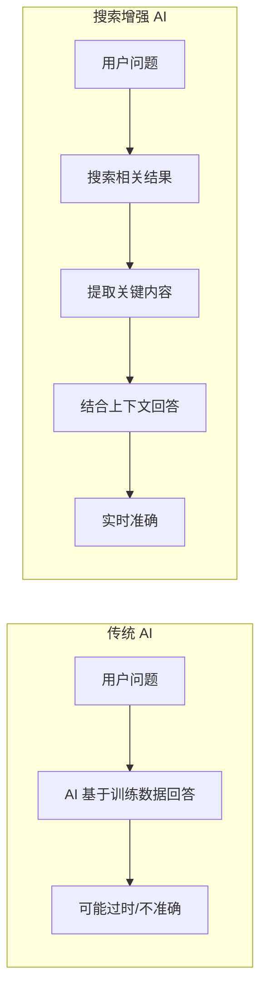
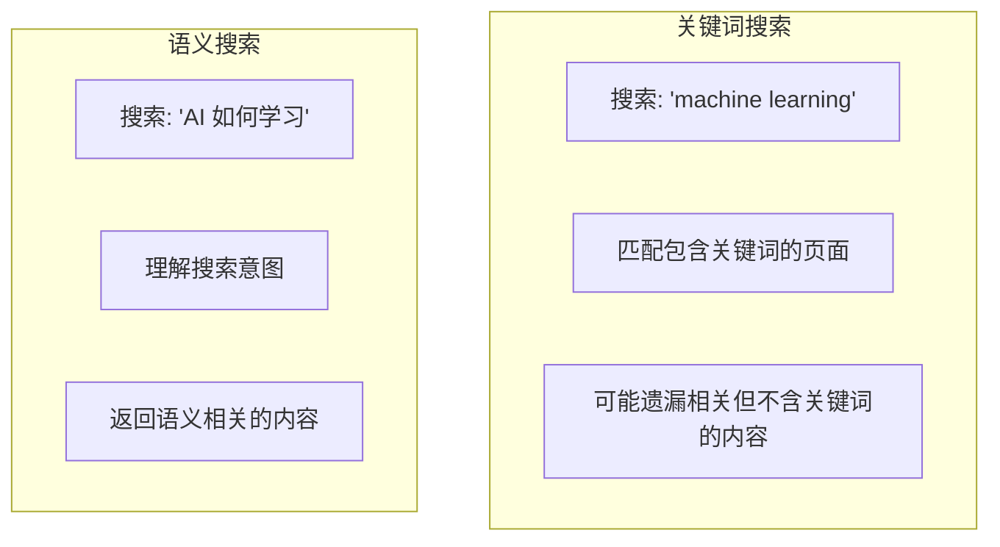
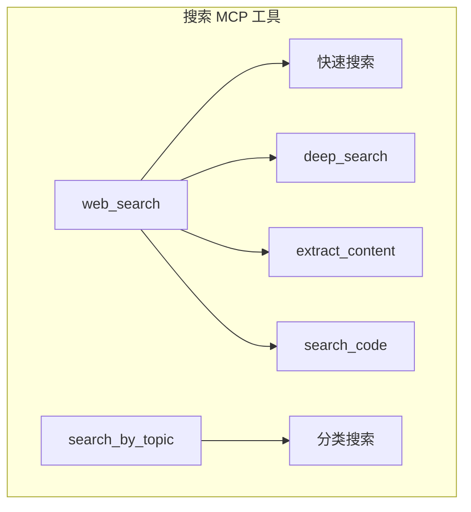
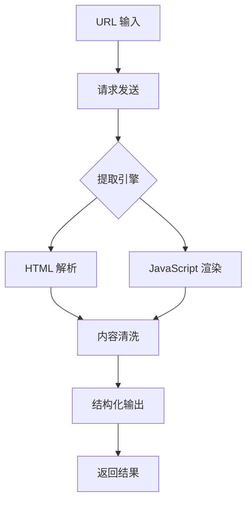

# 2.14 搜索 API 集成：让 AI 连接实时信息

> 本章将深入探讨搜索 API 集成的设计理念。我们会解释为什么 AI 需要搜索能力、不同的搜索服务如何选择，以及如何构建一个统一的搜索 MCP。

---

## 章节导航

| 阶段 | 内容 | 篇幅 |
|------|------|------|
| 问题引入 | AI 的知识截止困境 | 10% |
| 核心概念 | 搜索服务对比 | 20% |
| 架构设计 | 统一搜索接口 | 15% |
| 实践指南 | 使用与配置 | 15% |
| 附录 | 完整开发指南 | 30% |
| 总结 | 要点回顾 | 10% |

---

## 一、引子：AI 的知识截止困境

### 1.1 大语言模型的局限性

```
┌─────────────────────────────────────────────────────────────────┐
│                    AI 知识的时间限制                               │
├─────────────────────────────────────────────────────────────────┤
│                                                                 │
│  问题：                                                        │
│  ┌─────────────────────────────────────────────────────────┐   │
│  │  • 训练数据有截止日期                                  │   │
│  │  • 无法获取最新信息                                    │   │
│  │  • 无法访问私有/付费内容                               │   │
│  │  • 知识可能过时                                        │   │
│  └─────────────────────────────────────────────────────────┘   │
│                                                                 │
│  解决方案：                                                    │
│  ┌─────────────────────────────────────────────────────────┐   │
│  │  ✓ 实时搜索 → 获取最新信息                            │   │
│  │  ✓ 内容提取 → 解析网页内容                            │   │
│  │  ✓ RAG → 结合私有知识库                              │   │
│  └─────────────────────────────────────────────────────────┘   │
│                                                                 │
│  典型问题：                                                    │
│  ┌─────────────────────────────────────────────────────────┐   │
│  │  "今天天气如何？"                                     │   │
│  │  "最新的 iPhone 发布了吗？"                           │   │
│  │  "这篇新闻讲了什么？"                                 │   │
│  └─────────────────────────────────────────────────────────┘   │
│                                                                 │
└─────────────────────────────────────────────────────────────────┘
```

### 1.2 搜索 MCP 的价值



---

## 二、核心概念：搜索服务对比

### 2.1 主流搜索服务对比

```
┌─────────────────────────────────────────────────────────────────┐
│                    搜索服务对比分析                                  │
├─────────────────────────────────────────────────────────────────┤
│                                                                 │
│  Exa (formerly Google for AI):                                  │
│  ┌─────────────────────────────────────────────────────────┐   │
│  │  ✓ 专为 AI 设计的语义搜索                             │   │
│  │  ✓ 可以提取网页全文内容                               │   │
│  │  ✓ 支持分类过滤（文档、代码、文章等）                 │   │
│  │  ✓ 提供内容高亮                                       │   │
│  │                                                          │   │
│  │  适用：需要深度内容的搜索                              │   │
│  └─────────────────────────────────────────────────────────┘   │
│                                                                 │
│  Brave Search:                                                  │
│  ┌─────────────────────────────────────────────────────────┐   │
│  │  ✓ 注重隐私的搜索引擎                                 │   │
│  │  ✓ 实时新闻能力强                                    │   │
│  │  ✓ 独立索引，不依赖 Google                           │   │
│  │                                                          │   │
│  │  适用：需要隐私保护、新闻搜索                         │   │
│  └─────────────────────────────────────────────────────────┘   │
│                                                                 │
│  Tavily:                                                       │
│  ┌─────────────────────────────────────────────────────────┐   │
│  │  ✓ 专为 AI 助手设计                                   │   │
│  │  ✓ 多步搜索能力                                       │   │
│  │  ✓ 结构化结果输出                                     │   │
│  │  ✓ 学术搜索能力强                                     │   │
│  │                                                          │   │
│  │  适用：需要多步推理的研究搜索                         │   │
│  └─────────────────────────────────────────────────────────┘   │
│                                                                 │
│  DuckDuckGo:                                                   │
│  ┌─────────────────────────────────────────────────────────┐   │
│  │  ✓ 免费使用                                            │   │
│  │  ✓ 隐私保护                                            │   │
│  │  ✗ 需要自行处理内容提取                               │   │
│  │                                                          │   │
│  │  适用：预算有限的个人项目                             │   │
│  └─────────────────────────────────────────────────────────┘   │
│                                                                 │
└─────────────────────────────────────────────────────────────────┘
```

### 2.2 语义搜索 vs 关键词搜索



---

## 三、架构设计：统一搜索接口

### 3.1 工具设计



### 3.2 结果处理流程

```
┌─────────────────────────────────────────────────────────────────┐
│                    搜索结果处理流程                                  │
├─────────────────────────────────────────────────────────────────┤
│                                                                 │
│  1. 发起搜索请求                                               │
│  ┌─────────────────────────────────────────────────────────┐   │
│  │  web_search(query="最新 AI 新闻", num_results=10)      │   │
│  └─────────────────────────────────────────────────────────┘   │
│                         │                                       │
│                         ▼                                       │
│  2. 接收原始结果                                               │
│  ┌─────────────────────────────────────────────────────────┐   │
│  │  [                                                    │   │
│  │    {title, url, snippet, date, ...}                  │   │
│  │    {title, url, snippet, date, ...}                  │   │
│  │  ]                                                    │   │
│  └─────────────────────────────────────────────────────────┘   │
│                         │                                       │
│                         ▼                                       │
│  3. 内容提取（可选）                                           │
│  ┌─────────────────────────────────────────────────────────┐   │
│  │  extract_content(urls=["url1", "url2"])                │   │
│  └─────────────────────────────────────────────────────────┘   │
│                         │                                       │
│                         ▼                                       │
│  4. 返回结构化结果                                             │
│  ┌─────────────────────────────────────────────────────────┐   │
│  │  {                                                    │   │
│  │    "results": [{                                      │   │
│  │      "title": "...",                                 │   │
│  │      "url": "...",                                   │   │
│  │      "content": "...",     // 提取的正文             │   │
│  │      "highlights": [...]  // 关键词高亮              │   │
│  │    }]                                                 │   │
│  │  }                                                    │   │
│  └─────────────────────────────────────────────────────────┘   │
│                                                                 │
└─────────────────────────────────────────────────────────────────┘
```

---

## 四、实践指南：使用与配置

### 4.1 API 密钥配置

```
┌─────────────────────────────────────────────────────────────────┐
│                    搜索服务 API 配置                                 │
├─────────────────────────────────────────────────────────────────┤
│                                                                 │
│  Exa 配置：                                                    │
│  ┌─────────────────────────────────────────────────────────┐   │
│  │  1. 注册 exa.ai                                        │   │
│  │  2. 获取 API Key                                       │   │
│  │  3. 配置环境变量: EXA_API_KEY=xxx                      │   │
│  └─────────────────────────────────────────────────────────┘   │
│                                                                 │
│  Brave/Tavily 配置：                                            │
│  ┌─────────────────────────────────────────────────────────┐   │
│  │  类似流程，都需要申请 API Key                          │   │
│  └─────────────────────────────────────────────────────────┘   │
│                                                                 │
│  MCP 配置示例：                                                 │
│  ┌─────────────────────────────────────────────────────────┐   │
│  │  {                                                      │   │
│  │    "mcpServers": {                                     │   │
│  │      "search": {                                       │   │
│  │        "command": "python",                            │   │
│  │        "args": ["search_server.py"],                  │   │
│  │        "env": {"EXA_API_KEY": "xxx"}                  │   │
│  │      }                                                 │   │
│  │    }                                                   │   │
│  │  }                                                      │   │
│  └─────────────────────────────────────────────────────────┘   │
│                                                                 │
└─────────────────────────────────────────────────────────────────┘
```

### 4.2 使用场景

```
┌─────────────────────────────────────────────────────────────────┐
│                    搜索 MCP 典型场景                                 │
├─────────────────────────────────────────────────────────────────┤
│                                                                 │
│  场景1: 实时信息查询                                           │
│  ┌─────────────────────────────────────────────────────────┐   │
│  │  用户: "今天有什么科技新闻？"                          │   │
│  │  AI → 搜索 → 返回今日科技新闻摘要                     │   │
│  └─────────────────────────────────────────────────────────┘   │
│                                                                 │
│  场景2: 深入研究                                               │
│  ┌─────────────────────────────────────────────────────────┐   │
│  │  用户: "帮我研究一下 RAG 技术的发展"                  │   │
│  │  AI → 搜索多篇相关文章 → 提取内容 → 总结研究         │   │
│  └─────────────────────────────────────────────────────────┘   │
│                                                                 │
│  场景3: 验证信息                                               │
│  ┌─────────────────────────────────────────────────────────┐   │
│  │  用户: "这个说法对吗？"                                │   │
│  │  AI → 搜索验证 → 提供来源和证据                        │   │
│  └─────────────────────────────────────────────────────────┘   │
│                                                                 │
│  场景4: 代码查找                                               │
│  ┌─────────────────────────────────────────────────────────┐   │
│  │  用户: "帮我找一下如何使用 FastAPI"                   │   │
│  │  AI → 搜索代码 → 返回示例和文档                       │   │
│  └─────────────────────────────────────────────────────────┘   │
│                                                                 │
└─────────────────────────────────────────────────────────────────┘
```

---

## 五、本章小结

### 5.1 核心要点

```
┌─────────────────────────────────────────────────────────────────┐
│                    本章核心要点                                    │
├─────────────────────────────────────────────────────────────────┤
│                                                                 │
│  1. 设计理念                                                    │
│     • AI 需要搜索能力来获取实时信息                             │
│     • 搜索 MCP 解决知识截止问题                                 │
│                                                                 │
│  2. 核心机制                                                    │
│     • Exa: 语义搜索 + 内容提取                                  │
│     • Brave: 隐私保护 + 新闻搜索                                │
│     • Tavily: AI 优化 + 结构化输出                              │
│                                                                 │
│  3. 工具设计                                                    │
│     • web_search: 通用搜索                                     │
│     • deep_search: 深度研究                                     │
│     • extract_content: 内容提取                                 │
│                                                                 │
│  4. 典型场景                                                    │
│     • 实时信息查询                                             │
│     • 深入研究                                                 │
│     • 信息验证                                                 │
│                                                                 │
└─────────────────────────────────────────────────────────────────┘
```

### 5.2 知识检查

1. 为什么 AI 需要搜索能力？
2. Exa、Brave、Tavily 有什么区别？
3. 语义搜索和关键词搜索的区别是什么？

---

## 六、延伸阅读

| 资源 | 说明 |
|------|------|
| Exa 文档 | 官方文档 |
| Tavily 文档 | AI 搜索指南 |

---

## 七、下一章预告

下一章我们将学习 **自定义工具构建**，总结 MCP 工具的设计模式和最佳实践。

---

## 附录：搜索与网页提取 MCP 完整开发指南

> 本附录提供搜索和网页提取 MCP 的完整设计、架构和开发指南，适合需要构建自定义搜索解决方案的开发者。

---

### 附录一、搜索 MCP 架构设计

#### 1.1 整体架构

```
┌─────────────────────────────────────────────────────────────────┐
│                    搜索 MCP 整体架构                                  │
├─────────────────────────────────────────────────────────────────┤
│                                                                 │
│  ┌────────────────────────────────────────────────│
│ ─────────────┐ │                      Claude Code / AI 客户端                 ││
│  └─────────────────────────────────────────────────────────────┘│
│                              │                                    │
│                              ▼                                    │
│  ┌─────────────────────────────────────────────────────────────┐│
│  │                    MCP 协议层                                ││
│  │              (JSON-RPC 2.0 + Stdio/HTTP)                   ││
│  └─────────────────────────────────────────────────────────────┘│
│                              │                                    │
│                              ▼                                    │
│  ┌─────────────────────────────────────────────────────────────┐│
│  │                   搜索 MCP 服务器                           ││
│  │  ┌──────────────┐  ┌──────────────┐  ┌──────────────┐   ││
│  │  │  请求路由器  │  │  查询构建器   │  │ 结果处理器   │   ││
│  │  └──────────────┘  └──────────────┘  └──────────────┘   ││
│  └─────────────────────────────────────────────────────────────┘│
│                              │                                    │
│              ┌───────────────┼───────────────┐                  │
│              ▼               ▼               ▼                  │
│  ┌─────────────────┐ ┌─────────────────┐ ┌─────────────────┐ │
│  │    Exa         │ │  Brave Search   │ │    Tavily      │ │
│  │   (语义搜索)    │ │   (隐私搜索)    │ │  (AI 优化)     │ │
│  └─────────────────┘ └─────────────────┘ └─────────────────┘ │
│                                                                 │
└─────────────────────────────────────────────────────────────────┘
```

#### 1.2 核心组件设计

```
┌─────────────────────────────────────────────────────────────────┐
│                    搜索 MCP 核心组件                                  │
├─────────────────────────────────────────────────────────────────┤
│                                                                 │
│  QueryRouter (请求路由器):                                       │
│  ┌─────────────────────────────────────────────────────────┐   │
│  │  • 分析用户查询意图                                      │   │
│  │  • 选择合适的搜索服务                                    │   │
│  │  • 构建优化查询                                          │   │
│  └─────────────────────────────────────────────────────────┘   │
│                                                                 │
│  QueryBuilder (查询构建器):                                      │
│  ┌─────────────────────────────────────────────────────────┐   │
│  │  • 语义扩展查询                                          │   │
│  │  • 添加过滤条件                                          │   │
│  │  • 优化搜索参数                                          │   │
│  └─────────────────────────────────────────────────────────┘   │
│                                                                 │
│  ResultProcessor (结果处理器):                                   │
│  ┌─────────────────────────────────────────────────────────┐   │
│  │  • 去重和排序                                            │   │
│  │  • 内容提取                                              │   │
│  │  • 摘要生成                                              │   │
│  │  • 结构化输出                                            │   │
│  └─────────────────────────────────────────────────────────┘   │
│                                                                 │
└─────────────────────────────────────────────────────────────────┘
```

---

### 附录二、网页提取 MCP 设计

#### 2.1 网页提取流程



#### 2.2 提取策略选择

```
┌─────────────────────────────────────────────────────────────────┐
│                    网页提取策略对比                                  │
├─────────────────────────────────────────────────────────────────┤
│                                                                 │
│  策略1: 静态 HTML 解析                                           │
│  ┌─────────────────────────────────────────────────────────┐   │
│  │  工具: BeautifulSoup, lxml, html5lib                  │   │
│  │  优点: 速度快，无需渲染                                 │   │
│  │  缺点: 无法处理动态内容                                 │   │
│  │  适用: 静态页面、文档页                                 │   │
│  └─────────────────────────────────────────────────────────┘   │
│                                                                 │
│  策略2: JavaScript 渲染                                          │
│  ┌─────────────────────────────────────────────────────────┐   │
│  │  工具: Playwright, Puppeteer, Selenium                 │   │
│  │  优点: 支持动态内容、无限滚动                           │   │
│  │  缺点: 速度慢，资源消耗大                               │   │
│  │  适用: SPA 应用、需要登录的内容                         │   │
│  └─────────────────────────────────────────────────────────┘   │
│                                                                 │
│  策略3: 混合模式                                                │
│  ┌─────────────────────────────────────────────────────────┐   │
│  │  先尝试静态解析，失败则回退到渲染                       │   │
│  │  平衡速度和功能                                          │   │
│  │  推荐生产环境使用                                        │   │
│  └─────────────────────────────────────────────────────────┘   │
│                                                                 │
└─────────────────────────────────────────────────────────────────┘
```

---

### 附录三、完整实现代码

#### 3.1 搜索 MCP 服务器

```python
"""
搜索 MCP 服务器完整实现
文件: search_mcp_server.py
"""
import os
import json
from typing import Any, Optional
from fastmcp import FastMCP
from pydantic import BaseModel, Field

# 初始化 MCP 服务器
mcp = FastMCP("Search MCP Server")

# ==================== 数据模型 ====================

class SearchQuery(BaseModel):
    """搜索请求模型"""
    query: str = Field(description="搜索关键词")
    num_results: int = Field(default=10, ge=1, le=50)
    category: Optional[str] = Field(None, description="分类: web, news, code, academic")
    language: Optional[str] = Field(None, description="语言过滤")

class ContentExtractRequest(BaseModel):
    """内容提取请求"""
    urls: list[str] = Field(description="要提取的 URL 列表")
    extract_main: bool = Field(default=True, description="是否只提取主要内容")
    timeout: int = Field(default=30, description="超时时间(秒)")

# ==================== 搜索工具 ====================

@mcp.tool()
async def web_search(
    query: str,
    num_results: int = 10,
    category: Optional[str] = None
) -> dict:
    """
    通用网页搜索

    Args:
        query: 搜索关键词
        num_results: 返回结果数量
        category: 可选分类过滤

    Returns:
        搜索结果列表
    """
    # 选择搜索服务
    if category == "academic":
        # 使用学术搜索
        results = await search_academic(query, num_results)
    else:
        # 使用通用搜索
        results = await search_general(query, num_results)

    return {
        "query "total": len(results),
": query,
               "results": results
    }

@mcp.tool()
async def deep_search(
    query: str,
    focus_areas: list[str] = None
) -> dict:
    """
    深度搜索 - 适合研究类查询

    Args:
        query: 研究主题
        focus_areas: 重点领域列表

    Returns:
        深度研究报告
    """
    # 多轮搜索
    searches = []

    # 第一轮: 基础信息
    basic = await search_general(query, 5)
    searches.append({"stage": "basic", "results": basic})

    # 第二轮: 深度内容
    deep = await search_academic(query, 10)
    searches.append({"stage": "deep", "results": deep})

    # 第三轮: 最新动态
    if focus_areas:
        latest = []
        for area in focus_areas:
            r = await search_news(f"{query} {area}", 3)
            latest.extend(r)
        searches.append({"stage": "latest", "results": latest})

    return {
        "query": query,
        "focus_areas": focus_areas or [],
        "searches": searches,
        "summary": await generate_summary(searches)
    }

@mcp.tool()
async def search_by_topic(
    topic: str,
    subtopics: list[str) -> dict:
    """
    按] = None
主题搜索 - 系统化研究

    Args:
        topic: 主 topic
        subtopics: 子主题列表

    Returns:
        主题化搜索结果
    """
    results = {}

    # 主 topic 搜索
    results["main"] = await search_general(topic, 10)

    # 子 topic 搜索
    if subtopics:
        for sub in subtopics:
            results[sub] = await search_general(f"{topic} {sub}", 5)

    return {
        "topic": topic,
        "results": results
    }

# ==================== 网页提取工具 ====================

@mcp.tool()
async def extract_content(
    urls: list[str],
    extract_main: bool = True
) -> dict:
    """
    提取网页内容

    Args:
        urls: URL 列表
        extract_main: 是否提取主要内容

    Returns:
        提取的内容
    """
    extracted = []

    for url in urls:
        try:
            content = await extract_single_url(url, extract_main)
            extracted.append({
                "url": url,
                "status": "success",
                "content": content
            })
        except Exception as e:
            extracted.append({
                "url": url,
                "status": "error",
                "error": str(e)
            })

    return {
        "total": len(urls),
        "extracted": extracted
    }

# ==================== 搜索结果处理 ====================

async def search_general(query: str, num: int) -> list[dict]:
    """通用搜索实现"""
    # 这里可以集成 Exa, Tavily, Brave 等服务
    # 示例使用 Tavily
    try:
        from tavily import TavilyClient
        client = TavilyClient(api_key=os.getenv("TAVILY_API_KEY"))
        response = client.search(
            query=query,
            num_results=num,
            include_answer=True,
            include_raw_content=False
        )
        return format_tavily_results(response)
    except ImportError:
        # 回退实现
        return fallback_search(query, num)

async def search_academic(query: str, num: int) -> list[dict]:
    """学术搜索"""
    try:
        from exa_py import Exa
        client = Exa(api_key=os.getenv("EXA_API_KEY"))
        results = client.search(
            query,
            num_results=num,
            type="article",
            categories=["academic"]
        )
        return format_exa_results(results)
    except ImportError:
        return fallback_search(query, num)

async def search_news(query: str, num: int) -> list[dict]:
    """新闻搜索"""
    try:
        from exa_py import Exa
        client = Exa(api_key=os.getenv("EXA_API_KEY"))
        results = client.search(
            query,
            num_results=num,
            type="article",
            categories=["news"]
        )
        return format_exa_results(results)
    except:
        return fallback_search(query, num)

async def extract_single_url(url: str, main_only: bool) -> dict:
    """提取单个 URL 内容"""
    try:
        import httpx
        from bs4 import BeautifulSoup

        async with httpx.AsyncClient(
            timeout=30.0,
            follow_redirects=True
        ) as client:
            response = await client.get(url)
            soup = BeautifulSoup(response.text, "html.parser")

            if main_only:
                # 提取主要内容
                # 移除脚本和样式
                for script in soup(["script", "style"]):
                    script.decompose()

                # 尝试获取主要内容区域
                main = soup.find("main") or soup.find("article") or soup.find("body")
                text = main.get_text(separator="\n", strip=True) if main else soup.get_text()
            else:
                text = soup.get_text(separator="\n", strip=True)

            return {
                "title": soup.title.string if soup.title else "",
                "text": text[:10000],  # 限制长度
                "url": url
            }
    except Exception as e:
        raise RuntimeError(f"提取失败: {str(e)}")

def format_tavily_results(response: dict) -> list[dict]:
    """格式化 Tavily 结果"""
    results = []
    for item in response.get("results", []):
        results.append({
            "title": item.get("title", ""),
            "url": item.get("url", ""),
            "snippet": item.get("content", ""),
            "score": item.get("score", 0)
        })
    return results

def format_exa_results(results) -> list[dict]:
    """格式化 Exa 结果"""
    formatted = []
    for r in results.results:
        formatted.append({
            "title": r.title,
            "url": r.url,
            "snippet": r.text[:200] if r.text else "",
            "score": r.score
        })
    return formatted

def fallback_search(query: str, num: int) -> list[dict]:
    """回退搜索实现"""
    return [
        {
            "title": f"搜索结果: {query}",
            "url": "https://example.com",
            "snippet": "请配置搜索 API",
            "score": 0
        }
    ]

async def generate_summary(searches: list[dict]) -> str:
    """生成搜索摘要"""
    total = sum(len(s.get("results", [])) for s in searches)
    return f"共搜索到 {total} 个相关结果，分为 {len(searches} 个阶段"

# ==================== 服务器入口 ====================

if __name__ == "__main__":
    import uvicorn
    uvicorn.run(mcp.app, host="0.0.0.0", port=8000)
```

#### 3.2 完整 MCP 配置

```json
{
  "mcpServers": {
    "search": {
      "command": "python",
      "args": ["search_mcp_server.py"],
      "env": {
        "TAVILY_API_KEY": "${TAVILY_API_KEY}",
        "EXA_API_KEY": "${EXA_API_KEY}"
      }
    }
  }
}
```

---

### 附录四、进阶功能实现

#### 4.1 缓存策略

```python
from functools import lru_cache
import hashlib
import json

class SearchCache:
    """搜索结果缓存"""

    def __init__(self, ttl: int = 3600):
        self.cache = {}
        self.ttl = ttl

    def _make_key(self, query: str, **kwargs) -> str:
        """生成缓存键"""
        data = {"query": query, **kwargs}
        return hashlib.md5(json.dumps(data, sort_keys=True).encode()).hexdigest()

    def get(self, key: str) -> Optional[dict]:
        """获取缓存"""
        if key in self.cache:
            entry = self.cache[key]
            import time
            if time.time() - entry["timestamp"] < self.ttl:
                return entry["data"]
            del self.cache[key]
        return None

    def set(self, key: str, data: dict):
        """设置缓存"""
        import time
        self.cache[key] = {
            "data": data,
            "timestamp": time.time()
        }

# 使用缓存
cache = SearchCache(ttl=1800)  # 30分钟缓存

@mcp.tool()
async def web_search_cached(query: str, num_results: int = 10) -> dict:
    """带缓存的搜索"""
    key = cache._make_key(query, num=num_results)

    cached = cache.get(key)
    if cached:
        return {**cached, "cached": True}

    results = await web_search(query, num_results)
    cache.set(key, results)

    return {**results, "cached": False}
```

#### 4.2 速率限制

```python
import time
from collections import defaultdict
from fastapi import HTTPException

class RateLimiter:
    """速率限制器"""

    def __init__(self, max_calls: int = 100, period: int = 60):
        self.max_calls = max_calls
        self.period = period
        self.calls = defaultdict(list)

    def check(self, key: str) -> bool:
        """检查是否超限"""
        now = time.time()
        # 清理过期记录
        self.calls[key] = [t for t in self.calls[key] if now - t < self.period]

        if len(self.calls[key]) >= self.max_calls:
            return False

        self.calls[key].append(now)
        return True

rate_limiter = RateLimiter(max_calls=100, period=60)

@mcp.tool()
async def web_search_ratelimited(query: str, num_results: int = 10) -> dict:
    """带速率限制的搜索"""
    if not rate_limiter.check("global"):
        raise HTTPException(status_code=429, detail="请求过于频繁，请稍后重试")

    return await web_search(query, num_results)
```

#### 4.3 结果去重与排序

```python
from typing import List, Dict

class ResultProcessor:
    """搜索结果处理器"""

    @staticmethod
    def dedupe(results: List[dict], threshold: float = 0.8) -> List[dict]:
        """结果去重"""
        unique = []
        seen_domains = set()

        for r in results:
            # 提取域名
            from urllib.parse import urlparse
            domain = urlparse(r.get("url", "")).netloc

            if domain not in seen_domains:
                seen_domains.add(domain)
                unique.append(r)

        return unique

    @staticmethod
    def rerank(results: List[dict], query: str) -> List[dict]:
        """结果重排序"""
        # 基于关键词匹配重排序
        keywords = query.lower().split()

        def score(result: dict) -> float:
            text = (result.get("title", "") + " " + result.get("snippet", "")).lower()
            matches = sum(1 for kw in keywords if kw in text)
            return matches + result.get("score", 0)

        return sorted(results, key=score, reverse=True)

    @staticmethod
    def truncate(results: List[dict], max_length: int = 500) -> List[dict]:
        """截断过长内容"""
        for r in results:
            if "snippet" in r and len(r["snippet"]) > max_length:
                r["snippet"] = r["snippet"][:max_length] + "..."
            if "text" in r and len(r.get("text", "")) > max_length * 10:
                r["text"] = r["text"][:max_length * 10] + "..."
        return results
```

---

### 附录五、最佳实践

#### 5.1 错误处理

```
┌─────────────────────────────────────────────────────────────────┐
│                    错误处理最佳实践                                  │
├─────────────────────────────────────────────────────────────────┤
│                                                                 │
│  1. API 错误                                                    │
│  ┌─────────────────────────────────────────────────────────┐   │
│  │  • 超时: 返回友好提示，建议重试                          │   │
│  │  • 配额超限: 提示用户联系管理员                         │   │
│  │  • 服务不可用: 自动切换备选服务                         │   │
│  └─────────────────────────────────────────────────────────┘   │
│                                                                 │
│  2. 网络错误                                                    │
│  ┌─────────────────────────────────────────────────────────┐   │
│  │  • 重试机制: 指数退避策略                               │   │
│  │  • 降级处理: 返回缓存或空结果                           │   │
│  │  • 日志记录: 便于问题排查                               │   │
│  └─────────────────────────────────────────────────────────┘   │
│                                                                 │
│  3. 内容提取错误                                                 │
│  ┌─────────────────────────────────────────────────────────┐   │
│  │  • 返回原始 HTML 或错误信息                             │   │
│  │  • 提供部分成功的结果                                   │   │
│  │  • 标记失败原因                                         │   │
│  └─────────────────────────────────────────────────────────┘   │
│                                                                 │
└─────────────────────────────────────────────────────────────────┘
```

#### 5.2 安全性考虑

```python
# 1. URL 验证
from urllib.parse import urlparse

def validate_url(url: str) -> bool:
    """验证 URL 安全性"""
    parsed = urlparse(url)
    # 只允许 http/https
    if parsed.scheme not in ("http", "https"):
        return False
    # 阻止危险协议
    if parsed.scheme in ("javascript", "data", "file"):
        return False
    # 阻止内部 IP
    if parsed.hostname:
        if parsed.hostname.startswith(("10.", "192.168.", "127.")):
            return False
    return True

# 2. 查询过滤
import re

def sanitize_query(query: str) -> str:
    """清理搜索查询"""
    # 移除特殊字符
    query = re.sub(r"[^\w\s\-.:]", "", query)
    # 限制长度
    return query[:500]

# 3. 速率限制配置
RATE_LIMITS = {
    "free": {"calls": 10, "period": 60},
    "pro": {"calls": 100, "period": 60},
    "enterprise": {"calls": 1000, "period": 60}
}
```

#### 5.3 性能优化

```
┌─────────────────────────────────────────────────────────────────┐
│                    性能优化清单                                    │
├─────────────────────────────────────────────────────────────────┤
│                                                                 │
│  □ 连接池复用                                                   │
│    • httpx.Client() 全局复用                                    │
│    • 减少 TCP 连接开销                                          │
│                                                                 │
│  □ 异步并行请求                                                 │
│    • asyncio.gather() 并行提取多个 URL                          │
│    • 控制并发数量避免被封                                        │
│                                                                 │
│  □ 结果缓存                                                     │
│    • 热门查询缓存                                               │
│    • 设置合理 TTL                                               │
│                                                                 │
│  □ 按需加载                                                     │
│    • 大文本延迟加载                                             │
│    • 分页返回结果                                               │
│                                                                 │
│  □ 超时控制                                                     │
│    • 设置合理超时                                                │
│    • 快速失败                                                   │
│                                                                 │
└─────────────────────────────────────────────────────────────────┘
```

---

*本章附录贡献者：MCP Tutorial Team*
*版本：v3.0 出版级*
