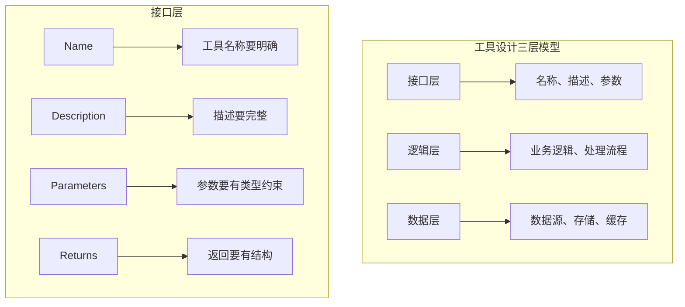
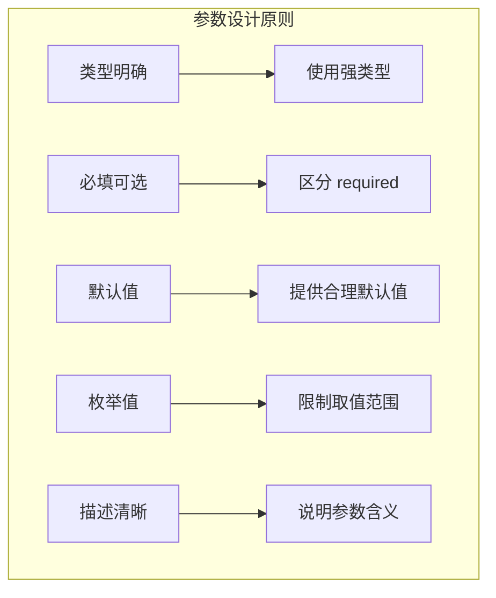

# 2.15 自定义工具构建：设计模式与最佳实践

> 本章将总结 MCP 工具的设计模式和最佳实践。我们会解释如何构建高质量、易维护、可扩展的自定义 MCP 工具。

---

## 章节导航

| 阶段 | 内容 | 篇幅 |
|------|------|------|
| 问题引入 | 工具设计的重要性 | 15% |
| 核心原则 | 设计模式与哲学 | 30% |
| 实践模式 | 常见设计模式 | 30% |
| 最佳实践 | 工程实践 | 25% |

---

## 一、引子：为什么工具设计很重要？

### 1.1 好的工具 vs 差的工具

```
┌─────────────────────────────────────────────────────────────────┐
│                    工具设计的影响                                   │
├─────────────────────────────────────────────────────────────────┤
│                                                                 │
│  好的工具设计：                                                 │
│  ┌─────────────────────────────────────────────────────────┐   │
│  │  • AI 能准确理解工具的用途                              │   │
│  │  • 参数定义清晰，AI 知道怎么调用                       │   │
│  │  • 返回结果结构化，AI 能正确解析                       │   │
│  │  • 错误信息友好，帮助 AI 修复问题                      │   │
│  └─────────────────────────────────────────────────────────┘   │
│                                                                 │
│  差的工具设计：                                                 │
│  ┌─────────────────────────────────────────────────────────┐   │
│  │  • 工具名称模糊，AI 不知道能做什么                     │   │
│  │  • 参数描述不清，AI 猜测参数                            │   │
│  │  • 返回格式不一致，AI 解析困难                         │   │
│  │  • 错误信息泄露系统细节                                │   │
│  └─────────────────────────────────────────────────────────┘   │
│                                                                 │
│  影响：                                                        │
│  ┌─────────────────────────────────────────────────────────┐   │
│  │  • 工具调用成功率                                      │   │
│  │  • AI 推理质量                                         │   │
│  │  • 用户体验                                            │   │
│  └─────────────────────────────────────────────────────────┘   │
│                                                                 │
└─────────────────────────────────────────────────────────────────┘
```

### 1.2 工具设计的三层模型



---

## 二、核心原则：工具设计的哲学

### 2.1 单一职责原则

```
┌─────────────────────────────────────────────────────────────────┐
│                    单一职责 vs 多职责                               │
├─────────────────────────────────────────────────────────────────┤
│                                                                 │
│  ❌ 不好设计：                                                 │
│  ┌─────────────────────────────────────────────────────────┐   │
│  │  tool: "handle_user"                                  │   │
│  │    - 创建用户                                          │   │
│  │    - 发送欢迎邮件                                      │   │
│  │    - 创建默认项目                                      │   │
│  │    - 设置权限                                          │   │
│  └─────────────────────────────────────────────────────────┘   │
│                                                                 │
│  ✅ 好的设计：                                                 │
│  ┌─────────────────────────────────────────────────────────┐   │
│  │  tool: "create_user"  - 创建用户                      │   │
│  │  tool: "send_email"    - 发送邮件                     │   │
│  │  tool: "create_project" - 创建项目                    │   │
│  │  tool: "set_permissions" - 设置权限                   │   │
│  └─────────────────────────────────────────────────────────┘   │
│                                                                 │
│  优点：                                                        │
│  ┌─────────────────────────────────────────────────────────┐   │
│  │  ✓ 每个工具职责清晰                                     │   │
│  │  ✓ 易于测试和维护                                      │   │
│  │  ✓ AI 更容易理解和使用                                 │   │
│  │  ✓ 可以灵活组合                                       │   │
│  └─────────────────────────────────────────────────────────┘   │
│                                                                 │
└─────────────────────────────────────────────────────────────────┘
```

### 2.2 命名规范

```
┌─────────────────────────────────────────────────────────────────┐
│                    工具命名规范                                  │
├─────────────────────────────────────────────────────────────────┤
│                                                                 │
│  动词 + 名词模式：                                               │
│  ┌─────────────────────────────────────────────────────────┐   │
│  │  get_user         → 获取用户                           │   │
│  │  create_project   → 创建项目                           │   │
│  │  update_settings  → 更新设置                          │   │
│  │  delete_file     → 删除文件                           │   │
│  │  list_resources  → 列出资源                          │   │
│  └─────────────────────────────────────────────────────────┘   │
│                                                                 │
│  前缀规范：                                                     │
│  ┌─────────────────────────────────────────────────────────┐   │
│  │  get_*    → 获取/查询                                  │   │
│  │  create_* → 创建                                       │   │
│  │  update_* → 更新                                       │   │
│  │  delete_* → 删除                                       │   │
│  │  list_*   → 列表                                       │   │
│  │  search_* → 搜索                                       │   │
│  │  batch_*  → 批量操作                                   │   │
│  │  export_* → 导出数据                                   │   │
│  └─────────────────────────────────────────────────────────┘   │
│                                                                 │
│  避免：                                                         │
│  ┌─────────────────────────────────────────────────────────┐   │
│  │  ✗ do_something      → 含义模糊                        │   │
│  │  ✗ handle_xxx        → 动作不明确                     │   │
│  │  ✗ process_data      → 不够具体                       │   │
│  └─────────────────────────────────────────────────────────┘   │
│                                                                 │
└─────────────────────────────────────────────────────────────────┘
```

### 2.3 参数设计原则



---

## 三、实践模式：常见设计模式

### 3.1 组合工具模式

```
┌─────────────────────────────────────────────────────────────────┐
│                    组合工具模式                                    │
├─────────────────────────────────────────────────────────────────┤
│                                                                 │
│  场景：复杂操作由简单操作组合                                     │
│                                                                 │
│  ┌─────────────────────────────────────────────────────────┐   │
│  │  原子工具:                                              │   │
│  │  • add_item(items, item)  → 添加项目                  │   │
│  │  • remove_item(items, item) → 移除项目                │   │
│  │  • list_items(items)      → 列出项目                  │   │
│  └─────────────────────────────────────────────────────────┘   │
│                          │                                       │
│                          ▼                                       │
│  ┌─────────────────────────────────────────────────────────┐   │
│  │  组合工具:                                              │   │
│  │  • batch_update(items, to_add, to_remove)             │   │
│  │    → 批量更新（组合多个原子操作）                     │   │
│  └─────────────────────────────────────────────────────────┘   │
│                                                                 │
│  优势：                                                        │
│  ✓ 简单操作可复用                                              │
│  ✓ 复杂操作可组合                                              │
│  ✓ AI 可以选择使用原子或组合工具                               │
│                                                                 │
└─────────────────────────────────────────────────────────────────┘
```

### 3.2 事务性工具模式

```
┌─────────────────────────────────────────────────────────────────┐
│                    事务性工具模式                                  │
├─────────────────────────────────────────────────────────────────┤
│                                                                 │
│  场景：需要保证原子性的操作                                     │
│                                                                 │
│  ┌─────────────────────────────────────────────────────────┐   │
│  │  问题: 转账操作需要原子性                               │   │
│  │       - 扣款                                           │   │
│  │       - 存款                                           │   │
│  │       - 两个操作必须同时成功或失败                     │   │
│  └─────────────────────────────────────────────────────────┘   │
│                                                                 │
│  解决方案:                                                      │
│  ┌─────────────────────────────────────────────────────────┐   │
│  │  tool: "transfer_money(from, to, amount)"            │   │
│  │    - 开启事务                                         │   │
│  │    - 扣款检查余额                                     │   │
│  │    - 存款                                            │   │
│  │    - 提交事务（失败则回滚）                          │   │
│  └─────────────────────────────────────────────────────────┘   │
│                                                                 │
│  设计要点:                                                      │
│  ✓ 明确返回成功/失败状态                                       │
│  ✓ 失败时提供原因                                             │
│  ✓ 记录事务日志                                               │
│                                                                 │
└─────────────────────────────────────────────────────────────────┘
```

### 3.3 分页工具模式

```
┌─────────────────────────────────────────────────────────────────┐
│                    分页工具模式                                     │
├─────────────────────────────────────────────────────────────────┤
│                                                                 │
│  场景: 大数据量查询                                            │
│                                                                 │
│  ┌─────────────────────────────────────────────────────────┐   │
│  │  参数:                                                  │   │
│  │  • query: 搜索关键词                                   │   │
│  │  • page: 页码 (默认 1)                                │   │
│  │  • page_size: 每页数量 (默认 20)                      │   │
│  └─────────────────────────────────────────────────────────┘   │
│                                                                 │
│  返回:                                                         │
│  ┌─────────────────────────────────────────────────────────┐   │
│  │  {                                                     │   │
│  │    "results": [...],                                  │   │
│  │    "pagination": {                                    │   │
│  │      "page": 1,                                      │   │
│  │      "page_size": 20,                                │   │
│  │      "total": 1000,                                  │   │
│  │      "total_pages": 50                                │   │
│  │    }                                                  │   │
│  │  }                                                    │   │
│  └─────────────────────────────────────────────────────────┘   │
│                                                                 │
│  最佳实践:                                                     │
│  ✓ 限制最大 page_size                                         │
│  ✓ 返回总数和页数信息                                         │
│  ✓ 智能默认值（20-100）                                      │
│                                                                 │
└─────────────────────────────────────────────────────────────────┘
```

---

## 四、最佳实践：工程实践

### 4.1 错误处理模式

```
┌─────────────────────────────────────────────────────────────────┐
│                    错误处理最佳实践                                  │
├─────────────────────────────────────────────────────────────────┤
│                                                                 │
│  原则1: 错误信息要友好                                         │
│  ┌─────────────────────────────────────────────────────────┐   │
│  │  ❌ "FileNotFoundError: [Errno 2] No such file..."    │   │
│  │  ✅ "文件不存在: /path/to/file                        │   │
│  └─────────────────────────────────────────────────────────┘   │
│                                                                 │
│  原则2: 区分错误类型                                            │
│  ┌─────────────────────────────────────────────────────────┐   │
│  │  • 输入错误 → 明确说明需要什么                         │   │
│  │  • 权限错误 → 说明需要什么权限                        │   │
│  │  • 业务错误 → 说明为什么无法执行                       │   │
│  │  • 系统错误 → 返回友好消息，不暴露细节                │   │
│  └─────────────────────────────────────────────────────────┘   │
│                                                                 │
│  原则3: 返回结构化错误                                          │
│  ┌─────────────────────────────────────────────────────────┐   │
│  │  {                                                      │   │
│  │    "success": false,                                  │   │
│  │    "error": {                                         │   │
│  │      "code": "INVALID_INPUT",                        │   │
│  │      "message": "a 必须是数字",                       │   │
│  │      "field": "a"                                    │   │
│  │    }                                                  │   │
│  │  }                                                    │   │
│  └─────────────────────────────────────────────────────────┘   │
│                                                                 │
└─────────────────────────────────────────────────────────────────┘
```

### 4.2 性能优化模式

```
┌─────────────────────────────────────────────────────────────────┐
│                    性能优化策略                                     │
├─────────────────────────────────────────────────────────────────┤
│                                                                 │
│  缓存策略:                                                     │
│  ┌─────────────────────────────────────────────────────────┐   │
│  │  @lru_cache(maxsize=100)                               │   │
│  │  def get_user(user_id: str):                           │   │
│  │      return db.query("SELECT ...", user_id)           │   │
│  └─────────────────────────────────────────────────────────┘   │
│                                                                 │
│  连接池:                                                       │
│  ┌─────────────────────────────────────────────────────────┐   │
│  │  pool = PooledDB(creator, maxconnections=10, ...)    │   │
│  │  conn = pool.connection()                              │   │
│  └─────────────────────────────────────────────────────────┘   │
│                                                                 │
│  异步处理:                                                     │
│  ┌─────────────────────────────────────────────────────────┐   │
│  │  @app.tool()                                         │   │
│  │  async def fetch_data(urls: list):                    │   │
│  │      async with httpx.AsyncClient() as client:        │   │
│  │          tasks = [client.get(url) for url in urls]   │   │
│  │          return await asyncio.gather(*tasks)         │   │
│  └─────────────────────────────────────────────────────────┘   │
│                                                                 │
│  流式处理:                                                     │
│  ┌─────────────────────────────────────────────────────────┐   │
│  │  async def process_large_file(file):                  │   │
│  │      async for chunk in read_chunks(file):           │   │
│  │          yield await process_chunk(chunk)             │   │
│  └─────────────────────────────────────────────────────────┘   │
│                                                                 │
└─────────────────────────────────────────────────────────────────┘
```

---

## 五、本章小结

### 5.1 核心要点

```
┌─────────────────────────────────────────────────────────────────┐
│                    本章核心要点                                    │
├─────────────────────────────────────────────────────────────────┤
│                                                                 │
│  1. 设计原则                                                    │
│     • 单一职责：每个工具只做一件事                              │
│     • 命名规范：动词 + 名词模式                                 │
│     • 参数设计：类型明确、描述清晰                               │
│                                                                 │
│  2. 设计模式                                                    │
│     • 组合工具：简单工具可组合为复杂操作                        │
│     • 事务性：保证原子性操作                                    │
│     • 分页处理：大数据量优化                                    │
│                                                                 │
│  3. 最佳实践                                                    │
│     • 错误处理：友好、结构化                                    │
│     • 性能优化：缓存、连接池、异步                              │
│     • 日志审计：记录关键操作                                   │
│                                                                 │
└─────────────────────────────────────────────────────────────────┘
```

### 5.2 知识检查

1. 单一职责原则为什么重要？
2. 工具命名应该遵循什么规范？
3. 分页工具模式的优势是什么？

---

## 卷二总结

恭喜完成卷二 **开发实战** 的学习！你现在已经掌握：

- ✅ FastMCP、TypeScript、Go、Rust 四大框架
- ✅ JSON-RPC 通信原理
- ✅ 传输层实现（Stdio/HTTP/SSE/Streamable）
- ✅ 认证与安全机制
- ✅ 多种场景实战（文件/GitHub/数据库/浏览器等）
- ✅ 工具设计模式与最佳实践

---

## 下一步

卷三将进入 **企业级应用**，学习生产级 MCP 系统构建。

---

*本章贡献者：MCP Tutorial Team*
*版本：v3.0 出版级*
