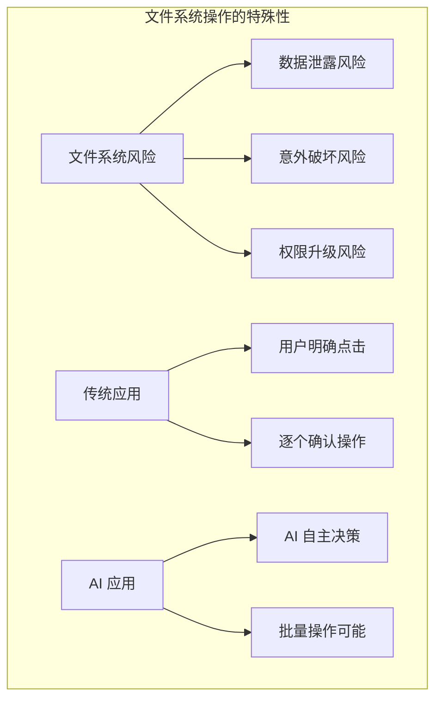
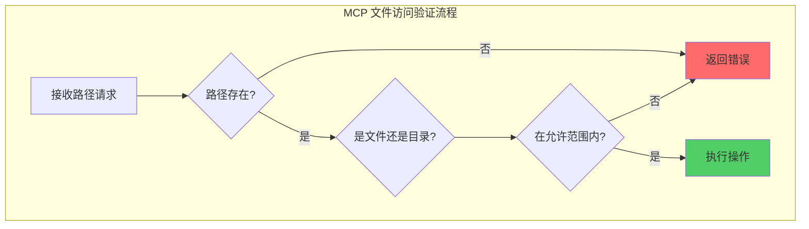
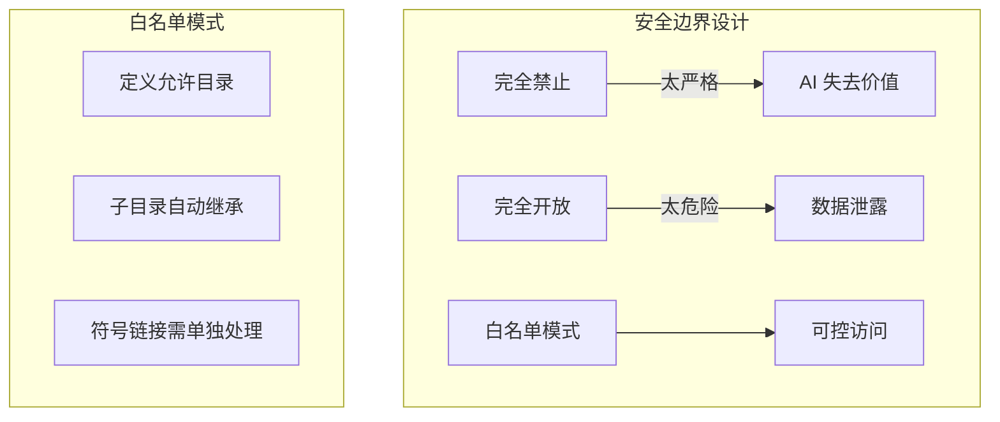
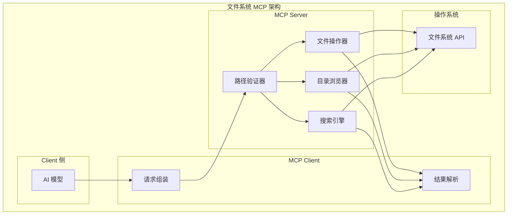
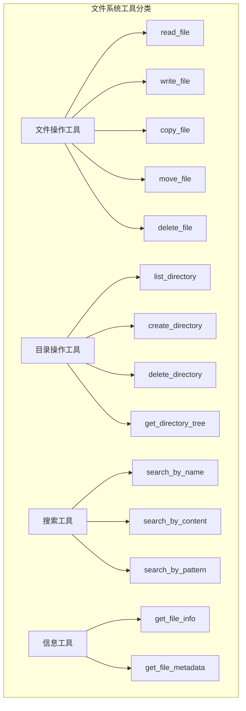
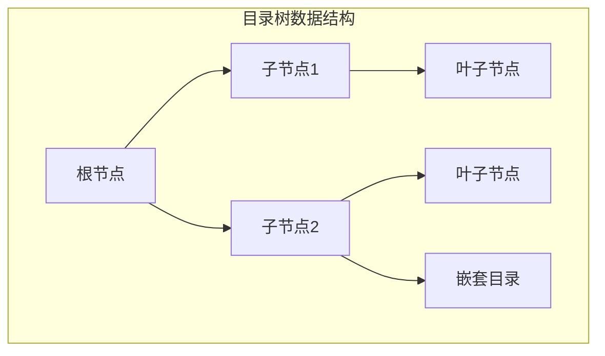
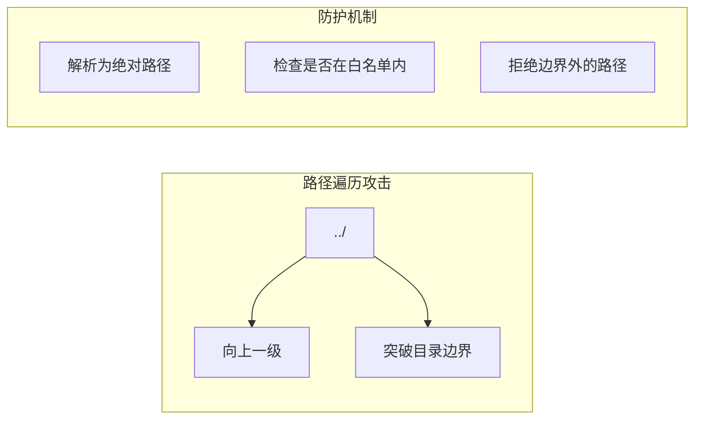
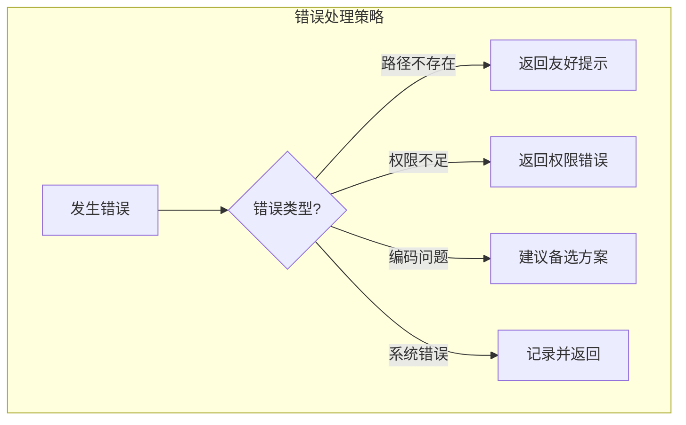

# 2.8 文件系统操作：AI 与本地文件的桥梁

> 本章将深入探讨如何让 AI 安全地访问和操作本地文件系统。我们会解释文件系统的安全模型、设计原则，以及如何构建一个生产级的文件系统 MCP 服务器。

---

## 章节导航

| 阶段 | 内容 | 篇幅 |
|------|------|------|
| 问题引入 | 为什么 AI 需要文件系统访问 | 15% |
| 核心概念 | 路径解析与安全边界 | 25% |
| 架构设计 | MCP 文件系统设计模式 | 25% |
| 实践指南 | 安全配置与最佳实践 | 25% |
| 总结 | 要点回顾 | 10% |

---

## 一、引子：AI 为什么要"看见"文件？

### 1.1 从对话到行动的跨越

想象这样一个场景：你对 Claude 说"帮我看看上周写的项目报告有没有语法错误"。这个简单的请求背后，AI 需要完成一系列操作：

```
┌─────────────────────────────────────────────────────────────────┐
│                    用户请求的处理流程                             │
├─────────────────────────────────────────────────────────────────┤
│                                                                 │
│  用户: "帮我看看上周写的项目报告有没有语法错误"                  │
│                        │                                       │
│                        ▼                                       │
│  ┌─────────────────────────────────────────────────────────┐   │
│  │  步骤1: 找到文件                                        │   │
│  │  • 需要知道文件在哪里                                   │   │
│  │  • 需要浏览可能的目录                                   │   │
│  └─────────────────────────────────────────────────────────┘   │
│                        │                                       │
│                        ▼                                       │
│  ┌─────────────────────────────────────────────────────────┐   │
│  │  步骤2: 读取文件内容                                    │   │
│  │  • 需要打开文件                                         │   │
│  │  • 需要正确处理编码                                     │   │
│  └─────────────────────────────────────────────────────────┘   │
│                        │                                       │
│                        ▼                                       │
│  ┌─────────────────────────────────────────────────────────┐   │
│  │  步骤3: 分析内容                                        │   │
│  │  • 理解报告内容                                         │   │
│  │  • 检查语法错误                                         │   │
│  └─────────────────────────────────────────────────────────┘   │
│                        │                                       │
│                        ▼                                       │
│  ┌─────────────────────────────────────────────────────────┐   │
│  │  步骤4: 返回结果                                        │   │
│  │  • 总结发现的问题                                       │   │
│  │  • 提供修改建议                                         │   │
│  └─────────────────────────────────────────────────────────┘   │
│                                                                 │
└─────────────────────────────────────────────────────────────────┘
```

**这就是文件系统 MCP 的价值所在**：它为 AI 提供了一双"看见"本地文件的眼睛，和一双"修改"文件的 hands。

### 1.2 文件系统的独特挑战

与其他 MCP 场景不同，文件系统操作有其独特的复杂性：



| 维度 | 传统应用 | AI + 文件系统 |
|------|----------|---------------|
| 操作粒度 | 逐个确认 | 批量执行 |
| 风险控制 | 用户判断 | AI 可能误判 |
| 路径处理 | 相对路径 | 需要安全解析 |
| 权限边界 | 操作系统 | 需要 MCP 层 |
| 错误恢复 | 用户可见 | 难以即时发现 |

---

## 二、核心概念：文件系统访问的设计智慧

### 2.1 为什么需要路径解析？

当你告诉 AI "读取项目根目录下的 README.md"时，这个请求经历了复杂的转换过程：


**关键设计原则**：MCP 总是使用绝对路径（Absolute Path）进行文件操作，这样可以避免歧义和安全漏洞。

### 2.2 路径解析的三层验证



**设计原理**：

1. **存在性检查**：路径是否真实存在
2. **类型判断**：是文件还是目录
3. **边界验证**：是否在允许访问的目录范围内

### 2.3 安全边界的设计哲学

文件系统 MCP 的核心挑战是：**如何在"让 AI 有用"和"不让 AI 危险"之间取得平衡？**



**最佳实践**：采用**白名单目录**模式，只允许 AI 访问明确指定的目录及其子目录。

---

## 三、架构设计：文件系统 MCP 的模块化

### 3.1 整体架构



### 3.2 工具分类与设计



### 3.3 目录树的可视化设计

当 AI 需要"了解项目结构"时，返回一个清晰的目录树至关重要：



**设计要点**：
- 限制递归深度，防止无限遍历
- 区分文件和目录的显示方式
- 显示文件大小和修改时间
- 跳过隐藏文件和系统目录

---

## 四、安全配置：生产环境的必备措施

### 4.1 路径遍历攻击防护

**什么是路径遍历攻击？**

```
正常请求: 读取 /home/user/documents/report.txt
攻击请求: 读取 /home/user/../../etc/passwd

实际效果: 攻击者可以读取系统敏感文件
```



### 4.2 安全配置清单

```
┌─────────────────────────────────────────────────────────────────┐
│                    文件系统 MCP 安全配置清单                        │
├─────────────────────────────────────────────────────────────────┤
│                                                                 │
│  基础安全：                                                     │
│  ┌─────────────────────────────────────────────────────────┐   │
│  │ □ 只允许访问工作目录                                     │   │
│  │ □ 禁止访问系统目录 (/etc, /sys, /proc)                  │   │
│  │ □ 禁止访问敏感目录 (.ssh, .aws, .gitcredentials)        │   │
│  │ □ 启用符号链接解析，防止绕过                             │   │
│  └─────────────────────────────────────────────────────────┘   │
│                                                                 │
│  操作安全：                                                     │
│  ┌─────────────────────────────────────────────────────────┐   │
│  │ □ 写入操作需要明确确认                                   │   │
│  │ □ 删除操作默认禁用或需要二次确认                         │   │
│  │ □ 大文件操作需要分片或流式处理                          │   │
│  │ □ 设置最大文件大小限制                                   │   │
│  └─────────────────────────────────────────────────────────┘   │
│                                                                 │
│  审计安全：                                                     │
│  ┌─────────────────────────────────────────────────────────┐   │
│  │ □ 记录所有文件访问操作                                   │   │
│  │ □ 记录操作者身份和时间                                   │   │
│  │ □ 异常操作触发告警                                       │   │
│  └─────────────────────────────────────────────────────────┘   │
│                                                                 │
└─────────────────────────────────────────────────────────────────┘
```

### 4.3 编码处理的重要性

文件编码是一个经常被忽视但极其重要的问题：

```
┌─────────────────────────────────────────────────────────────────┐
│                    编码问题的影响                                  │
├─────────────────────────────────────────────────────────────────┤
│                                                                 │
│  常见编码类型：                                                  │
│  • UTF-8      - 现代标准，推荐使用                              │
│  • GBK/GB2312 - 中文 Windows 默认                              │
│  • ISO-8859-1 - 拉丁字符                                       │
│  • Binary     - 二进制文件                                      │
│                                                                 │
│  问题场景：                                                      │
│  ┌────────────────────┬────────────────────────────────────┐   │
│  │ 场景               │ 结果                                │   │
│  ├────────────────────┼────────────────────────────────────┤   │
│  │ 读取 GBK 文件用    │ 出现乱码                            │   │
│  │ UTF-8 编码         │                                    │   │
│  ├────────────────────┼────────────────────────────────────┤   │
│  │ 读取二进制文件     │ 抛出异常                            │   │
│  │ 作为文本           │                                    │   │
│  ├────────────────────┼────────────────────────────────────┤   │
│  │ 文件名编码错误     │ 文件找不到                          │   │
│  └────────────────────┴────────────────────────────────────┘   │
│                                                                 │
│  最佳实践：                                                      │
│  • 文本文件默认使用 UTF-8                                       │
│  • 遇到解码错误时提供备选方案                                   │
│  • 二进制文件单独处理                                           │
│                                                                 │
└─────────────────────────────────────────────────────────────────┘
```

---

## 五、最佳实践

### 5.1 工具定义原则

```
┌─────────────────────────────────────────────────────────────────┐
│                    工具命名规范                                  │
├─────────────────────────────────────────────────────────────────┤
│                                                                 │
│  动词 + 名词模式：                                               │
│  ├─ read_file         读取文件                                  │
│  ├─ write_file        写入文件                                   │
│  ├─ list_directory    列出目录                                   │
│  ├─ create_directory  创建目录                                  │
│  ├─ search_files      搜索文件                                   │
│  └─ get_file_info    获取文件信息                               │
│                                                                 │
│  参数命名一致性：                                                │
│  ├─ path              路径参数                                  │
│  ├─ content           内容参数                                  │
│  ├─ pattern           匹配模式                                  │
│  └─ encoding          编码参数                                   │
│                                                                 │
└─────────────────────────────────────────────────────────────────┘
```

### 5.2 错误处理模式



**关键原则**：
- 错误信息要友好，不暴露系统细节
- 不同错误类型返回不同消息
- 提供修复建议

### 5.3 性能优化考量

| 优化点 | 策略 | 适用场景 |
|--------|------|----------|
| 大文件读取 | 分块读取 + 流式处理 | GB 级文件 |
| 目录遍历 | 限制深度 + 异步 | 大型项目 |
| 搜索 | 索引缓存 | 频繁搜索 |
| 列表操作 | 分页返回 | 大量文件 |

---

## 六、本章小结

### 6.1 核心要点

```
┌─────────────────────────────────────────────────────────────────┐
│                    本章核心要点                                    │
├─────────────────────────────────────────────────────────────────┤
│                                                                 │
│  1. 设计理念                                                    │
│     • AI 需要文件系统访问来完成实际任务                          │
│     • 安全是核心挑战——平衡可用性与风险                          │
│                                                                 │
│  2. 核心机制                                                    │
│     • 路径解析：将相对路径转换为绝对路径                         │
│     • 安全边界：白名单目录模式                                   │
│     • 编码处理：支持多种文件编码                                 │
│                                                                 │
│  3. 安全实践                                                    │
│     • 防止路径遍历攻击                                           │
│     • 限制可访问目录范围                                         │
│     • 启用完整审计日志                                           │
│                                                                 │
│  4. 架构设计                                                    │
│     • 工具分类清晰                                              │
│     • 错误处理友好                                              │
│     • 性能可优化                                                │
│                                                                 │
└─────────────────────────────────────────────────────────────────┘
```

### 6.2 知识检查

1. 为什么文件系统 MCP 需要路径验证？
2. 路径遍历攻击是什么？如何防护？
3. 白名单模式相比黑名单模式的优势是什么？
4. 为什么要关心文件编码问题？

---

## 七、延伸阅读

| 资源 | 说明 |
|------|------|
| OWASP 路径遍历 | 安全攻击防护指南 |
| Python pathlib 文档 | 路径处理最佳实践 |
| 文件系统权限模型 | POSIX 权限基础 |

---

## 八、下一章预告

下一章我们将学习 **GitHub 操作 MCP**，了解如何让 AI 与代码仓库深度交互——这将开启 AI 编程助手的真正能力。

---

*本章贡献者：MCP Tutorial Team*
*版本：v3.0 出版级*
