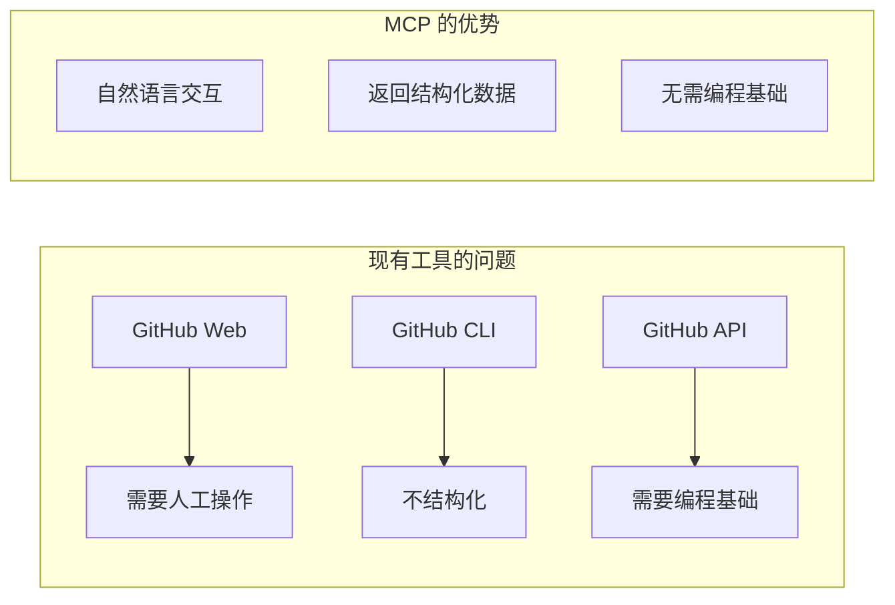
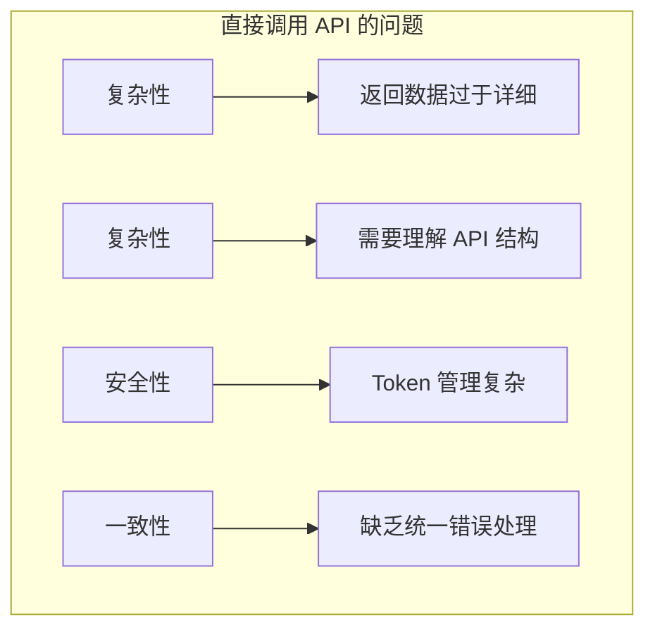
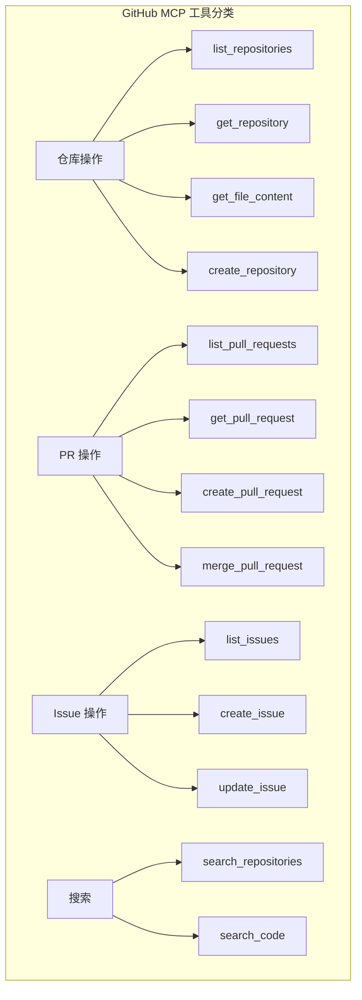
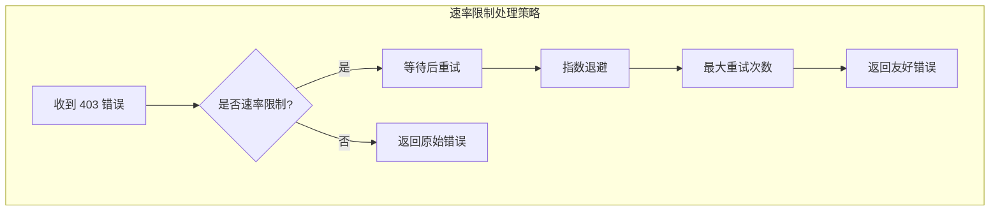

# 2.9 GitHub 操作：让 AI 成为代码管理助手

> 本章将深入探讨如何让 AI 与 GitHub 深度交互。我们会解释 GitHub MCP 的设计理念、API 封装策略，以及如何构建一个安全易用的 GitHub 集成。

---

## 章节导航

| 阶段 | 内容 | 篇幅 |
|------|------|------|
| 问题引入 | AI 编程助手的最后一块拼图 | 15% |
| 核心概念 | GitHub API 与 MCP 的桥梁 | 25% |
| 架构设计 | 工具分类与操作模型 | 25% |
| 实践指南 | 认证配置与最佳实践 | 25% |
| 总结 | 要点回顾 | 10% |

---

## 一、引子：AI 编程助手的进化

### 1.1 从代码补全到代码管理

想象一下，你正在开发一个复杂的项目：

```
┌─────────────────────────────────────────────────────────────────┐
│                    AI 编程助手能力演进                            │
├─────────────────────────────────────────────────────────────────┤
│                                                                 │
│  阶段1: 代码补全                                                │
│  ┌─────────────────────────────────────────────────────────┐   │
│  │  你的 AI 只能帮你写当前文件                               │   │
│  │  • "帮我补全这个函数" ✓                                 │   │
│  │  • "看看其他文件怎么实现的" ✗                           │   │
│  └─────────────────────────────────────────────────────────┘   │
│                                                                 │
│  阶段2: 项目感知                                                │
│  ┌─────────────────────────────────────────────────────────┐   │
│  │  AI 可以浏览项目文件                                     │   │
│  │  • "看看 src/utils 目录" ✓                             │   │
│  │  • "这个函数在哪里定义的" ✓                             │   │
│  └─────────────────────────────────────────────────────────┘   │
│                                                                 │
│  阶段3: 版本控制                                                │
│  ┌─────────────────────────────────────────────────────────┐   │
│  │  AI 可以与 GitHub 交互                                  │   │
│  │  • "创建 PR" ✓                                         │   │
│  │  • "看看谁提交了这个改动" ✓                            │   │
│  │  • "帮我审查这个 PR" ✓                                 │   │
│  └─────────────────────────────────────────────────────────┘   │
│                                                                 │
│  阶段4: 自动化协作                                              │
│  ┌─────────────────────────────────────────────────────────┐   │
│  │  AI 可以自动完成整个工作流                               │   │
│  │  • "帮我提交代码并创建 PR" ✓                           │   │
│  │  • "看看有哪些待处理的 PR" ✓                           │   │
│  │  • "创建一个 Issue 报告 bug" ✓                        │   │
│  └─────────────────────────────────────────────────────────┘   │
│                                                                 │
└─────────────────────────────────────────────────────────────────┘
```

**GitHub MCP 的价值**：它让 AI 从"只会写代码"进化到"能够管理代码"。

### 1.2 为什么需要专门的 GitHub MCP？

GitHub 有完整的 Web 界面和 CLI 工具，但它们都不是为 AI 设计的：



---

## 二、核心概念：GitHub API 的 MCP 封装

### 2.1 理解 GitHub REST API

GitHub API 是一个功能强大但复杂的系统。要让 AI 有效使用它，我们需要理解其设计原则：

```
┌─────────────────────────────────────────────────────────────────┐
│                    GitHub API 核心概念                            │
├─────────────────────────────────────────────────────────────────┤
│                                                                 │
│  资源导向设计：                                                 │
│  ┌─────────────────────────────────────────────────────────┐   │
│  │  /repos/{owner}/{repo}        → 仓库                   │   │
│  │  /repos/{owner}/{repo}/pulls  → PR 列表                │   │
│  │  /repos/{owner}/{repo}/issues → Issue 列表             │   │
│  │  /repos/{owner}/{repo}/contents/{path} → 文件内容       │   │
│  └─────────────────────────────────────────────────────────┘   │
│                                                                 │
│  HTTP 方法语义：                                               │
│  ┌─────────────────────────────────────────────────────────┐   │
│  │  GET    → 读取资源                                      │   │
│  │  POST   → 创建资源                                      │   │
│  │  PATCH  → 部分更新                                      │   │
│  │  PUT    → 完全替换                                      │   │
│  │  DELETE → 删除资源                                      │   │
│  └─────────────────────────────────────────────────────────┘   │
│                                                                 │
│  认证方式：                                                    │
│  ┌─────────────────────────────────────────────────────────┐   │
│  │  Personal Access Token (PAT) → 个人使用                │   │
│  │  OAuth Token → 第三方应用授权                          │   │
│  │  GitHub App → 企业级应用                              │   │
│  └─────────────────────────────────────────────────────────┘   │
│                                                                 │
└─────────────────────────────────────────────────────────────────┘
```

### 2.2 为什么要封装 API？

直接调用 GitHub API 有以下问题：



**封装的价值**：

| 问题 | 直接调用 | MCP 封装后 |
|------|----------|------------|
| 数据复杂性 | 返回完整对象 | 只返回需要的字段 |
| 错误处理 | 原始错误信息 | 友好错误提示 |
| 认证 | 每次都要传 token | 自动注入 |
| 工具发现 | 查文档 | AI 自动发现能力 |

### 2.3 认证机制设计

```
┌─────────────────────────────────────────────────────────────────┐
│                    GitHub MCP 认证流程                            │
├─────────────────────────────────────────────────────────────────┤
│                                                                 │
│  方式一: 环境变量注入                                           │
│  ┌─────────────────────────────────────────────────────────┐   │
│  │  claude_desktop_config.json:                           │   │
│  │  {                                                     │   │
│  │    "env": {"GITHUB_TOKEN": "ghp_xxx"}                 │   │
│  │  }                                                     │   │
│  └─────────────────────────────────────────────────────────┘   │
│                                                                 │
│  方式二: 动态传入                                               │
│  ┌─────────────────────────────────────────────────────────┐   │
│  │  @tool()                                               │   │
│  │  def list_repos(token: str, ...):                     │   │
│  │      # 每次调用传入 token                              │   │
│  └─────────────────────────────────────────────────────────┘   │
│                                                                 │
│  推荐: 方式一（更安全、更简洁）                                 │
│                                                                 │
└─────────────────────────────────────────────────────────────────┘
```

---

## 三、架构设计：工具分类与操作模型

### 3.1 工具分类体系



### 3.2 数据模型简化

GitHub API 返回的数据非常详细，MCP 需要对其进行简化：

```mermaid
flowchart LR
    subgraph "原始 API 返回"
        A1["{",
        A2["  'id': 123456789,",
        A3["  'node_id': 'R_kgDOHACKS',",
        A4["  'name': 'my-repo',",
        A5["  'full_name': 'user/my-repo',",
        A6["  'private': false,",
        A7["  'html_url': 'https://github.com/...',",
        A8["  'description': 'A cool project',",
        A9["  'fork': false,",
        A10["  'url': 'https://api.github.com/...',",
        A11["  ... 更多 50+ 字段",
        A12["}"]
    end

    subgraph "MCP 简化后"
        C1["{",
        C2["  'name': 'my-repo',",
        C3["  'full_name': 'user/my-repo',",
        C4["  'private': false,",
        C5["  'description': 'A cool project',",
        C6["  'language': 'Python',",
        C7["  'stars': 42",
        C8["}"]
    end
```

**设计原则**：
- 只保留 AI 真正需要的字段
- 保持返回结构一致性
- 添加中文说明

### 3.3 操作的幂等性设计

```
┌─────────────────────────────────────────────────────────────────┐
│                    操作幂等性设计                                 │
├─────────────────────────────────────────────────────────────────┤
│                                                                 │
│  幂等操作（可安全重试）：                                        │
│  ├─ GET 请求（读取）                                           │
│  ├─ 创建（存在则报错，但可检测）                                │
│  └─ 删除（不存在则报错，但可检测）                              │
│                                                                 │
│  非幂等操作（需谨慎）：                                          │
│  ├─ 合并 PR（只能执行一次）                                    │
│  ├─ 发布 Release（只能执行一次）                               │
│  └─ 删除（物理删除不可恢复）                                   │
│                                                                 │
│  MCP 设计策略：                                                 │
│  • 敏感操作添加确认参数                                         │
│  • 返回操作结果状态                                             │
│  • 记录操作日志                                                 │
│                                                                 │
└─────────────────────────────────────────────────────────────────┘
```

---

## 四、实践指南：安全配置与最佳实践

### 4.1 Token 权限控制

```
┌─────────────────────────────────────────────────────────────────┐
│                    GitHub Token 权限指南                           │
├─────────────────────────────────────────────────────────────────┤
│                                                                 │
│  最小权限原则：                                                 │
│                                                                 │
│  ┌─────────────────────────────────────────────────────────┐   │
│  │  场景               所需权限                            │   │
│  ├────────────────────┼──────────────────────────────────┤   │
│  │  只读仓库          repo (read)                        │   │
│  │  读写仓库          repo                                │   │
│  │  管理 Issues       issues                             │   │
│  │  管理 PR           pull_requests                       │   │
│  │  创建仓库          repo (write) + delete_repo         │   │
│  │  管理组织          admin:org                           │   │
│  └────────────────────┴──────────────────────────────────┘   │
│                                                                 │
│  ⚠️  不要使用 scope 過大的 token                              │
│                                                                 │
└─────────────────────────────────────────────────────────────────┘
```

### 4.2 速率限制处理

GitHub API 有速率限制，MCP 需要优雅处理：



### 4.3 安全配置清单

```
┌─────────────────────────────────────────────────────────────────┐
│                    GitHub MCP 安全检查清单                         │
├─────────────────────────────────────────────────────────────────┤
│                                                                 │
│  认证安全：                                                     │
│  ┌─────────────────────────────────────────────────────────┐   │
│  │ □ Token 存储在环境变量，不硬编码                       │   │
│  │ □ 使用最小必要权限的 token                            │   │
│  │ □ 定期轮换 token                                      │   │
│  └─────────────────────────────────────────────────────────┘   │
│                                                                 │
│  操作安全：                                                     │
│  ┌─────────────────────────────────────────────────────────┐   │
│  │ □ 敏感操作需要二次确认                                │   │
│  │ □ 限制可操作的仓库范围                                │   │
│  │ □ 启用操作审计日志                                    │   │
│  └─────────────────────────────────────────────────────────┘   │
│                                                                 │
│  数据安全：                                                     │
│  ┌─────────────────────────────────────────────────────────┐   │
│  │ □ 不记录敏感操作日志                                   │   │
│  │ □ 清理临时数据                                         │   │
│  │ □ 验证返回数据的边界                                   │   │
│  └─────────────────────────────────────────────────────────┘   │
│                                                                 │
└─────────────────────────────────────────────────────────────────┘
```

---

## 五、常见场景与解决方案

### 5.1 AI 如何"理解"代码库结构

```
┌─────────────────────────────────────────────────────────────────┐
│                    AI 代码库理解流程                              │
├─────────────────────────────────────────────────────────────────┤
│                                                                 │
│  用户请求: "帮我看看这个项目的架构"                              │
│                                                                 │
│  步骤1: 获取仓库信息                                            │
│  ┌─────────────────────────────────────────────────────────┐   │
│  │  get_repository(owner, repo)                          │   │
│  │  → 返回: 语言、描述、星标数                            │   │
│  └─────────────────────────────────────────────────────────┘   │
│                          │                                       │
│                          ▼                                       │
│  步骤2: 列出目录结构                                            │
│  ┌─────────────────────────────────────────────────────────┐   │
│  │  get_file_content(owner, repo, path="")               │   │
│  │  → 返回: 根目录文件列表                                │   │
│  └─────────────────────────────────────────────────────────┘   │
│                          │                                       │
│                          ▼                                       │
│  步骤3: 深入查看目录                                            │
│  ┌─────────────────────────────────────────────────────────┐   │
│  │  get_file_content(owner, repo, path="src")            │   │
│  │  → 返回: src 目录结构                                  │   │
│  └─────────────────────────────────────────────────────────┘   │
│                          │                                       │
│                          ▼                                       │
│  步骤4: 读取关键文件                                            │
│  ┌─────────────────────────────────────────────────────────┐   │
│  │  get_file_content(owner, repo, path="README.md")       │   │
│  │  → 返回: 项目说明文档                                   │   │
│  └─────────────────────────────────────────────────────────┘   │
│                                                                 │
└─────────────────────────────────────────────────────────────────┘
```

### 5.2 自动代码审查流程

```
┌─────────────────────────────────────────────────────────────────┐
│                    AI PR 审查流程                                 │
├─────────────────────────────────────────────────────────────────┤
│                                                                 │
│  用户请求: "帮我审查这个 PR"                                     │
│                                                                 │
│  ┌─────────────────────────────────────────────────────────┐   │
│  │  get_pull_request(pr_number)                           │   │
│  │                                                          │   │
│  │  返回:                                                  │   │
│  │  • PR 标题和描述                                       │   │
│  │  • 改动的文件列表                                       │   │
│  │  • 新增/删除行数                                        │   │
│  │  • 审查意见                                             │   │
│  └─────────────────────────────────────────────────────────┘   │
│                          │                                       │
│                          ▼                                       │
│  ┌─────────────────────────────────────────────────────────┐   │
│  │  分析每个文件:                                          │   │
│  │  • 读取文件 diff                                       │   │
│  │  • 检查潜在问题                                         │   │
│  │  • 生成审查意见                                         │   │
│  └─────────────────────────────────────────────────────────┘   │
│                          │                                       │
│                          ▼                                       │
│  ┌─────────────────────────────────────────────────────────┐   │
│  │  返回审查结果:                                          │   │
│  │  • 总体评价                                             │   │
│  │  • 发现的问题列表                                       │   │
│  │  • 改进建议                                             │   │
│  └─────────────────────────────────────────────────────────┘   │
│                                                                 │
└─────────────────────────────────────────────────────────────────┘
```

---

## 六、本章小结

### 6.1 核心要点

```
┌─────────────────────────────────────────────────────────────────┐
│                    本章核心要点                                    │
├─────────────────────────────────────────────────────────────────┤
│                                                                 │
│  1. 设计理念                                                    │
│     • AI 需要与 GitHub 交互才能真正管理代码                      │
│     • MCP 封装简化 API 复杂度，降低 AI 使用门槛                 │
│                                                                 │
│  2. 核心机制                                                    │
│     • 工具分类：仓库/PR/Issue/搜索                              │
│     • 数据简化：只返回 AI 需要的字段                            │
│     • 认证：使用环境变量注入 token                              │
│                                                                 │
│  3. 安全实践                                                    │
│     • 最小权限原则                                             │
│     • 速率限制处理                                             │
│     • 敏感操作确认                                             │
│                                                                 │
│  4. 典型场景                                                    │
│     • 代码库理解                                               │
│     • PR 审查                                                  │
│     • Issue 管理                                               │
│                                                                 │
└─────────────────────────────────────────────────────────────────┘
```

### 6.2 知识检查

1. 为什么需要单独封装 GitHub API 而不是直接使用？
2. GitHub MCP 工具应该如何分类？
3. 为什么返回数据需要简化？
4. Token 权限应该如何配置？

---

## 七、延伸阅读

| 资源 | 说明 |
|------|------|
| GitHub REST API 文档 | 官方 API 参考 |
| GitHub GraphQL API | 更灵活的查询方式 |
| Octokit SDK | GitHub 官方 SDK |

---

## 八、下一章预告

下一章我们将学习 **数据库访问 MCP**，让 AI 能够查询和分析数据——这是构建智能数据分析助手的基础。

---

*本章贡献者：MCP Tutorial Team*
*版本：v3.0 出版级*
